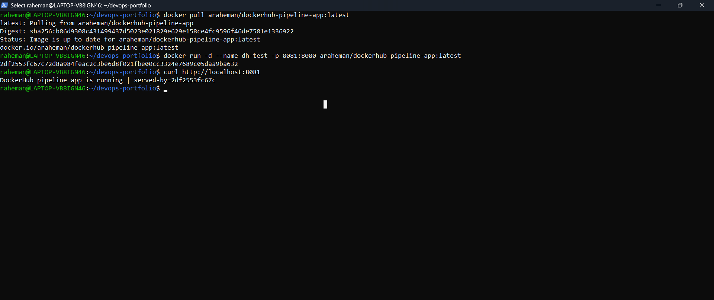

# 05 - DockerHub Pipeline

## Objective
Build a Jenkins pipeline that automatically builds a Docker image from application source code and pushes the image to DockerHub.

---

## Tools Used
- Jenkins
- Docker
- DockerHub
- GitHub
- Node.js

---

## Project Structure

```text
05-dockerhub-pipeline/
| - README.md
| - app/
| | - Dockerfile
| | - package.json
| | - server.js
| - jenkins/
| | - Jenkinsfile
| - scripts/
| | - build.sh
| | - push.sh
| - screenshots/

---

## Architecture Workflow

Developer -> GitHub -> Jenkins Pipeline -> Docker Build -> Docker Tag -> DockerHub Push

---

## Prerequisites 

Before running this project ensure:

- Jenkins installed
- Docker installed
- DockerHub account created
- Jenkins connected to GitHub repository
- DockerHub credentials added in Jenkins

---

## Build Locally 

Navigate to the application folder:

```bash
cd app

Build the Docker image: 

`docker build -t dockerhub-pipeline-app:v1 .`

Run the container:

docker run -d -p 8081:8080 dockerhub-pipeline-app:v1

Test the application:

curl http://localhost:8081

Expected output:

DockerHub pipeline app is running | served-by=a08ff1911b2c

Stop container after testing:

docker stop dockerhub-pipeline-test
docker rm dockerhub-pipeline-test

---

## Jenkins Pipeline Stages

1. Clean workspace
2. Checkout repository
3. Build Docker image
4. Login to DockerHub
5. Push Docker image with version tag
6. Push Docker image with latest tag

---

## Jenkins Credential Configuration

The Jenkins pipeline expects DockerHub credentails configured as:

Credentail Type: 

username with Password

Credential ID:

dockerhub-creds

---

## Verification

After a successful pipeline run:

Check Jenkins console output.

Verify DockerHub repository contains:

- image with build-number tag
- image with latest tag

---

## Common Errors and Fixes

### Error: docker command not found

Cause:
Docker not installed or Jenkins user lacks permission. 

Fix:

sudo usermod -aG docker jenkins
sudo systemctl restart jenkins

---

### Error: DockerHub authentication failed

Cause:
Incorrect working directory in Jenkinsfile.

Fix:
Ensure Jenkins build inside the correct folder:

dir('projects/05-dockerhub-pipeline/app')

---

## Learning Outome:

This project demonstrates:
- Docker image creation
- Jenkins pipeline automation
- DockerHub registry integration
- Image version tagging strategy
- CI/CD workflow

---

## Interview Questions

### 1. Why do we push images to DockerHub?

To store and distribute container images so deployment servers can pull the same tested image.
 
### 2. Why use both build-number and latest tags?

Build-number tags allow rollback and traceability while `latest` provides a moving stable reference.

### 3. Why store credentials in Jenkins instead of the pipeline script?

To avoid exposing sensitive data and maintain secure CI/CD pipelines.

---

## Screenshots

### Jenkins Pipeline Success


### DockerHub Repository


### Jenkins Push Log


### Container Running Test


