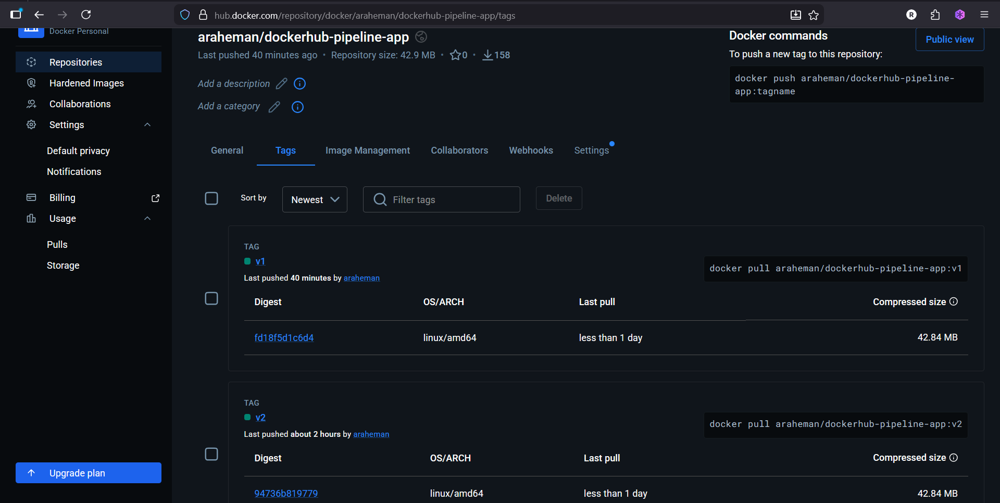
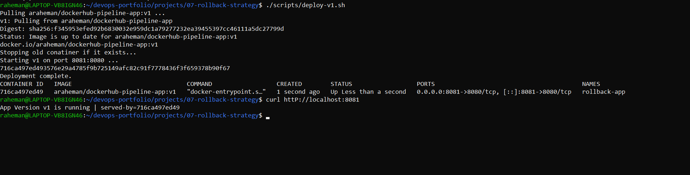
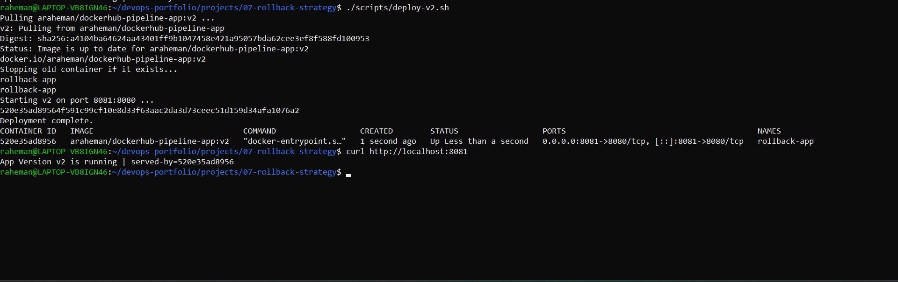
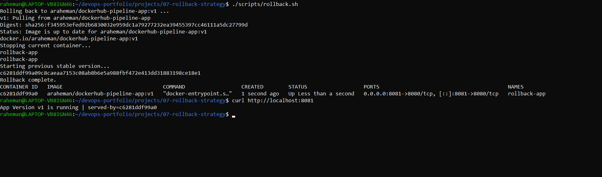
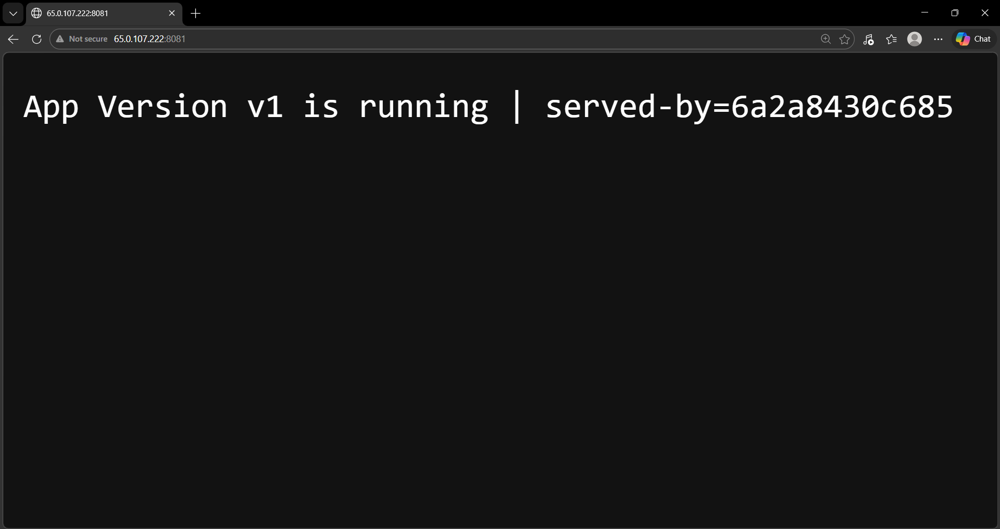

# 07 - Rollback Strategy 

## Objective
Demonstrate a basic rollback strategy by deploying two Docker image versions and reverting from version `v2` back to stable version `v1`.

---

## Tools Used
- Docker
- DockerHub
- AWS EC2
- Bash

---

## Project Structure

07-rollback-strategy/
├── README.md
├── app-v1/
├── app-v2/
├── scripts/
│   ├── deploy-v1.sh
│   ├── deploy-v2.sh
│   └── rollback.sh
└── screenshots/

## Concept
A rollback strategy is used when a newly deployed version casues issues in production.
Instead of rebuilding everything, operations team redeploy the last known stable version quickly.

---

## Version Used
- `araheman/dockerhub-pipeline-app:v1`
- `araheman/dockerhub-pipleine-app:v2`

---

## Port Mapping 

`8081:8080`

---

## Deployment Flow
Stable Version v1 -> New Version v2 -> Issue Detected -> Rollback to v1

---

## Build and Push Images

## Build v1

`docker build -t araheman/dockerhub-pipeline-app:v1 ./app-v1`
`docker push araheman/dockerhub-pipeline-app:v1`

---

## Deployment Commands
## Deploy v1

`./scripts/deploy-v1.sh`
`curl http://localhost:8081`

## Deploy v2
`./scripts/deploy-v2.sh`
`curl http://localhost:8081`

## Rollback to v1
`./scripts/rollback.sh`
`curl http://localhost:8081`

---

## Verification
## Expected v1 response

`App Version v1 is running | served-by=...`

## Expected v2 response

`App Version v2 is running | served-by=...`

## Expected rollback response

`App Version v1 is running | served-by=...`

---

## Common Errors and Fixes

## Error: image tag not found
Cause: 
- image was not pushed to DockerHub
Fix:
- `docker images`
- `docker push araheman/dockerhub-pipeline-app:v1`
- `docker push araheman/dockerhub-pipeline-app:v2`

## Error: port already allocated
Cause:
- another container is using port 8081

Fix:
- `docker ps`
- `docker stop <container>`
- `docker rm <container>`

## Error: rollback did not change version
Cause:
- container was recreated with same image tag by mistake
Fix:
Verify the correct image tag in rollback script:
- `araheman/dockerhub-pipeline-app:v1`

---

## Learning Outcome

This project demonstrates:

- versioned image deployment

- safe rollback practice

- separation of stable and new releases

- production-style recovery thinking

---

## Interview Questions

1. Why is rollback important in production?
Rollback allows quick recovery when a new release introduces bugs, downtime, or instability.

2. Why use versioned image tags like v1 and v2?
Version tags provide tracebility and make it easy to redeploy a known good version.

3. Why is relying only on `latest` risky?
Because `latest` changes over time and does not clearly identify which version is currently deployed.

4. What is the fastest rollback method in a containerized deployment?
Redeploy the last stable image tag and replace the faulty container.

5. How do you verify rollback actually worked?
By checking container state and testing the application response, which should match the expected stable version.

---

## Screenshots

### DockerHub Tags (v1 and v2)

### Deploy Version v1

### Deploy Version v2

### Rollback to v1

### Browser Verification After Rollback

