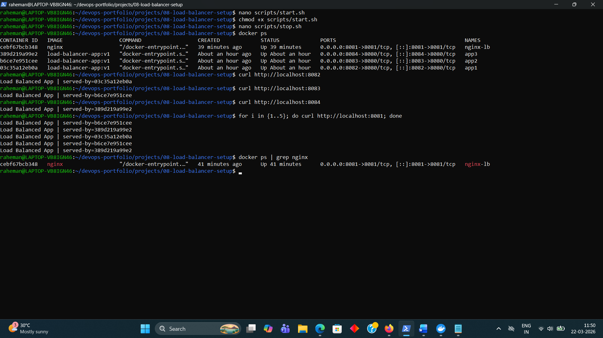

# 08 - Load Balancer Setup (NGINX)

## Objective
Implement load balancing using NGINX to distribute incoming traffic across multiple Docker containers running the same application.

---

## Tools Used
- Docker
- NGINX
- Linux
- Node.js

---

## Architecture

Client → NGINX (Load Balancer) → Multiple Backend Containers

---

## Project Structure


08-load-balancer-setup/
├── README.md
├── app/
│ ├── Dockerfile
│ ├── package.json
│ └── server.js
├── nginx/
│ └── nginx.conf
├── scripts/
│ ├── start.sh
│ └── stop.sh
└── screenshots/


---

## Application Details

The application is a simple Node.js server that returns:


Load Balanced App | served-by=<container-id>


This helps verify load balancing by identifying which container handled the request.

---

## Docker Image Build

```bash
docker build -t load-balancer-app:v1 ./app

---

## Running Multiple Containers

docker run -d --name app1 -p 8082:8080 load-balancer-app:v1
docker run -d --name app2 -p 8083:8080 load-balancer-app:v1
docker run -d --name app3 -p 8084:8080 load-balancer-app:v1

---

## NGINX Configuration
### nginx.conf

events {}

http {
    upstream backend {
        server host.docker.internal:8082;
        server host.docker.internal:8083;
        server host.docker.internal:8084;
    }

    server {
        listen 8081;

        location / {
            proxy_pass http://backend;
        }
    }
}

---

### Running NGINX Load Balancer

docker run -d \
  --name nginx-lb \
  -p 8081:8081 \
  -v $(pwd)/nginx/nginx.conf:/etc/nginx/nginx.conf \
  nginx

---

### Testing Load Balancing

Run multiple times:

curl http://localhost:8081

Expected output:

Load Balanced App | served-by=container1
Load Balanced App | served-by=container2
Load Balanced App | served-by=container3

Each request should be served by a different container.

---

## Automation Scripts

## Start all services
./scripts/start.sh

## Stop all services
./scripts/stop.sh

---

## Common Errors and Fixes
## Error: NGINX not distributing traffic

Cause:

Incorrect backend IP configuration

Fix:
Use correct host IP:

172.17.0.1

---

## Error: Cannot access localhost:8081

Cause:

NGINX container not running

Fix:

docker ps
docker logs nginx-lb

---

## Error: Backend containers not responding

Cause:

Containers not running or wrong ports

Fix:

docker ps
curl http://localhost:8082

---

## Learning Outcome

This project demonstrates:

- Running multiple container instances

- Configuring NGINX as a reverse proxy

- Load balancing traffic across services

- Basic system design for scalable applications

---

## Interview Questions

1. What is a load balancer?

A load balancer distributes incoming traffic across multiple backend servers to improve performance and availability.
---
2. Why use NGINX as a load balancer?

NGINX is lightweight, fast, and commonly used as a reverse proxy and load balancer in production environments.
---
3. How does load balancing improve system reliability?

It prevents a single server from being overloaded and ensures continued availability if one instance fails.
---
4. How do you verify load balancing is working?

By sending multiple requests and observing responses from different backend servers (different container IDs).
---
5. What happens if one container fails?

NGINX will continue routing traffic to the remaining healthy containers (if configured properly).

---

## Screenshots

### Load Balancer Working (NGINX + Multiple Containers)




