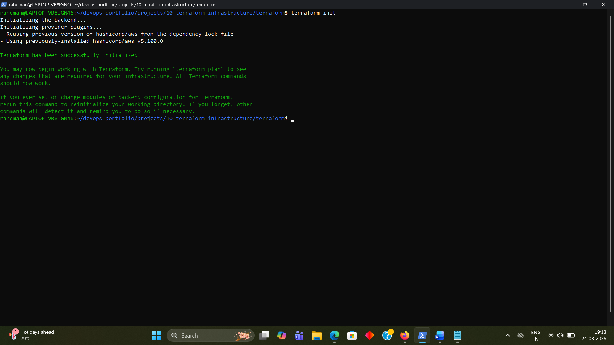
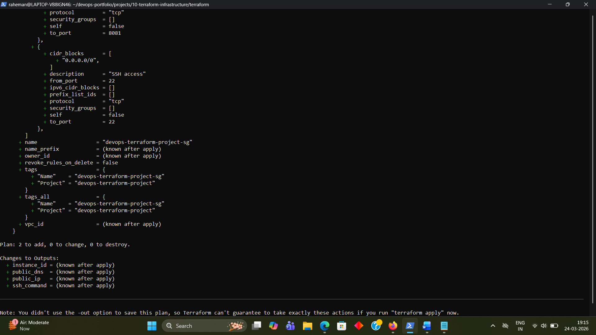
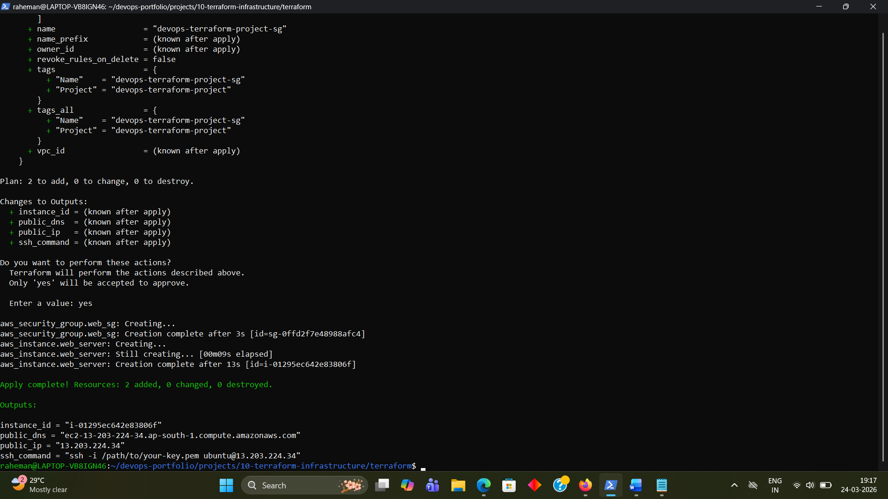
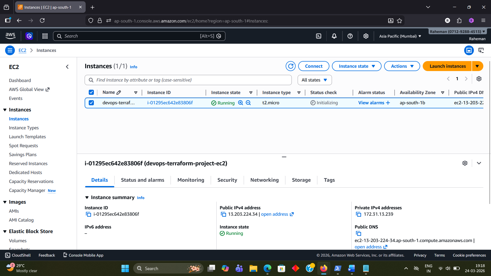
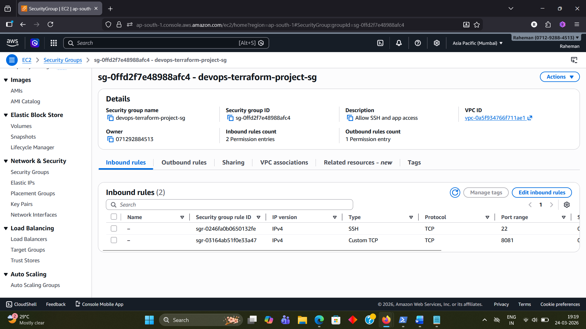

# 10 - Terraform Infrastructure

## Objective
Provision AWS infrastructure using Terraform instead of creating resources manually through the AWS Console.

---

## Tools Used
- Terraform
- AWS EC2 
- AWS Security Groups
- AWS CLI
- Linux

---

## Project Structure

```text
10-terraform-infrastructure/
├── README.md
├── screenshots/
└── terraform/
    ├── .gitignore
    ├── main.tf
    ├── outputs.tf
    ├── provider.tf
    ├── terraform.tfvars
    └── variables.tf
```
What This Project Creates
- 1 AWS Security Group
- 1 AWS EC2 instance
- Outputs for instance ID, public IP, public DNS, and SSH command

---

## Terraform Files Explanation

### provider.tf
Defines Terraform version requirements and AWS provider configuration.

### variables.tf
Stores resuable input variables such as region, AMI ID, instance type, and key pair name.

### main.tf
Defines the AWS resources:
- Security Group
- EC2 instance

### outputs.tf
Displays important infrastructure details after deployment.

### terraform.tfvars
Provides actual values for variables.

---

## Terraform Workflow

### Initialize
```bash
terraform init
```

### Format
```bash
terraform fmt
```

### Validate
```bash
terraform validate
```

### Plan
```bash
terraform plan
```

### Apply
```bash
terraform apply
```

### Destroy
```bash
terraform destroy 
```

---

## Security Group Rules 
- Port 22 for SSH
- Port 8081 for application access
- All outbound traffic allowed

---

## Verification

After `terraform apply`, Terraform successfully created:
- 1 EC2 instance
- 1 security group
- output values for instance ID, public IP, public DNS, and SSH command

After testing, `terraform destroy` successfully removed the provisioned resources to avoid unnecessary AWS charges.

---

## Learning Outcome
This project demonstrates:

- Infrastructure as Code (IaC)
- AWS resource provisioning using Terraform
- Reusable, variable-driven infrastructure design
- Safe planning and controlled infrastructure changes
- Clean resource lifecycle management using apply and destroy

---


## Interview Questions

### 1. What is Infrastructure as Code?
Infrastructure as Code is the practice of managing and provisioning infrastructure using code instead of manual processes.

### 2. Why is Terraform useful in DevOps?
Terraform makes infrastructure repeatable, version-controlled, scalable, and easier to automate.

### 3. What is the difference between `terraform plan` and `terraform apply`?
`terraform plan` shows the changes Terraform intends to make, while `terraform apply` executes those changes.

### 4. Why is Terraform state important?
Terraform state tracks the resources it manages, allowing it to compare desired configuration with actual infrastructure.

### 5. Why use variables in Terraform?
Variables make Terraform code reusable, cleaner, and easier to maintain across environments.

---


## Screenshots

### Terraform Init



### Terraform Plan



### Terraform Apply



### EC2 Instance Created in AWS



### Security Group Created in AWS



### Terraform Destroy


---

