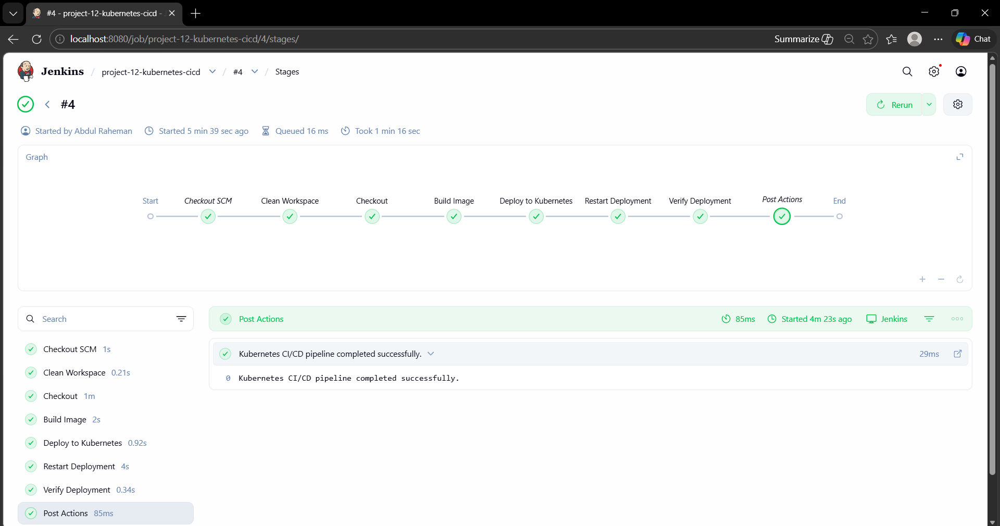
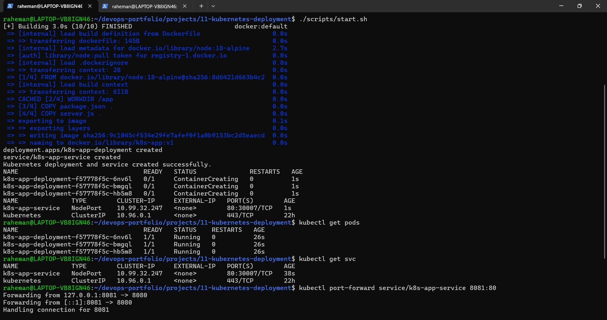
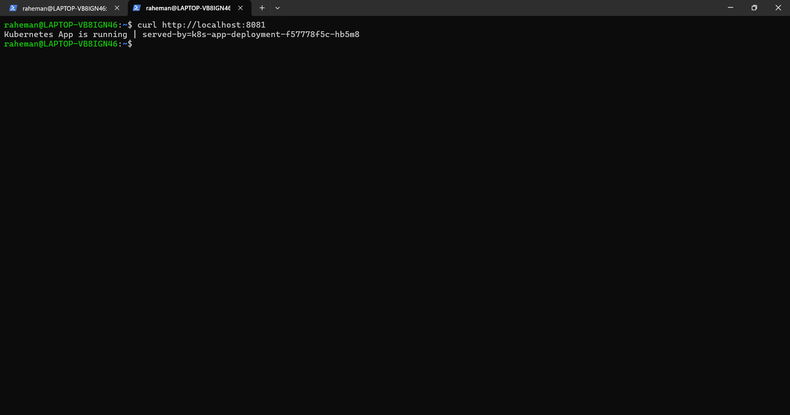
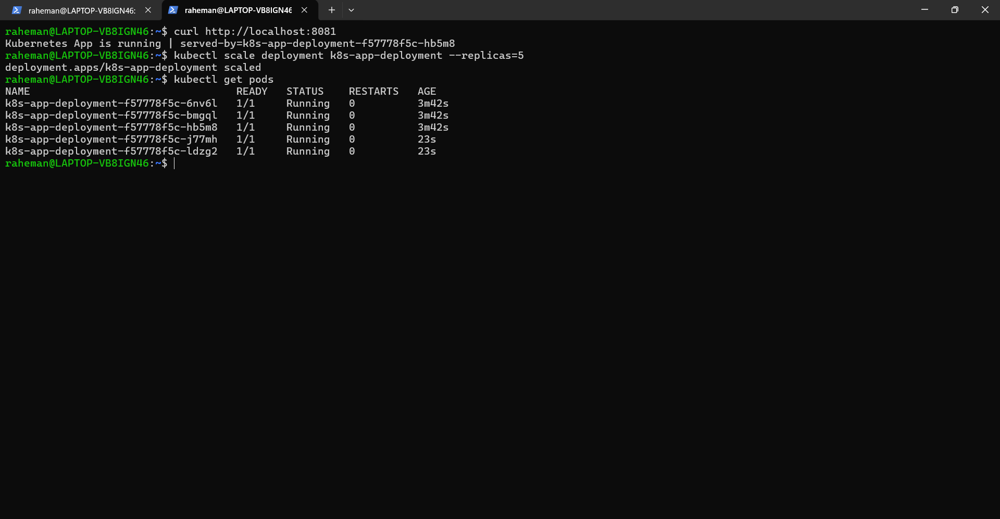
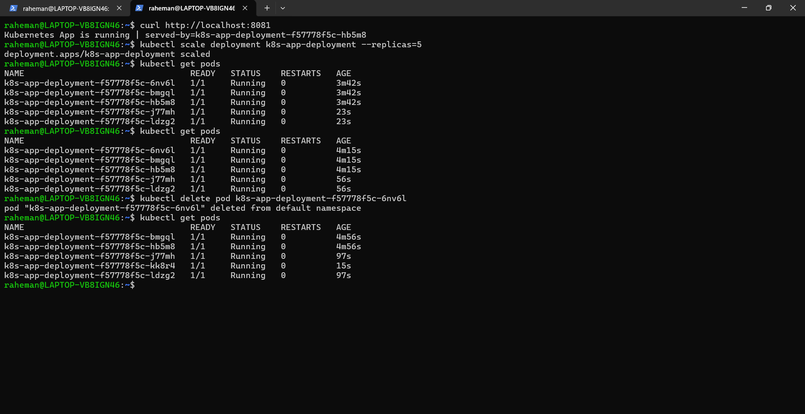

# 12 - Kubernetes CI/CD Pipeline

## Objective 

Build an automated CI/CD pipeline using Jenkins to deploy a containerized application to Kubernetes (Minikube), replacing manual deployment with an automated workflow.

---

## Tools Used

- Jenkins
- Kubenetes 
- Minikube 
- Kubectl
- Docker
- Node.js
- Linux

---

## Project Structure

```text
12-kubernetes-cicd/
├── README.md
├── app/
│   ├── Dockerfile
│   ├── package.json
│   └── server.js
├── k8s/
│   ├── deployment.yaml
│   └── service.yaml
├── jenkins/
│   └── Jenkinsfile
├── scripts/
│   ├── start.sh
│   └── cleanup.sh
└── screenshots/

---

## CI/CD Pipeline FLow

```GitHub -> Jenkins -> Docker Build -> Kubernetes Deployment -> Service -> Application Access
```

---

## Application Overview

A simple Node.js application that returns:
```Kubernetes CI/CD App is running | served-by=<pod-name>
```
This helps verify:
- which pod handled the request
- load balancing across pods

---

## Kubernetes Concepts Used

### Deployment
- Manages application pods
- Ensures desired replicas are running
- Supports rolling updates

### Service 
- Exposes applcation to external access
- Provides load balancing across pods

### Rollout Restart
- Used to redeploy application after image update

---

## Jenkins Pipeline Stages

### 1. Clean Workspace
Remove previous build files.

### 2. Checkout Code
Pulls latest code from GitHub.

### 3. Build Docker Image
Builds application image:
```bash
docker build -t k8s-cicd-app:v1 .
```

### 4. Deploy to Kubernetes
Applies manifests:
```bash
kubectl apply -f deployment.yaml
kubectl apply -f service.yaml
```

### 5. Restart Deployment
Triggers rollout:
```bash
kubectl rollout restart deployment/k8s-cicd-app-deployment
kubectl rollout status deployment/k8s-cicd-app-deployment
```

### 6. Verify Deployment
Checks pods and services:
```bash
kubectl get pods
kubectl get svc
```

---

## Build and Deployment

### Start Minikube
```bash
minikube start
```

### Run Jenkins Pipeline
Trigger build from Jenkins UI.

---

## Verification

### Check Kubernetes resources
```bash
kubectl get pods
kubectl get svc
```

### Access Application 
```bash
kubectl port-forward service/k8s-cicd-app-serivce 8082:80
curl http://localhost:8082
```
Expected output:
```
Kubernetes CI/CD App is running | served-by=<pod-name>
```

---

## Debugging & Issues Faced

### Issue 1 - Minikube Docker Environment Error
```
minikube docker-env -> exit code 85
```

### Fix:
Removed dependency on `minikube docker-env` in Jenkins pipeline.

---

### Issue 2 - Incorrect Kubernetes API Target
```
kubectl pointing to Jenkins (localhost:8080)
```

### Fix:
Configured `KUBECONFIG` explicitly in Jenkins.

---

### Issue 3 - Certificate Permission Denied
```
unable to read client.crt / client.key
```

### Fix: 
Copied Minikube certificates to Jenkins directory:
```
/var/lib/jenkins/.minikube/
```
Updated kubeconfig paths and permissions.

---


## Screenshots

### Jenkins Pipeline Success



### Kubernetes Overview (Pods, Service, and Port Forward)



### Application Response



### Scaled to 5 Pods



### Pod Recreated After Deletion



---

## Learning Outcome
This project demonstrates:
- End-to-end CI/CD pipeline using Jenkins
- Kubernetes-based application deployment
- Integration of CI/CD with container orchestration
- Debugging real-world pipeline and infrastructure issues
- Managing kubeconfig and permissions in multi-user environments
- Automated deployment and rollout strategies

---

## Interview Questions

### 1. What is CI/CD in Kubernetes context?
CI/CD automates building, testing, and deploying applications to Kubernetes clusters.

---

### 2. How does Jenkins deploy to Kubernetes?
Jenkins runs `kubectl` commands to apply manifests and manage deployments.

---

### 3. What is `kubectl rollout restart`?
It triggers a rolling restart of pods in a Deployment.

---

### 4. Why is kubeconfig important?
It defines cluster access, authentication, and context for Kubernetes operations.

---

### 5. What challenges did you face?
- Jenkins not accessing Minikube
- Incorrect API endpoint 
- Certificate permission issues

---

### 6. How did you solve them?
- Confgured `KUBECONFIG`
- Fixed certificate permissions
- Aligned Jenkins with Kubernetes environment

---

## Conclusion
This project demonstrates a complete DevOps workflow:
- Build -> Deploy -> Automate -> Debug -> Verify
and represents a problem-style CI/CD pipeline integrated with Kubernetes. 

---

