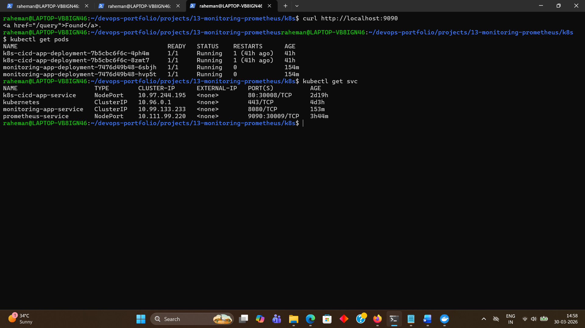
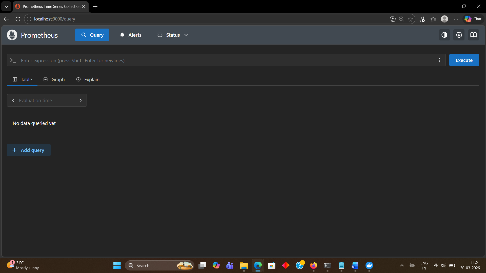
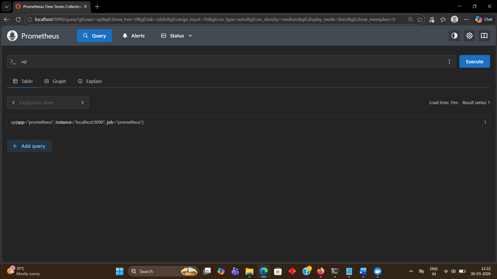
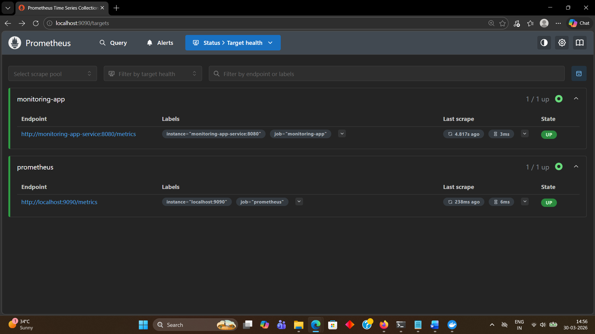
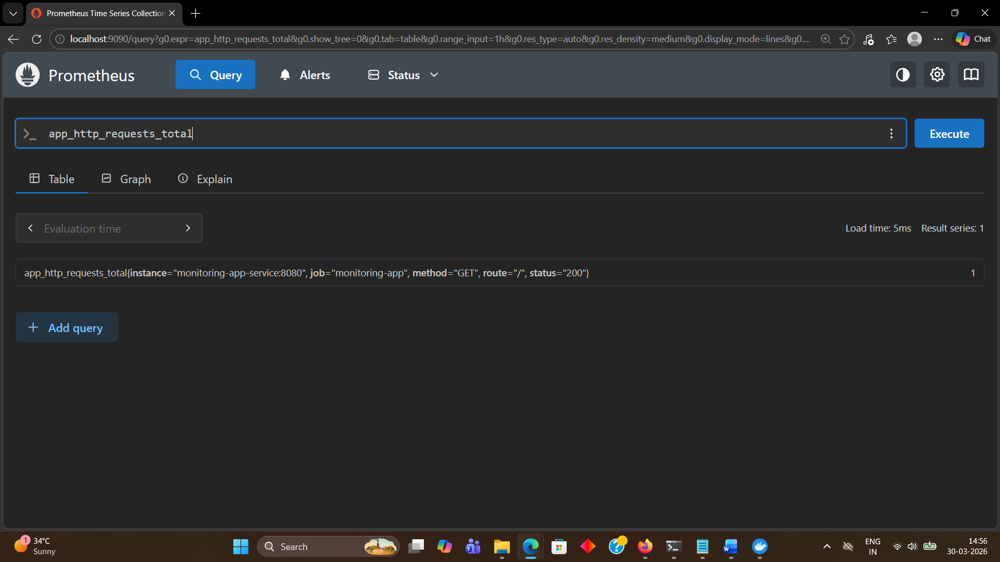

# 13 - Monitoring with Prometheus (Kubernetes)

## Objective

Implement application monitoring by deploying Prometheus on Kubernetes and collecting real-time metrics from a containerized Node.js application.

---

## Tools Used

- Prometheus
- Kubernetes
- Minikube
- Kubectl
- Docker
- Node.js
- Linux

---

## Project Structure

```text
13-monitoring-prometheus/
├── README.md
├── app/
│   ├── Dockerfile
│   ├── package.json
│   └── server.js
├── k8s/
│   ├── app-deployment.yaml
│   ├── app-service.yaml
│   ├── prometheus-config.yaml
│   ├── prometheus-deployment.yaml
│   └── prometheus-service.yaml
└── screenshots/
```

---

## Monitoring Architecture

```
Node.js App -> /metrics -> Prometheus -> Query UI
```
---

## Application Overview

The Node.js application expose:
- Root endpoint:
```
Monitored App is running | served-by=<pod-name>
```
- Metrics endpoint:
```
/metrics
```
- Metrics include:
```
app_http_requests_total
```

---

## Prometheus Configuration
Prometheus is configured using a ConfigMap.

### Scrape Targets

```YAML
global:
  scrape_interval: 5s

scrape_configs:
  - job_name: 'prometheus'
    static_configs:
      - targets: ['localhost:9090']

  - job_name: 'monitoring-app'
    metrics_path: /metrics
    static_configs:
      - targets: ['monitoring-app-service:8080']
```
---

## Deploying Steps

### Start Minikube
```bash
minikube start
```

### Deploying Prometheus
```bash
kubectl apply -f prometheus-config.yaml
kubectl apply -f prometheus-deployment.yaml
kubectl apply -f prometheus-service.yaml
```

### Deploy Monitoring App
```bash
kubectl apply -f app-deployment.yaml
kubectl apply -f app-service.yaml
```

## Verification

### Check resources
```bash
kubectl get pods
kubectl get svc
```

---

### Access Prometheus UI
```bash
kubectl port-forward service/prometheus-service 9090:9090
```
Open:
```
http://localhost:9090
```
---

### Check Targets

Navigate to:
```text
Status -> Targets
```

Expected:
```text
prometheus -> UP
monitoring-app -> UP
```

---

### Generate traffic
```bash
curl http://localhost:8085
curl http://localhost:8085
curl http://localhost:8085
```

---

### Query metrics

In prometheus UI:
```
app_http_requests_total
```

Expected result:
```
Value > 0
```
---

## Debugging & Issues Faced

### Issue - Prometheus UI not loading
```
Connection refused during port-forward
```

### Root Cause:
Prometheus failed to start due to configuration error.

---

### Issue - YAML parsing error
```
field scape_interval not found
```

### Root Cause:
Typo in configuration:
```YAML
scrape_interval
```
### Fix:
```YAML
scrape_interval
```

---

### Issue - Prometheus not scraping app

### Root Cause:
Prometheus config missing application target.

### Fix:
Added
```YAML
targets: ['monitoring-app-service:8080']
```

---

## Screenshots

### Prometheus Pod Overview



---

### Prometheus UI



---

### Prometheus Query (up)



---

### Targets Status (UP)



---

### App Metrics Query



---

## Learning Outcome
This project demonstrates:
- Prometheus deployment on Kubernetes
- Application metrics exposure using `prom-client`
- Service-based scraping inside Kubernetes
- Debugging configuration and YAML issues
- Understanding of monitoring architecture
- Real-time metrics collection and querying

---

## Interview Questions

### 1. What is Prometheus?
Prometheus is an open-source monitoring system that collects and stores time-series metrics.

---
### 2. How does Prometheus collect metrics?
It uses a pull-based model to scrape metrics from configured targets.

---
### 3. What is a metrics endpoint?
An HTTP endpoint (e.g., `/metrics`) that exposes application metrics.

---
### 4. What is scrape_interval?
It defines how frequently Prometheus collects metrics.

---
### 5. How does Prometheus discover services in Kubernetes?
It can use service names and cluster DNS to scrape targets within the cluster.

---
### 6. What issues did you face?
- Prometheus not starting due to config typo
- UI not loading due to container failure
- Missing scrape target configuration

---
### 7. How did you solve them?
- Fixed YAML typo
- Verified logs using `kubectl logs`
- Updated Prometheus scrape config

---

## Conclusion 
This project demonstrates a complete monitoring workflow:

Application -> Metrics -> Prometheus -> Query

and establishes a foundation for advanced observality using dashboards and alerting systems.

---

