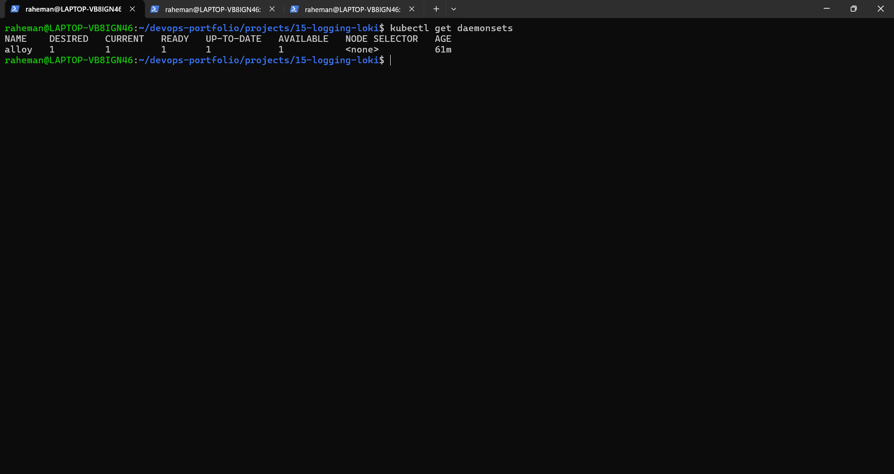
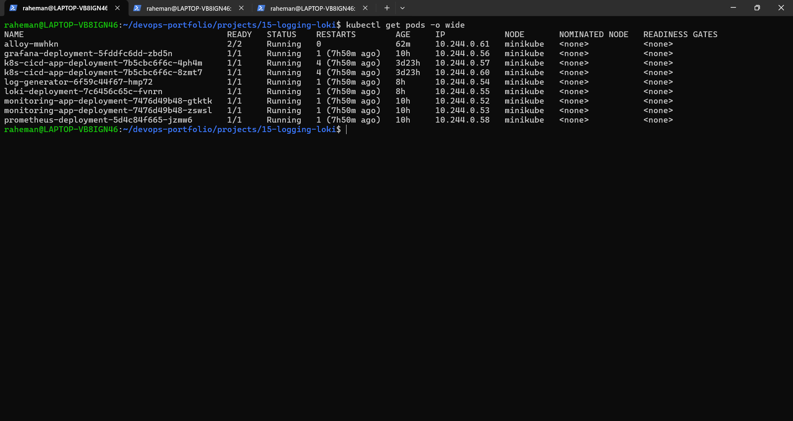
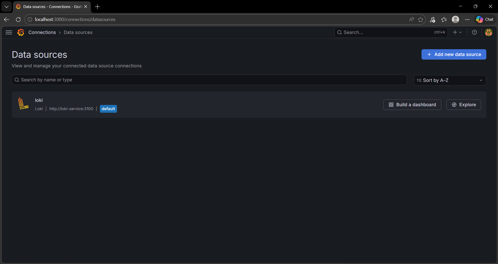
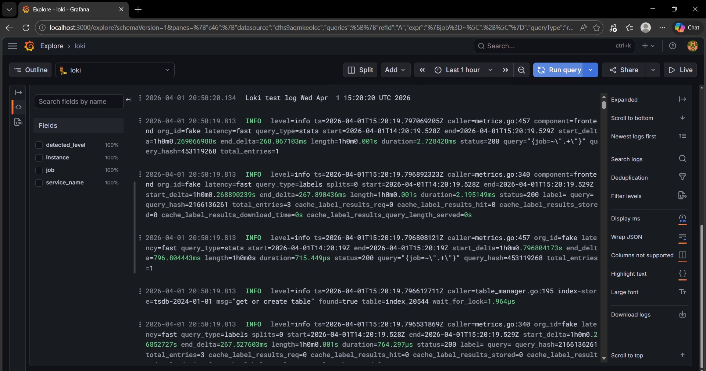
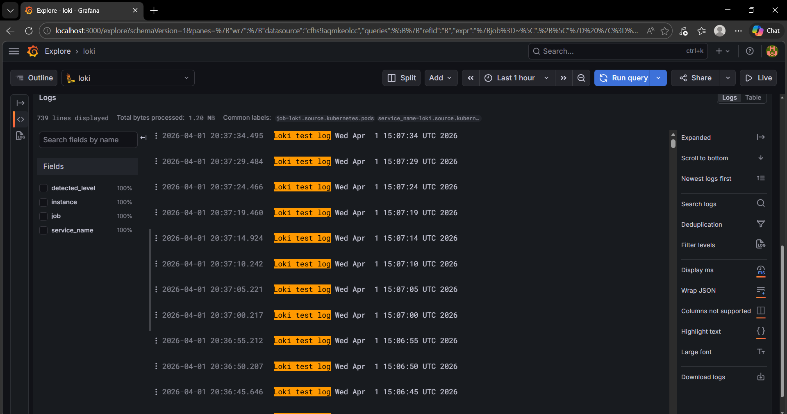
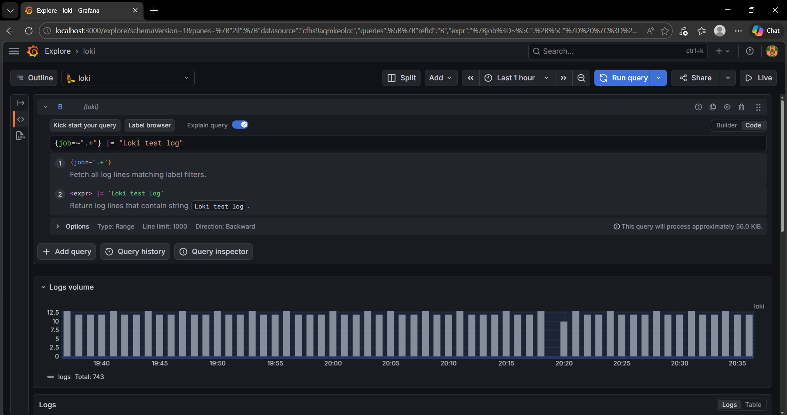

# 15 - Centralized Logging with Loki + Grafana (Kubernetes)

## Objective

Implemented centralized logging by collecting Kubernetes pod logs using Grafana Alloy, storing them in Loki, and visualizing them in Grafana.

---

## Tools Used 

- Grafana Loki
- Grafana Alloy 
- Grafana
- Kubernetes
- Minikube
- Kubectl
- Docker
- Linux

---

## Project Structure

```text
15-logging-loki/
├── README.md
├── k8s/
│   ├── loki-config.yaml
│   ├── loki-deployment.yaml
│   ├── loki-service.yaml
│   └── log-generator.yaml
├── alloy/
│   └── values.yaml
└── screenshots/
```

---

## Logging Architecture
```
Kubernetes Pods -> Grafana Alloy -> Loki -> Grafana Explore
```

---

## Overview
This project implements a centralized logging system:
- Applications generates log
- Grafana Alloy collects logs from Kubernetes pods
- Loki stores logs as time-series data
- Grafana allows querying and visualizing logs

---

## Loki Deployment
Loki is deployed as a single binary in Kubernetes using a ConfigMap-based configuration.

### Key Features
- Log aggregration
- Label-based indexing
- Efficient log querying

---

## Alloy Configuration
Grafana Alloy is deployed as a DaemonSet to collect logs from all nodes.

### Core Components
- `discovery.kubernetes` -> discover pods
- `loki.source.kubernetes` -> reads pod logs
- `loki.write` -> sends logs to Loki

### Loki Endpoint
```
http://loki-service:3100/loki/api/v1/push
```
---

## Deployment Steps

### Start MiniKube
```
minikube start
```

---

### Deploy Loki
```
kubectl apply -f loki-config.yaml
kubectl apply -f loki-deployment.yaml
kubectl apply -f loki-service.yaml
```

---

### Deploy Alloy (Helm)
```
helm repo add grafana https://grafana.github.io/helm-charts
helm repo update
helm upgrade --install alloy grafana/alloy -f alloy/values.yaml
```

---

### Deploy Log Generator
```
kubectl apply -f log-generator.yaml
```

---

## Verification

### Check resources
```
kubectl get pods
kubectl get daemonsets
kubectl get svc
```

---

### Verify Loki readiness
```
kubectl port-forward service/loki-service 3100:3100
curl http://localhost:3100/ready
```
Expected:
```
ready
```

---

### Access Grafana
```
kubectl port-forward service/grafana-service 3000:3000
```
Open:
```
http://localhost:3000
```

----

### Query logs in Grafana
Use:
```
{job=~".+"}
```
---

### Filter logs
```
{job=~".+"} |= "Loki test log"
```
---

## Screenshots

### Alloy DaemonSet Running



---

### Alloy Pod Running



---

### Loki Data Source (Grafana)



---

### Grafana Explore Logs



---

### Filtered Logs in Grafana



---

### Loki Query in Grafana



---

## Debugging & Issues Faced

### Issue - Logs not visible initially
#### Root Cause:
Loki does not collect logs directly from Kubernetes pods.

---

### Fix
Deployed Grafana Alloy:
- Enable Kubernetes discovery
- Configured log forwarding to Loki

---

### Issue - Query errors in Grafana
```
parse error: queries require at least one matcher
```

---

### Fix
Used valid LogQL query:
```
{job=~".+"}
```

---

## Learning Outcome
This porject demonstrates:
- Centralized logging architecture
- Log collection from Kubernetes using Alloy
- Log aggregation using Loki
- Querying logs using LogQL
- Debugging real-world logging issues
- Understanding observability stack

---

## Interview Questions

### 1. What is Loki?
Loki is a log aggregation system designed for efficient storage and querying of logs.
---
### 2. How is Loki different from traditional logging systems?
Loki indexes metadata (labels) instead of full log content, making it more efficient.
---
### 3. What is Grafana Alloy?
Grafana Alloy is a collector that gathers logs, metrics, and traces and forwards them to backends like Loki.
---
### 4. Why is Alloy deployed as a DaemonSet?
To ensure log collection from all Kubernetes nodes.
---
### 5. What is Log QL?
LogQL is the query language used in Loki to filter and analyze logs.
---
### 6. What challenges did you face?
- Logs not appearing initially
- Query syntax issues
- Understanding log collection flow
---
### 7. How did you solve them?
- Deployed Alloy for log collection
- Used correct LogQL queries
- Verified logs using Grafana Explore
---

## Conclusion 
This project completes the observability stack:

Metrics -> Prometheus
Logs -> Loki
Visualization -> Grafana

and demonstrates real-world monitoring and debugging capabilities in a Kubernetes environment.

---

