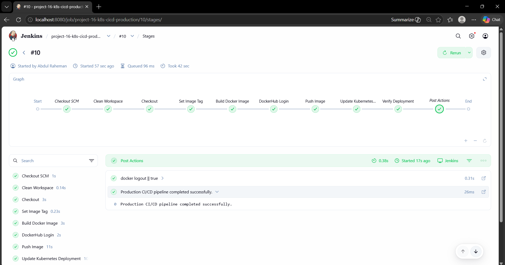
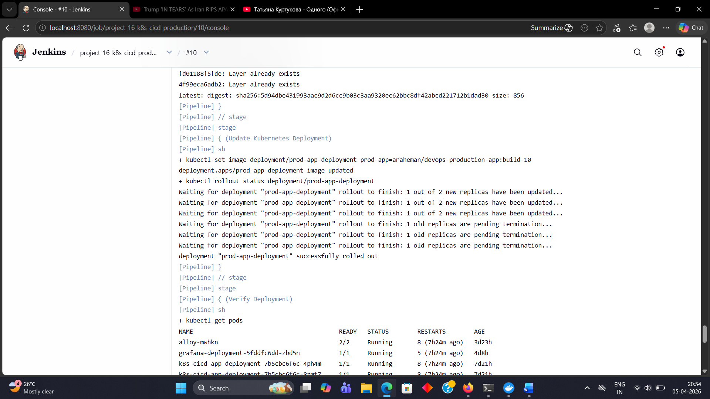
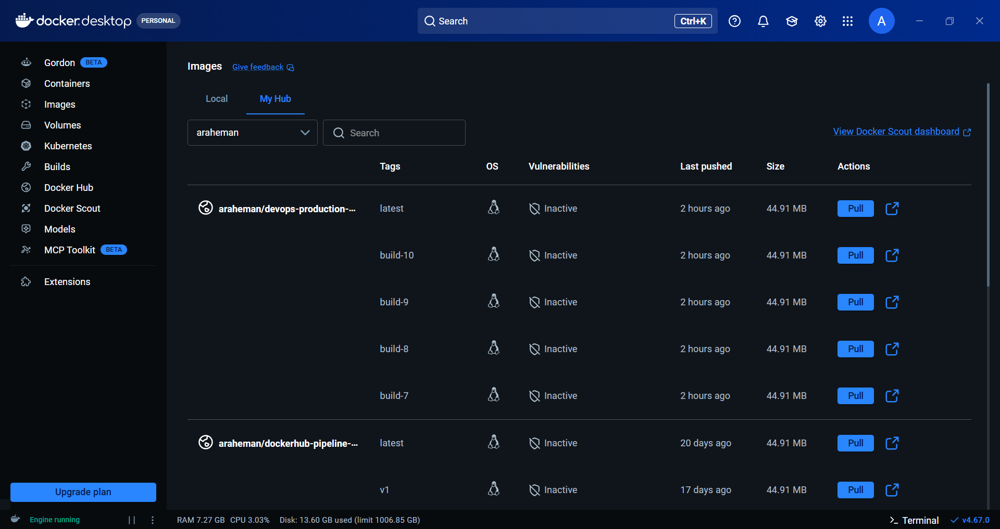
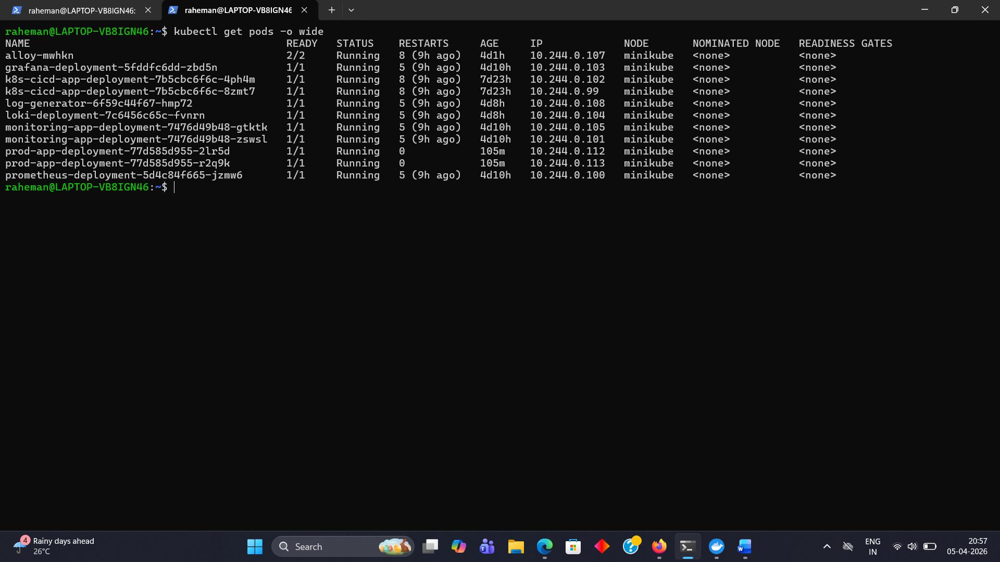
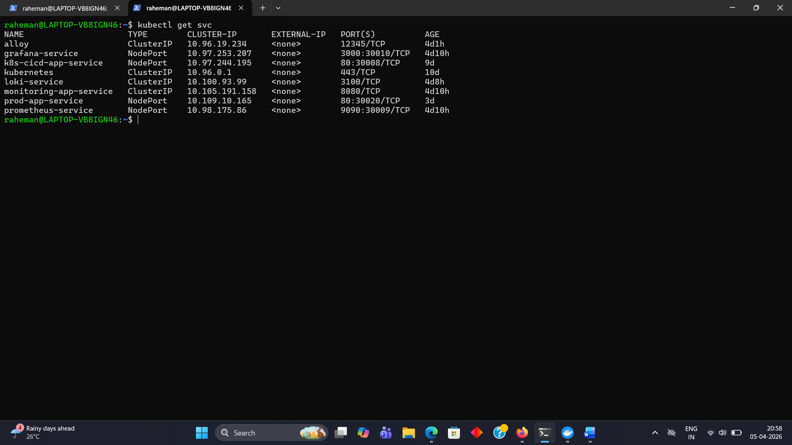
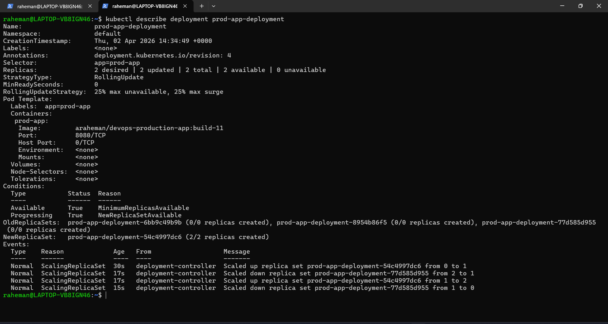
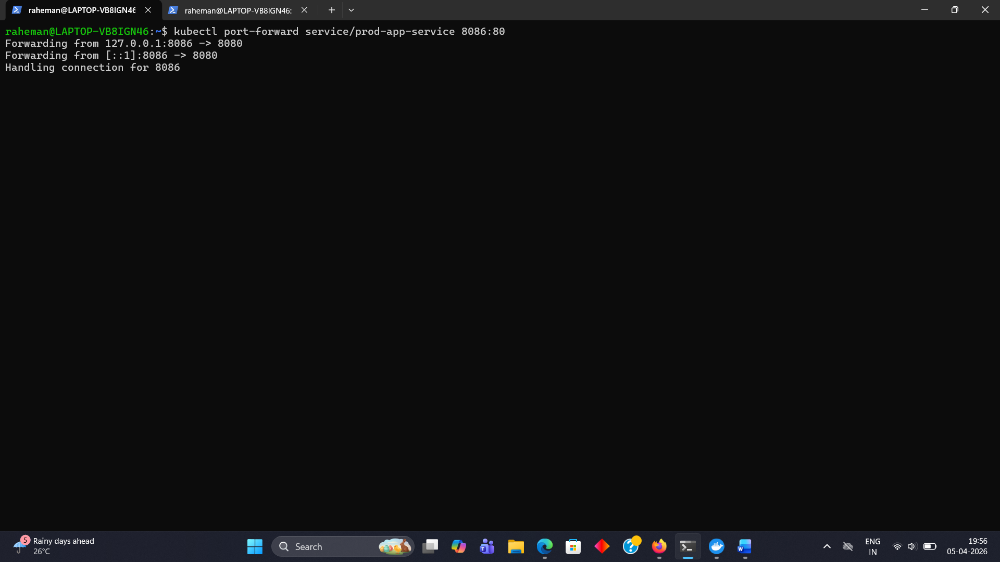

# 16 - Production CI/CD Pipeline (Jenkins -> DockerHub -> Kubernetes)

## Objective 

Build a fully automated production-grade CI/CD pipeline that deploys containerized applications to Kubernetes using Jenkins and DockerHub.

---

## Tools Used

- Jenkins
- Docker
- DockerHub
- Kubernetes
- Minikube
- Kubectl 
- Node.js
- Linux

---

## Project Structure
```text
16-k8s-cicd-production/
├── README.md
├── app/
│   ├── Dockerfile
│   ├── server.js
│   └── package.json
├── k8s/
│   ├── deployment.yaml
│   └── service.yaml
├── jenkins/
│   └── Jenkinsfile
└── screenshots/
```

---

## CI/CD Architecture

```
GitHub -> Jenkins -> Docker Build -> DockerHub -> Kubernetes -> Live App Update
```

---

## Overview

This project implements a production-grade CI/CD pipeline that automates build, push, and deployment workflows:
- Code is pushed to GitHub
- Jenkins automatically builds the application
- Docker image is created and versioned
- Image is pushed to DockerHub
- Kubernetes deployment is updated automatically
- Application is updated with zero downtime

---

## Key Features

- Automated CI/CD pipeline
- Docker image versioning (`build-<number>`)
- Continuous deployment to Kubernetes
- Rolling updates with zero downtime
- Real-time version verification

---

## Application Versioning

The application dynamically displays the deployed version:
```
Production CI/CD App build-7 is running | served-by=<pod>
```
This proves successful automated deployment.

---

## Deployment Steps

### Start Minikube
```
minikube start
```
---

### Deploy Application (Initial Setup)
```
kubectl apply -f k8s/deployment.yaml
kubectl apply -f k8s/service.yaml
```
---

### Verify Deployment
```
kubectl get pods
kubectl get svc
```
---

### Access Application
```
kubectl port-forward service/prod-app-service 8086:80
```
---

## Jenkins Pipeline Flow

### 1. Checkout Code
Pulls latest code from GitHub repository.

---

### 2. Build Docker Image
```
docker build -t araheman/devops-production-app:build-<number>
```
---

### 3. Push to DockerHub
```
docker push araheman/devops-production-app:build-<number>
docker push araheman/devops-production-app:latest
```
---

### 4. Update Kubernetes Deployment
```
kubectl set image deployment/prod-app-deployment prod-app=araheman/devops-production-app:build-<number>
```
---

### 5. Rollout Update
```
kubectl rollout status deployment/prod-app-deployment
```
---

## Verification

### Check Pods
```
kubectl get pods
```
---

### Check Rollout History
```
kubectl rollout history deployment/prod-app-deployment
```
---

### Verify Application Version
```
curl http://localhost:8086
```
Expected: 
```
Production CI/CD App build-<number> is running
```
---

## Screenshots

### Jenkins Pipeline Success



---

### Jenkins Console Output



---

### DockerHub Image Tags



---

### Kubernetes Pods Running



---

### Kubernetes Service



---

### Kubernetes Rollout Update



---

### Application Version Output



---

## Debugging & Issues Faced

### 1. Docker Image Tag Error
#### Issue:
Invalid reference format during Docker push.

#### Fix:
Separated `IMAGE_NAME` and `IMAGE_TAG` correctly in Jenkins pipeline.

---

### 2. Jenkins Git Checkout Failure
#### Issue:
Repository clone failed with network/EOF errors.

#### Fix:
Cleaned Jenkins workspace and retried clone.

---

### 3. Kubernetes Connection Failure
#### Issue:
Jenkins could not connect to Kubernetes cluster.

#### Fix:
Configured correct kubeconfig path for Jenkins.

---

### 4. Certificate Permission Errors
#### Issue:
Jenkins could not read Kubernetes certificate files.

#### Fix:
Copied certificates to Jenkins directory and updated permissions.

---

### 5. Minikube API Port Change
#### Issue:
Connection refused after restart.

#### Fix:
Refreshed Jenkins kubeconfig after Minikube restart.

---

## Learning Outcome

This project demonstrates:
- End-to-end CI/CD pipeline design
- Docker image versioning strategy
- Automated Kubernetes deployments
- Rolling updates with zero downtime
- Debugging real-world DevOps issues
- Integration of multiple DevOps tools

---

## Interview Questions

### 1. What is CI/CD?
CI/CD automates building, testing, and deploying applications to ensure faster and reliable delivery.

---

### 2. Why use Docker in CI/CD?
Docker ensures consistent environments across development, testing, and production.

---

### 3. Why push images to DockerHub?
DockerHub acts as a central image registry for deployments.

---

### 4. What is rolling update in Kubernetes?
Rolling update gradually replaces old pods with new ones without downtime.

---

### 5. How do you update a Kubernetes deployment?
Using:
```
kubectl set image deployment <name> <container>=<new-image>
```
---

### 6. How do you verify deployment success?
Using:
```
kubectl rollout status deployment/<name>
```
---

### 7. What challenges did you face?
- Docker tagging issues
- Jenkins pipeline errors
- Kubernetes connectivity problems

---

### 8. How did you solve them?
- Debugging pipeline logs
- Fixed environment variables
- Corrected kubeconfig setup

---

## Conclusion

This project demonstrates a real-world production CI/CD pipeline where:

Code -> Build -> Push -> Deploy -> Verify

is fully automated, ensuring faster and reliable application delivery.

---


