# Kubernetes Ingress Production Routing

## Project Overview
This project demonstrates **production-style traffic routing in Kubernetes using Ingress (NGINX Controller)**.

We deploy:
- Frontend Service (NGINX)
- API Service (http-echo)
- Kubernetes Services (Cluster IP)
- NGINX Ingress Controller

Then route traffic using:
- `/` -> Frontend
- `/api` -> API Service

---

## Architecture

Client Request -> Ingress Controller -> Service -> Pod

- **Ingress Controller** acts as a reverse proxy
- Routes based on **path rules**
- Uses **Host-based routing (app.local)**

---

## Tech Stack

- Kubernetes (Minikube)
- NGINX Ingress Controller
- Docker (containerized apps)
- kubectl 
- curl (testing)

---

## Project Structure

17-kubernetes-ingress-production-routing/
├── api-deployment.yaml
├── frontend-deployment.yaml
├── api-service.yaml
├── frontend-service.yaml
├── ingress.yaml
├── screenshots/
└── README.md

---

## Step-by-Step Execution

### 1. Deploy Applications
```bash
kubectl apply -f api-deployment.yaml
kubectl apply -f frontend-deployment.yaml
```
---

### 2. Create Services
```bash
kubectl apply -f api-service.yaml
kubectl apply -f frontend-service.yaml
```
---

### 3. Verify Pods
```bash
kubectl get pods -n ingress-lab
```
---

### 4. Verify Services
```bash
kubectl get svc -n ingress-lab
```
---

### 5. Test Internal Connectivity
#### Frontend
```bash
kubectl exec -n ingress-lab test-pod -- curl http://frontend-service
```
#### API
```bash
kubectl exec -n ingress-lab test-pod -- curl http://api-service
```
---

### 6. Deploy Ingress
```bash
kubectl apply -f ingress.yaml
```
---

### 7. Verify Ingress
```bash
kubectl get ingress -n ingress-lab
```
---

### 8. Inspect Routing Rules
```bash
kubectl describe ingress app-ingress -n ingress-lab
```
---

### 9. Access Ingress Controller
```bash
minikube service ingress-nginx-controller -n ingress-nginx --url
```
---

### Final Routing Test
#### Frontend Route ```/```
```bash
curl -H "Host: app.local" http://127.0.0.1:<PORT>/
```
---

#### API Route ```/api```
```bash
curl -H "Host: app.local" http://127.0.0.1:<PORT>/api
```
---

## 📸 Screenshots

### 🟢 Ingress Controller Setup
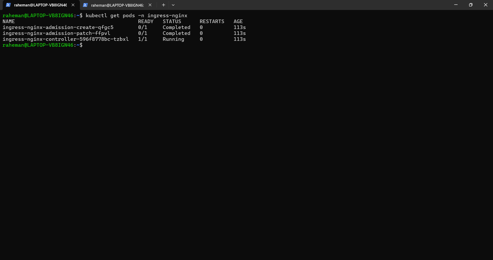

---

### 🟢 Application Pods Running


---

### 🟢 Services Created
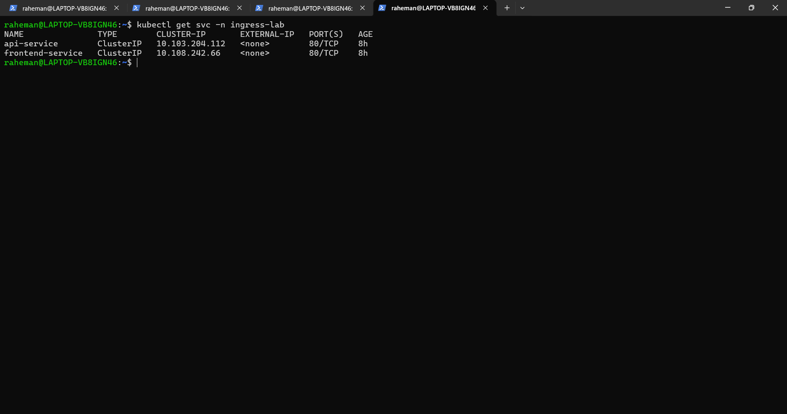

---

### 🟢 Ingress Resource Created
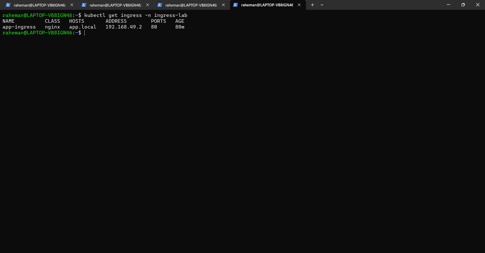

---

### 🟢 Ingress Routing Rules
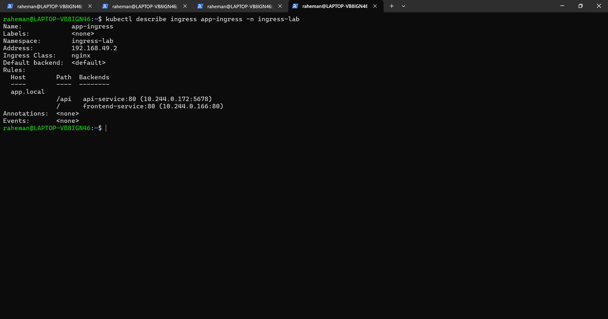

---

### 🟢 Internal Service Testing

#### Frontend Service
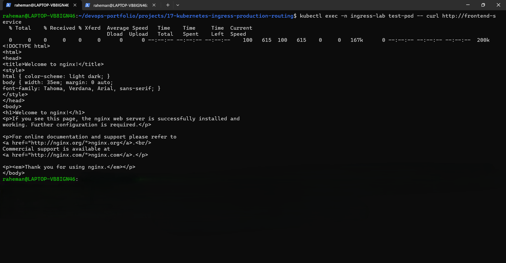

#### API Service
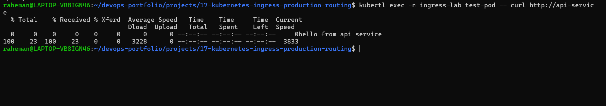

#### API Detailed Response
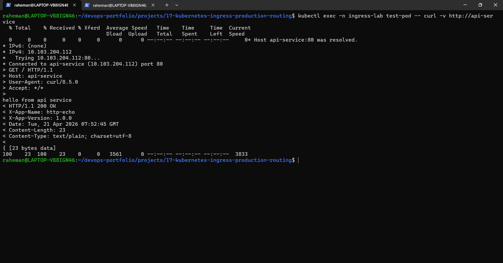

---

### 🟢 Ingress Controller URL
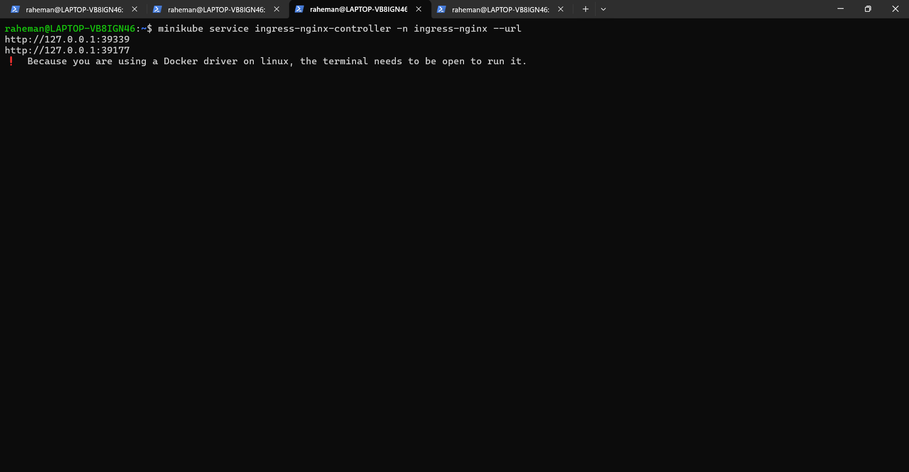

---

### 🟢 Final Routing via Ingress

#### Frontend Route (/)
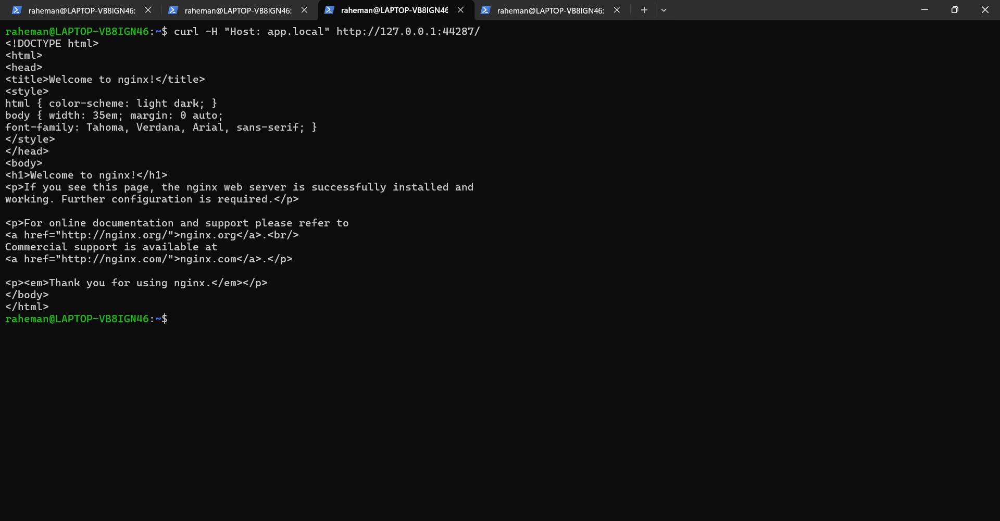

#### API Route (/api)
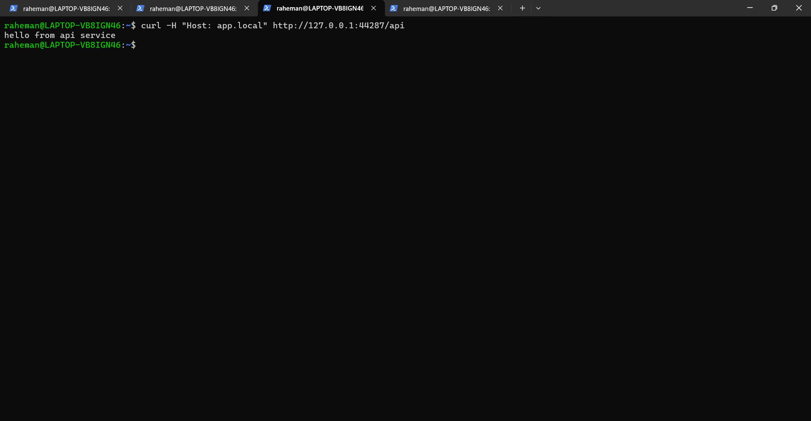

---

### 🔴 Debugging (502 Bad Gateway)
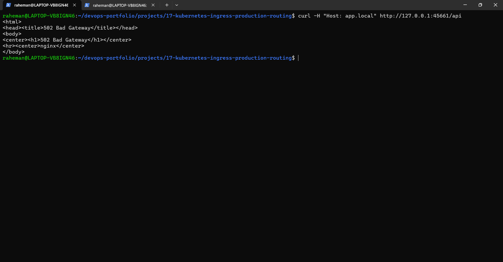

---

## Real-World Debugging (502 Bad Gateway)
### Issue
- Ingress returned **502 Bad Gateway**
- Backend not reachable

### Root Cause
- Service `targetPort` mismatch with container port

### Fix
- Corrected Service configuration:
```YAML
targetPORT: 5678
```

## Learning
- Ingress depends on Service -> Pod chain
- If any layer breaks -> request fails

## Key Learnings
- How Ingress works as a reverse proxy
- Difference between Service vs Ingress routing
- Debugging real production issues (502 error)
- Importance of correct port mapping 
- Internal vs External traffic flow

---

## Interview Questions

### Q1. What is Ingress in Kubernetes?
Ingress is an API object that manages **external access to services**, typically HTTP/HTTPS.

---

### Q2. How is Ingress different from Service?
- Service -> internal routing
- Ingress -> external routing

---

### Q3. What causes 502 Bad Gateway in Kubernetes?
- Wrong targetPort
- Pod not running 
- Service misconfiguration

---

### Q4. 
Ingress uses **host-based routing**, so we simulate DNS using:
```bash
-H "Host: app.local"
```

---

### Q5. What is Ingress Controller?
A component (like NGINX) that actually implements Ingress rules.

---

## Final Outcome
- Successfully routed traffic using Kubernetes Ingress
- Implemented production-style routing (`/` and `/api`)
- Debugged and resolved real-world error (`502`)

---

Author
**Abdul Raheman**
DevOps | Cloud | AWS | Kubernetes

---


