# Helm Kubernetes Package Management

## Overview

This project demonstrates how to use **Helm** as a package manager for Kubernetes applications.

This project covers:

- Installing and verifying Helm
- Creating a Helm chart
- Deploying a release to Kubernetes
- Upgrading the release with modified values
- Scaling with `values.yaml`
- Exposing the application with `NodePort`
- Maintaining separate `dev` and `prod` values files
- Deploying multiple releases from the same chart
- Using runtime overrides with `--set`
- Inspecting rendered templates and deployed manifests
- Understanding rollback and release history

This project was built on a local Kubernetes environment using **Minikube** and is designed as a foundation for later use in **AWS EKS** and **Azure AKS**.

---

## Tools Used

- Helm
- Kubernetes
- Minikube
- kubectl
- NGINX
- curl

---

## Project Structure

```text
18-helm-kubernetes-package-management/
├── charts/
│   └── my-nginx-app/
│       ├── Chart.yaml
│       ├── values.yaml
│       ├── values-dev.yaml
│       ├── values-prod.yaml
│       └── templates/
├── docs/
├── outputs/
├── screenshots/
└── README.md
```

---

## Key Concepts Learned

### 1. Helm Chart
A Helm chart is a packaged Kubernetes application.

### 2. Helm Release
A release is a deployed instance of a chart.

### 3. values.yaml
`values.yaml` stores configurable values used by chart templates.

### 4. Multi-Environment Deployment
The same chart can be deployed multiple times using different values files such as:
- `values-dev.yaml`
- `values-prod.yaml`

### 5. Runtime Overrides
Helm values can also be overridden during deployment using flags like:
```bash
helm upgrade my-nginx-dev ./charts/my-nginx-app -n helm-lab --set replicaCount=2
```
---

## Helm Workflow Practiced

### Install Helm Chart
```bash
helm install my-nginx-release ./charts/my-nginx-app -n helm-lab
```

### Upgrade Existing Release
```bash
helm upgrade my-nginx-release ./charts/my-nginx-app -n helm-lab
```

### View Release History
```bash
helm history my-nginx-release -n helm-lab
```

### Roll Back Release
```bash
helm rollback my-nginx-release 1 -n helm-lab
```

### Render Templates Locally
```bash
helm template my-nginx-release ./charts/my-nginx-app -n helm-lab
```

### Inspect Applied Values
```bash
helm get values my-nginx-dev -n helm-lab
```

### Inspect Deployed Manifest
```bash
helm get manifest my-nginx-dev -n helm-lab
```

---

## Environment-Specific Configuration

### Development
`values-dev.yaml` was used to deploy a lighter development release with fewer replicas.

### Production
`values-prod.yaml` was used to deploy a production-style release with more replicas and stronger resource settings.

This demonstrated how a **single chart** can support multiple environments cleanly.

---

## Screenshots

### Helm Setup & Chart Creation

#### Helm Version
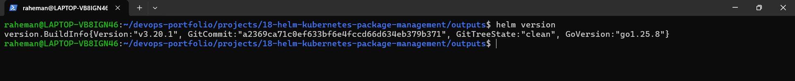

#### Chart Structure
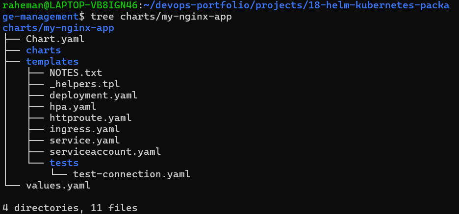

#### Initial Helm Release
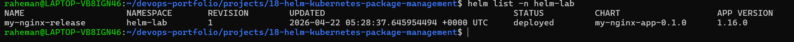

#### Kubernetes Resources Created
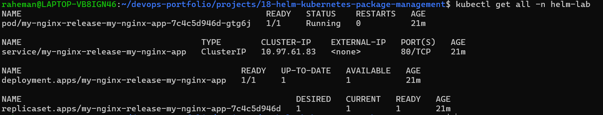

---

### Helm Upgrade & Scaling

#### Helm Upgrade Success
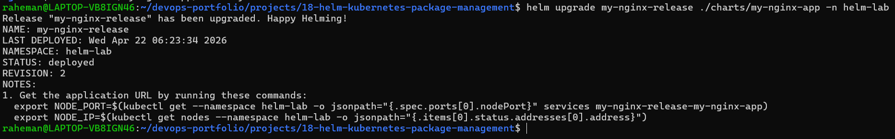

#### Release Revision
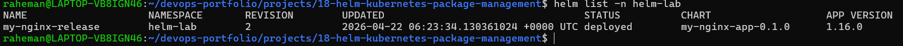

#### Scaled Pods
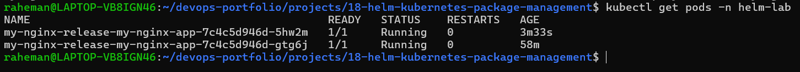

#### NodePort Service
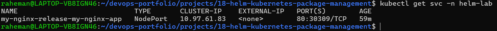

#### Application Access
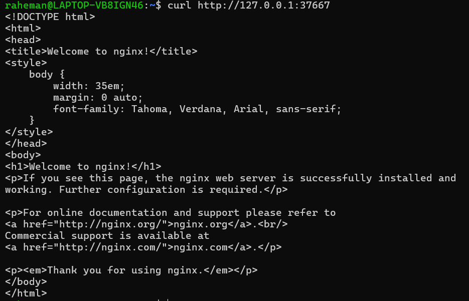

#### Helm History
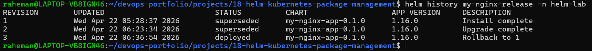

#### Helm Rollback
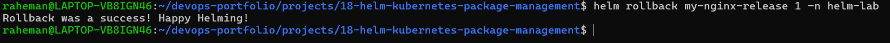

---

### Multi-Environment Deployment (Dev / Prod)

#### Dev Values
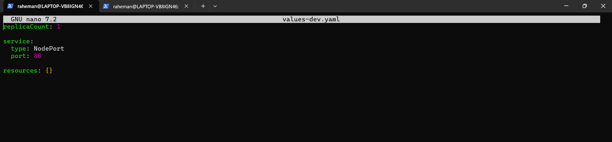

#### Prod Values
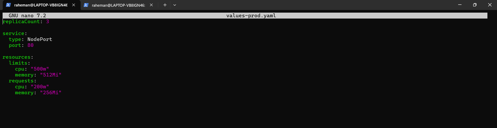

#### Multiple Releases
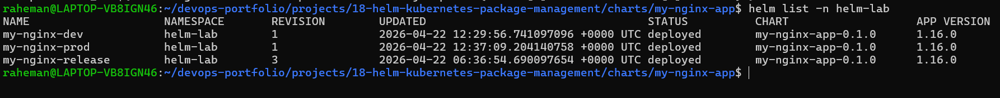

#### Pods Across Environments
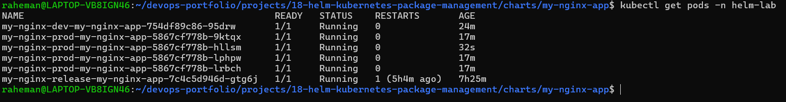

#### Services Across Environments
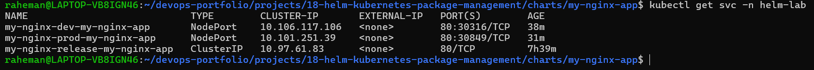

#### Dev Release Access
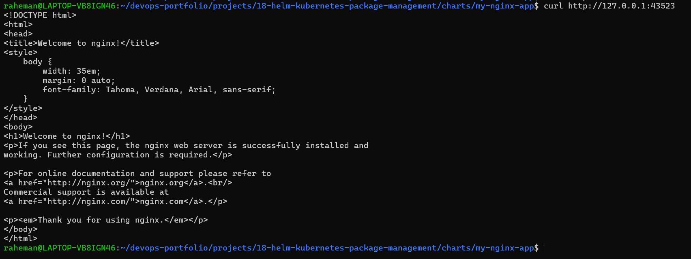

#### Prod Release Access
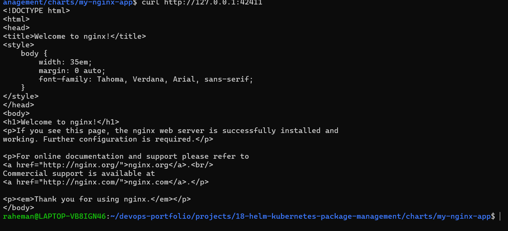

---

### Helm Templating & Runtime Overrides

#### Template Output (Part 1)


#### Template Output (Part 2)


#### Runtime Override (--set)
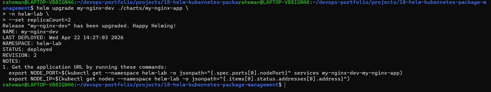

#### Applied Values
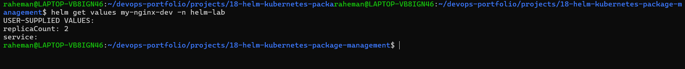

#### Manifest Output (Part 1)


#### Manifest Output (Part 2)


---

## Why This Project Matters
In real DevOps environments, teams do not manually manage separate YAML files for every environment.

Helm makes deployments:
- Reusable
- Scalable
- Environment-aware
- Easier to upgrade
- Easier to roll back

This project shows how Helm can be used as the deployment layer between source code / CI-CD pipelines and Kubernetes clusters.

---

## Cloud Connection
This project was completed locally on Minikube, but the same Helm workflow is directly applicable to managed cloud Kubernetes platforms such as:
- AWS EKS
- Azure AKS

Typical production workflow:
```bash
GitHub -> Jenkins / CI pipeline -> Helm upgrade -> Kubernetes Cluster
```
That is why Helm is a key skill for cloud-native DevOps roles.

---

## Interview Questions
### Basic
1. What is Helm?
2. What is a Helm chart?
3. What is a Helm release?
4. What is `values.yaml` used for?

### Intermediate
5. What is the difference between `helm install` and `helm upgrade`?
6. Why do teams use separate values files for dev and prod?
7. What does `helm template` do?
8. What is the purpose of `helm history` and `helm rollback`?

### Advanced
9.  How would you use Helm in a CI/CD pipeline?
10. How does Helm help when deploying to AWS EKS?
11. What is the difference between overriding values in a file and using `--set`?
12. How would you debug a broken Helm deployment?

## Final Outcome

By completing this project, I learned how to:

- package Kubernetes applications with Helm
- deploy and manage releases
- scale and expose applications using chart values
- support multiple environments from a single chart
- inspect template output and deployed manifests
- apply runtime overrides
- prepare Helm workflows for future cloud deployments on EKS and AKS
