# Project 19 - Helm CI/CD Pipeline

## Overview
This project demonstrates a **complete end-to-to CI/CD pipeline** using:
- Docker (build & containerization)
- Jenkins (automation pipeline)
- Kubernetes (Minikube deployment)
- Helm (application packaging & upgrades)

The pipeline automatically:
1. Builds a Docker image
2. Pushes it to DockerHub
3. Deploys/updates the application in Kubernetes using Helm

---

## Project Structure
```
19-helm-cicd/
├── app/
│   ├── Dockerfile
│   └── html/index.html
├── helm/
│   └── app/
│       ├── Chart.yaml
│       ├── values.yaml
│       └── templates/
├── jenkins/
│   └── Jenkinsfile
└── screenshots/
```

---

## Tech Stack

### Tools & Purpose
- Docker : Build container image
- Jenkins : CI/CD Automation
- Kubernetes : Container orchestration
- Helm : Kubernetes package management
- DockerHub : Image registry

---

## CI/CD Pipeline Flow
```
Code → Jenkins → Docker Build → DockerHub Push → Helm Deploy → Kubernetes
```

### Pipeline Stages:
- Checkout Source Code
- Build Docker Image
- Push Image to DockerHub
- Deploy to Kubernetes using Helm

---

## Key Concepts Implemented
- Helm-based deployments
- Dynamic image tagging (`build-${BUILD_NUMBER}`)
- CI/CD automation with Jenkins
- Kubernetes rolling updates via Helm 
- Debugging real-world issues:
  - ImagePullBackOff
  - Kubernetes connection issues
  - Jenkins permission errors

---

## How to Run

### 1. Build Docker Image
```bash
cd app
docker build -t helm-cicd-app:v1 .
```
---
### 2. Deploy using Helm
```bash
cd helm
helm upgrade --install helm-cicd ./app -n helm-lab
```
---
### 3. Verify Deployment
```bash
kubectl get pods -n helm-lab
helm list -n helm-lab
```
---
### 4. Access Application
```bash
minikube service helm-cicd-app -n helm-lab --url
```
OR
```bash
curl http://localhost:<NodePort>
```
---

## Screenshots

### Project Setup

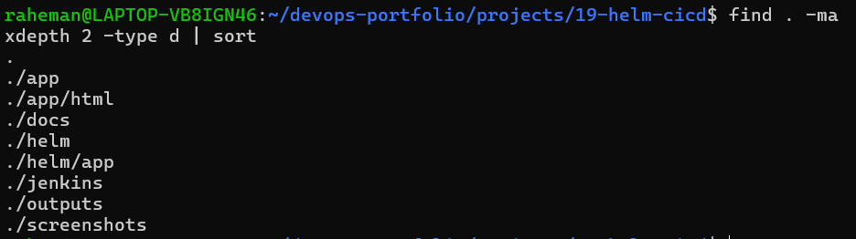
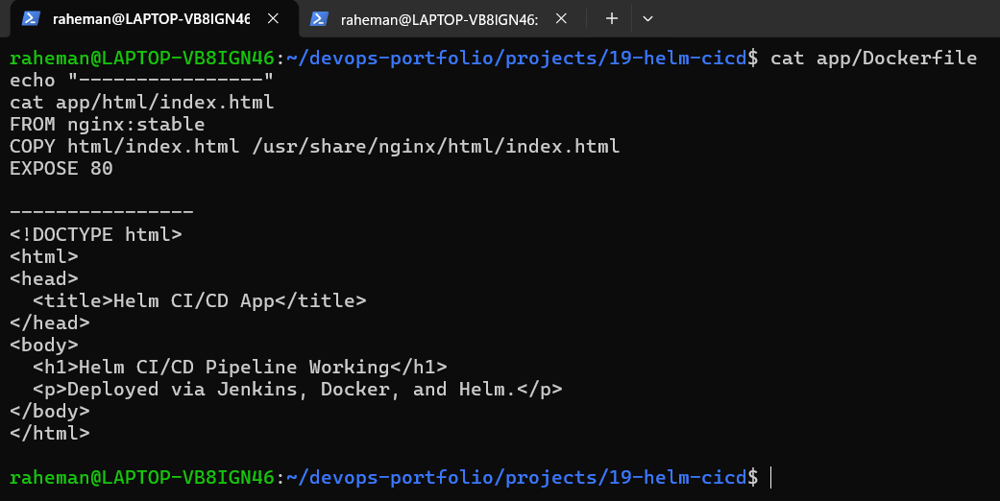

---

### Docker Build & Local Test

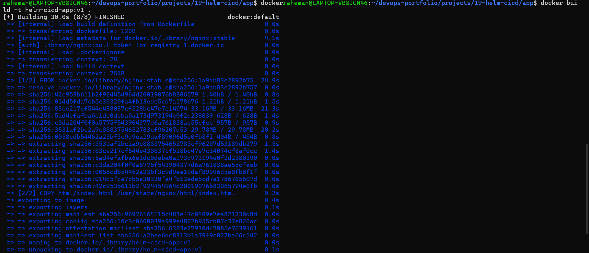
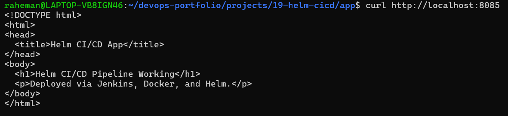

---

### Helm Configuration & Deployment

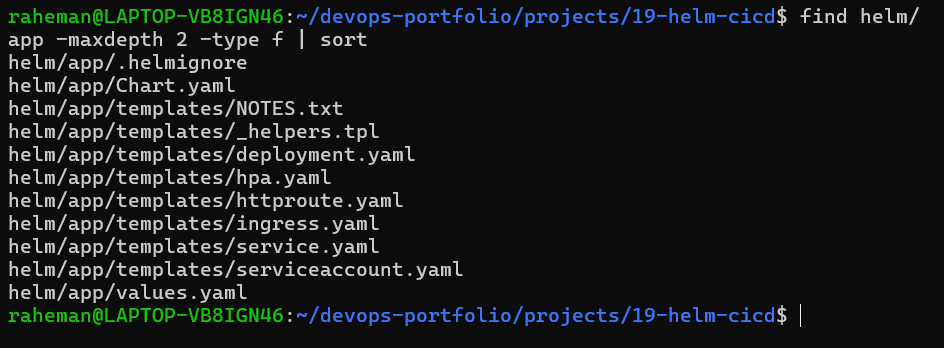
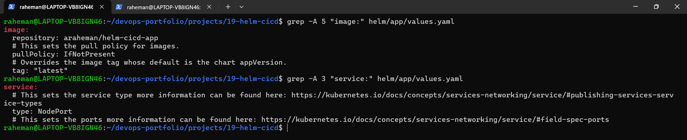
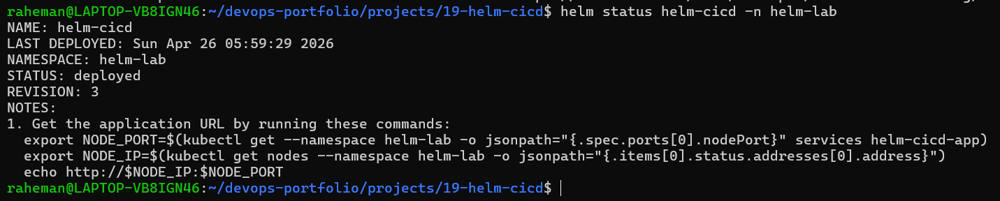

---

### Kubernetes Resources

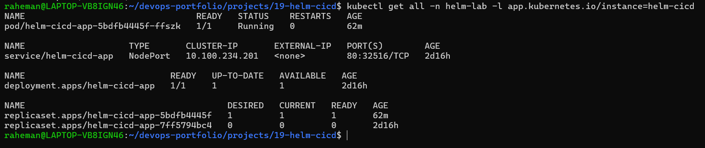
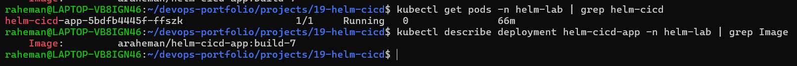

---

### Jenkins CI/CD Pipeline

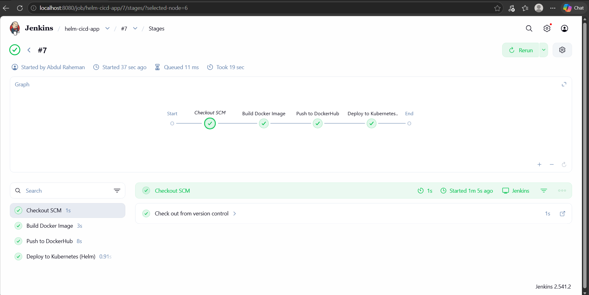

---

### Helm Upgrade via Jenkins

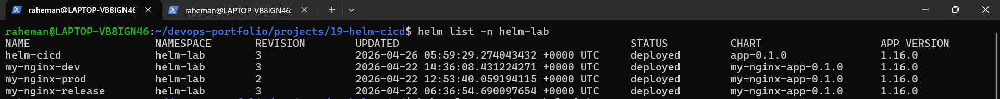
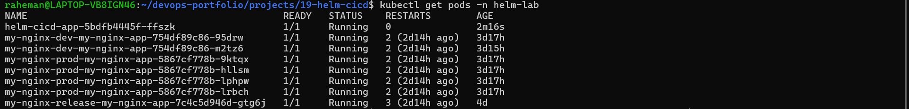
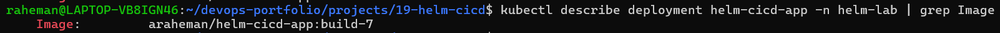

---

### Final Application Output

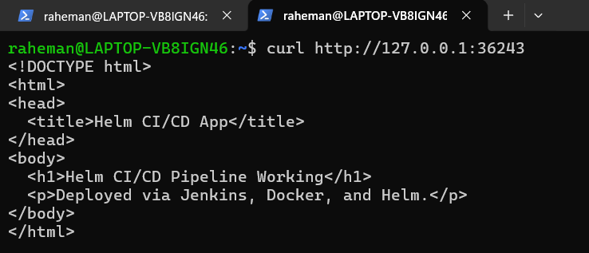

---

## Key Achievement
- Fully automated CI/CD pipeline using Helm
- Production-style deployment workflow
- Real-world debugging handled successfully
- Clean project structure for portfolio

---

## What's Next
- Helm + AWS EKS deployment
- GitOps with ArgoCD
- Monitoring with Prometheus & Grafana

---

## Author 

**Abdul Raheman**

DevOps | Cloud | CI/CD | Kubernetes

---

**If you found this useful, consider giving a star!**

