# Project 20 - AWS ECR + EKS Deployment with Helm

## Overview
This project demonstrates deploying a containerized application to **AWS Kubernetes (EKS)** using a production-style workflow. 

The pipeline includes:
- Building Docker image
- Pushing image to **Amazon ECR (private registry)**
- Deploying application on **Amazon EKS**
- Managing deployment using **Helm** 
- Exposing application using **AWS LoadBalancer**

---

## Project Structure
```
20-aws-eks/
├── app/
│   ├── Dockerfile
│   └── html/index.html
├── helm/
│   └── app/
│       ├── Chart.yaml
│       ├── values.yaml
│       └── templates/
├── docs/
├── outputs/
└── screenshots/
```

---

## Tech Stack
``` 
| Tool    | Purpose                         |
| ------- | ------------------------------- |
| Docker  | Containerization                |
| AWS ECR | Private image registry          |
| AWS EKS | Managed Kubernetes              |
| Helm    | Deployment & release management |
| kubectl | Kubernetes CLI                  |
| eksctl  | EKS cluster provisioning        |
```

---

## Architecture Flow
```
Local App → Docker → ECR → EKS → Helm → LoadBalancer → Public Access
```

---

## Implementation Steps

### 1. AWS Authentication
```bash
aws configure
aws sts get-caller-identity
```
---
### 2. Create ECR Repository
```bash
aws ecr create-repository \
--repository-name helm-cicd-app \
--region ap-south-1
```
---
### 3. Build & Push Image to ECR
```bash
docker build -t helm-cicd-app:eks-v1 .

aws ecr get-login-password --region ap-south-1 \
| docker login --username AWS --password-stdin <ACCOUNT_ID>.dkr.ecr.ap-south-1.amazonaws.com

docker tag helm-cicd-app:eks-v1 \
<ACCOUNT_ID>.dkr.ecr.ap-south-1.amazonaws.com/helm-cicd-app:eks-v1

docker push <ACCOUNT_ID>.dkr.ecr.ap-south-1.amazonaws.com/helm-cicd-app:eks-v1
```
---
### 4. Create EKS Cluster
```bash
eksctl create cluster \
--name helm-cicd-cluster \
--region ap-south-1 \
--node-type t3.small \
--nodes 1 \
--managed
```
---
### 5. Deploy using Helm
```bash
helm install helm-cicd-eks ./helm/app -n default
```
Override image:
```bash
helm upgrade helm-cicd-eks ./helm/app \
-n default \
--set image.repository=<ACCOUNT_ID>.dkr.ecr.ap-south-1.amazonaws.com/helm-cicd-app \
--set image.tag=eks-v1
---
### 6. Expose Application
```bash
kubectl patch svc helm-cicd-eks-app \
-p '{"spec":{"type":"LoadBalancer"}}'
```
---
### 7. Access Application
```bash
kubectl get svc
curl http://<ELB-DNS>
```
---

## Key Learnings
- Difference between **DockerHub vs ECR**
- Importance of **IAM permissions for ECR access**
- Node capacity limits in Kubernetes
- Difference between:
   - NodePort ❌
   - LoadBalancer ✅ (AWS standard)
- Helm value override vs static configuration
- Debugging: 
   - ImagePullBackOff
   - Pod Pending
   - LoadBalancer not responding

---

## Troubleshooting Highlights

### ImagePullBackOff

Cause:
- Helm using DockerHub image

Fix:
```bash
helm upgrade --set image.repository=<ECR_URL>
```
---
### Pod Pending (Too Many Pods)

Cause:
- Node capacity (t3.micro)

Fix:
- Use t3.small
---
### LoadBalancer Empty Response

Cause:
- Pod not running → no endpoints

Fix:
```bash
kubectl get pods
kubectl get endpoints
```
---
### NodePort not accessible

Cause:
- AWS Security Group restrictions

Fix:
- Use LoadBalancer instead
---

## Screenshots

### 🚀 Final Application Output
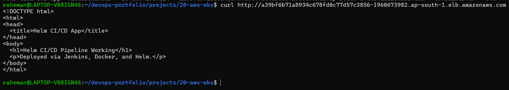

---

### ☁️ EKS Cluster Setup

#### Cluster Creation (eksctl)
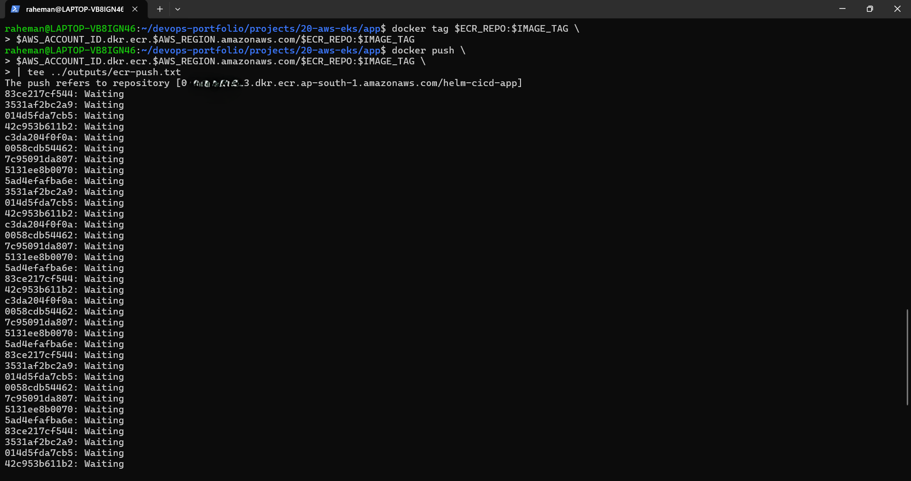
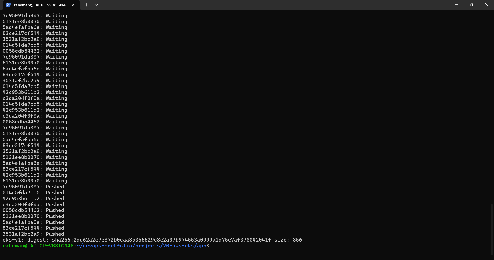

#### Update kubeconfig & Connect
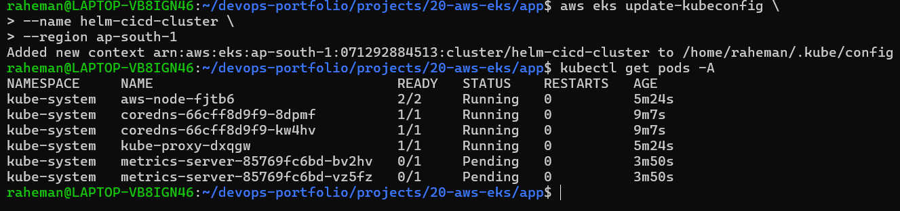

#### Verify Nodes
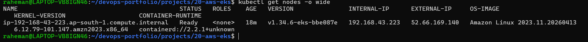
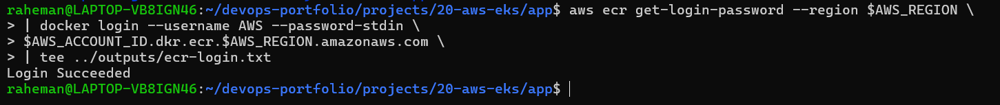

#### System Pods Running
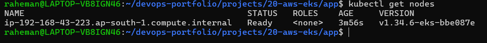

---

### 📦 ECR (Elastic Container Registry)

#### Repository Created
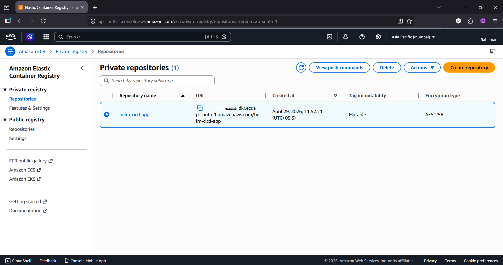

#### Login to ECR
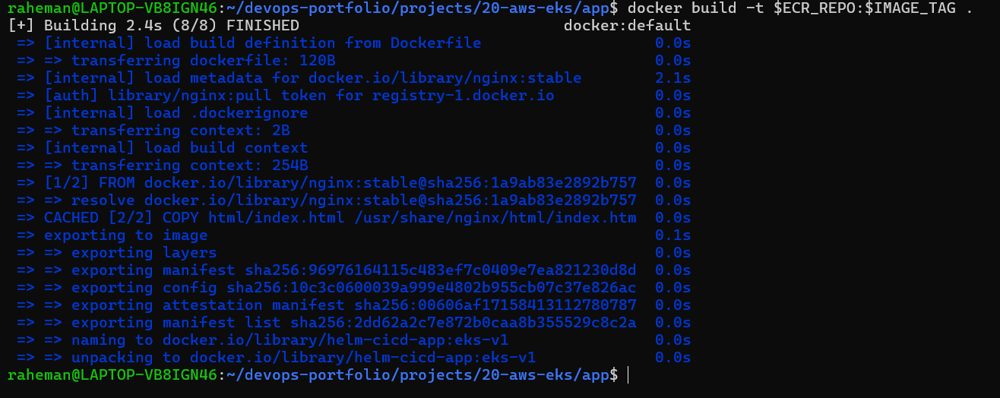

---

### 🐳 Docker Build & Push

#### Build Docker Image
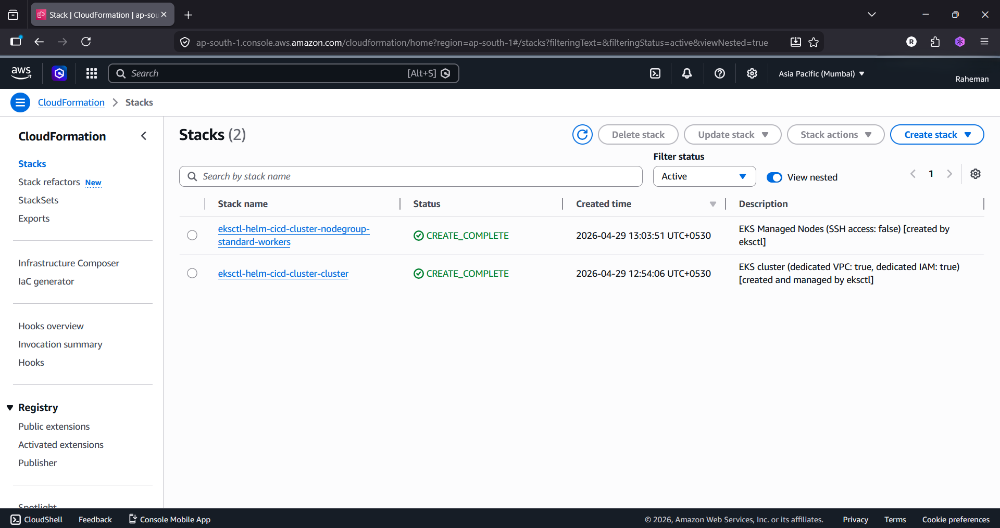

#### Push to ECR
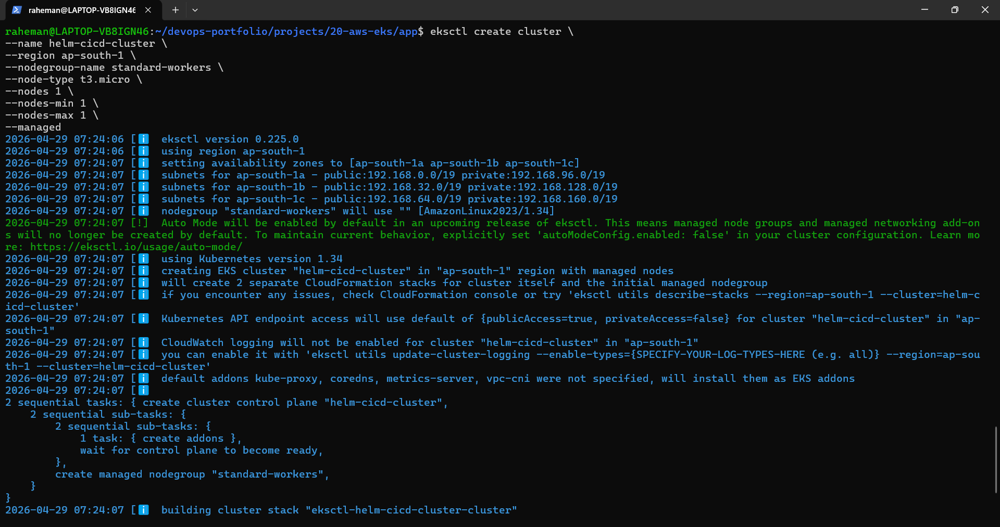
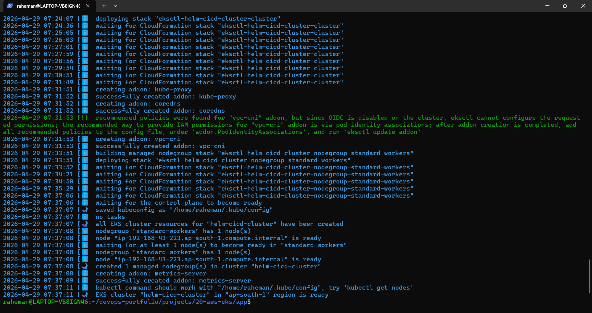

---

### ⚙️ Helm Deployment

#### Install Helm Release
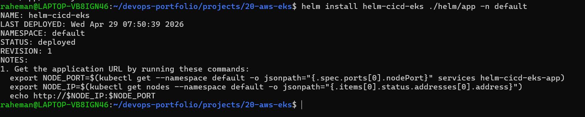

---

### 🐞 Troubleshooting & Debugging

#### Pod Pending Issue
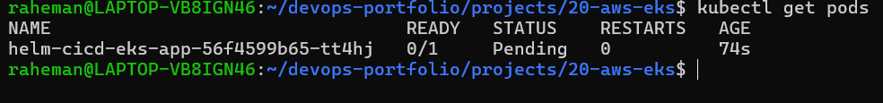

#### Initial Service (NodePort)
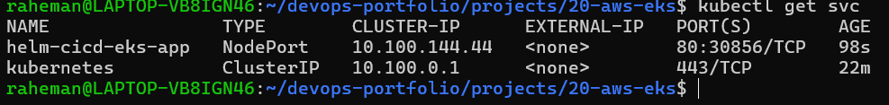

---

## Cost Optimization
- Used minimal cluster configuration
- Deleted cluster immediately after testing:
```bash
eksctl delete cluster --name helm-cicd-cluster --region ap-south-1
```
---

## Key Achievement
✅ Successfully deployed application to AWS Kubernetes
✅ Used private container registry (ECR)
✅ Implemented Helm-based deployment
✅ Debugged real production issues
✅ Managed cloud resources efficiently

---

## Author

**Abdul Raheman**

DevOps | Cloud | Kubernetes | CI/CD

---


