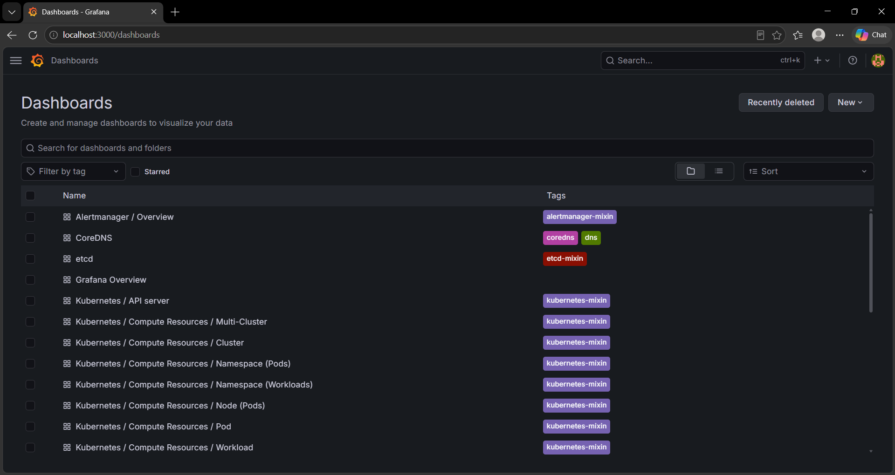
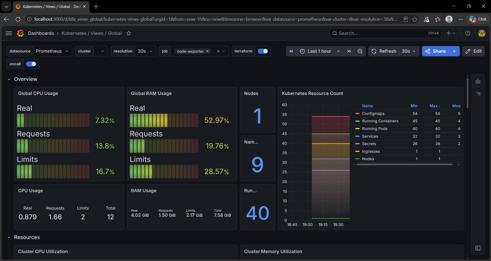
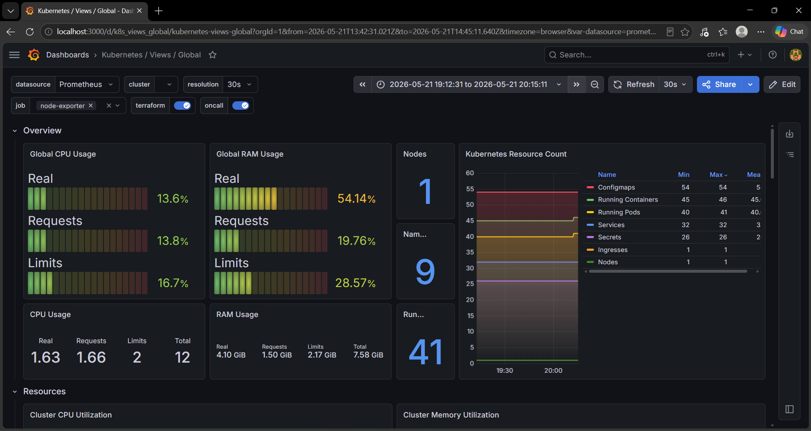
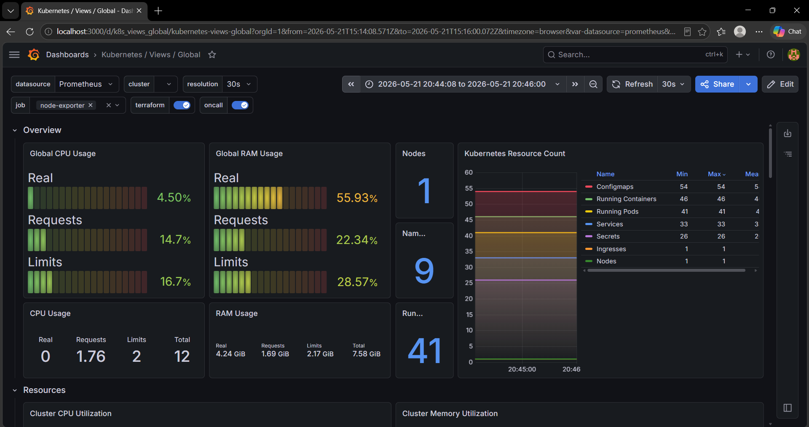
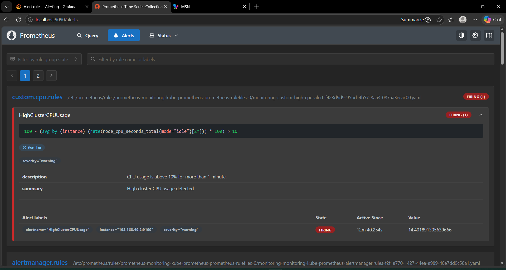
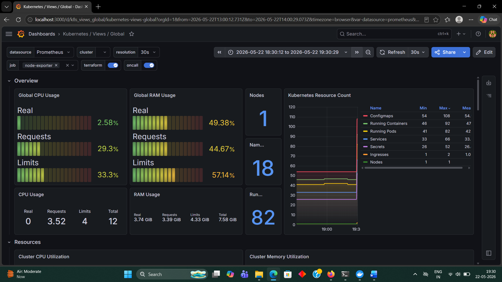

# Project 21 - Kubernetes Monitoring Stack using Prometheus + Grafana

## Project Overview

In modern production environments, monitoring is one of the most critical responsibilities of a DevOps Engineer. Without observability, teams cannot proactively identify CPU spikes, memory leaks, pod crashes, or infrastructure failures.
This project demonstrates how to implement a **production-style Kubernetes monitoring stack** using **prometheus, Grafana, and Alertmanager** deployed via **Helm** in Kubernetes.
This project also includes a **real-world incident simulation** where a CPU-intensive pod was intentionally deployed to generate abnormal resource usage, monitored through Grafana dashboards, detected using Prometheus alerts rules, and remediated as part of an incident response workflow.
This project reflects how **3-4 year experienced DevOps/SRE engineers monitor, detect, investigate, and remediate production issues.**

---

# Production Use Case

### Problem Statement

Imagine a production application suddenly becomes slow and users begin reporting latency issues.

Without monitoring:

❌ Engineers are blind to infrastructure issues  
❌ CPU spikes remain unnoticed  
❌ Root cause analysis becomes difficult  
❌ Teams react only after customers complain

With monitoring:

✅ Real-time visibility into Kubernetes cluster health  
✅ CPU and memory monitoring  
✅ Pod-level resource visibility  
✅ Automatic alerting for abnormal behavior  
✅ Faster incident detection and remediation

---

# Architecture 

```text
Kubernetes Cluster
        │
        │ Metrics Collection
        ▼
Prometheus
        │
        │ Query Metrics
        ▼
Grafana Dashboard
        │
        ├── CPU Monitoring
        ├── Memory Monitoring
        ├── Pod Monitoring
        └── Cluster Health

        ▼
Alertmanager
        │
        ▼
Alert Triggering
```

---

# Tech Stack

- **Kubernetes (Minikube)**
- **Prometheus**
- **Grafana**
- **Alertmanager**
- **Helm**
- **Metrics Server**
- **BusyBox (CPU Simulation)**

---

# Project Folder Structure

```text
21-kubernetes-monitoring-stack/
│
├── manifests/
│   └── high-cpu-alert-rule.yaml
│
├── screenshots/
│   ├── 01-monitoring-pods-running.png
│   ├── 02-grafana-login-success.png
│   ├── 03-working-grafana-dashboard.png
│   ├── 04-cpu-spike-monitoring.png
│   ├── 05-custom-high-cpu-alert-firing.png
│   └── 06-cpu-normal-after-remediation.png
│
├── troubleshooting/
│   └── common-errors.md
│
├── docs/
│   └── incident-report.md
│
└── README.md
```

---

# Step 1 - Add Prometheus Helm Repository

```bash
helm repo add prometheus-community https://prometheus-community.github.io/helm-charts
```

### What this does 

Adds the official Prometheus Helm repository.

### Why we use it 

Helm charts simplify the deployment of production-grade Kubernetes applications without writing hundreds of YAML files manually.

---

# Step 2 - Update Helm Repository 

```bash
helm repo update
```

### What this does

Fetches the latest chart metadata.

---

# Step 3 - Create Monitoring Namespace 
```bash
kubectl create namespace monitoring
```

### Why we use it 

Namespaces help isolate workloads.

Production teams commonly separate workloads using namespaces such as:

```text
monitoring
logging
production
staging
argocd
```

---

# Step 4 - Install Monitoring Stack

```bash
helm install monitoring prometheus-community/kube-prometheus-stack \
 --namespace monitoring
```

### Components Installed

- Prometheus
- Grafana
- Alertmanager
- Prometheus Operator
- Node Exporter
- kube-state-metrics

---

# Step 5 - Verify Pods

```bash
kubectl get pods -n monitoring
```

Expected components: 

```text
monitoring-grafana
monitoring-kube-prometheus-operator
monitoring-kube-state-metrics
prometheus-monitoring-kube-prometheus-prometheus
alertmanager-monitoring-kube-prometheus-alertmanager
```

### Screenshot

### 1. Grafana Access Verified



---

# Step 6 - Access Grafana

Port forward Grafana service:

```bash
kubectl port-forward svc/monitoring-grafana 3000:80 -n monitoring
```

Open:

```text
http://localhost:3000
```

### Retrieve Admin Password

```bash
kubectl get secret monitoring-grafana -n monitoring -o jsonpath="{.data.admin-password}" | base64 --decode && echo
```

Username:

```text
admin
```

### Screenshot

### 2. Kubernetes Dashboard Imported in Grafana



---

# Step 7 - Configure Grafana Dashboard

Imported Kubernetes monitoring dashboard using Dashboard ID:

```text
15757
```

### Why?

Provides:

- Cluster CPU Monitoring
- Memory Monitoring
- Pod Health
- Node Metrics
- Resource Utilization

### Screenshot

### 3. CPU Spike Observed in Grafana



---

# Step 8 - Install Metrics Server

To enable:

```bash
kubectl top pods
```

Metrics Server was installed.

Enable addon:

```bash
minikube addons enable metrics-server
```

Verify:

```bash
kubectl top pods
```

---

# Step 9 - Production Incident Simulation

## Scenario

A bad deployment caused excessive CPU consumption.

To simulate this production issue:

```bash
kubectl run cpu-stress \
 --image=busybox \
 --restart=Never \
 -- /bin/sh -c "while true; do yes > /dev/null; done"
```

### What this does 

Creates a pod intentionally consuming CPU.

### Purpose

To simulate:

- Runaway processes
- Bad deployments
- CPU spikes
- Infrastructure stress

### Monitoring Result

CPU usage increased in Grafana dashboard.

### Screenshot

### 4. CPU Normal After Remediation



---

# Step 10 - Investigating Resource Usage

Check pod resources consumption:

```bash
kubectl top pods
```

Result:

```text
cpu-stress → ~999m CPU
```

This confirmed the problematic workload.

---

# Step 11 - Create Custom Prometheus Alert Rule

Created custom alert rule:

```yaml
apiVersion: monitoring.coreos.com/v1
kind: PrometheusRule
metadata:
  name: custom-high-cpu-alert
  namespace: monitoring
  labels:
    release: monitoring
spec:
  groups:
    - name: custom.cpu.rules
      rules:
        - alert: HighClusterCPUUsage
          expr: 100 - (avg by(instance) (rate(node_cpu_seconds_total{mode="idle"}[2m])) * 100) > 10
          for: 1m
          labels:
            severity: warning
          annotations:
            summary: "High cluster CPU usage detected"
            description: "CPU usage is above 10% for more than 1 minute."
```

Apply:

```bash
kubectl apply -f manifests/high-cpu-alert-rule.yaml
```

---

# Step 12 - Trigger Alert

Recreated CPU load:

```bash
kubectl run cpu-stress \
 --image=busybox \
 --restart=Never \
 -- /bin/sh -c "while true; do yes > /dev/null; done"
```

Prometheus Alert Status:

```text
Pending → Firing
```

### Screenshot

### 5. Custom Prometheus Alert Firing



---

# Step 13 - Incident Remediation

Removed problematic pod:

```bash
kubectl delete pod cpu-stress
```

### Outcome

- CPU returned to normal\
- Alert resolved
- Cluster stabilized

### Screenshot 

### 6. Final Cluster Monitoring View



---

# Troubleshooting

### Issue 1 - Grafana Login Failed

### Cause

Default password was incorrect.

### Fix

Retrieve password:

```bash
kubectl get secret monitoring-grafana -n monitoring -o jsonpath="{.data.admin-password}" | base64 --decode && echo
```

---

### Issue 2 - Dashboard Showing N/A

### Cause

Old dashboard version mismatch.

### Fix

Used Dashboard ID:

```text
15757
```

instead of older dashboards.

---

### Issue 3 - Metrics API Not Available

### Cause

Metrics Server missing.

### Fix

```bash
minikube addons enable metrics-server
```

---

# Production Incident Timeline

```text
Monitoring Enabled
        ↓
CPU Spike Simulated
        ↓
Grafana Detected Spike
        ↓
kubectl top pods Investigation
        ↓
Prometheus Alert Fired
        ↓
Bad Pod Deleted
        ↓
CPU Normalized
        ↓
Incident Resolved
```

---

# Interview Questions 

## Beginner Level

### 1. What is Prometheus?

Prometheus is open-source monitoring and alerting tool used to collect metrics from infrastructure and applications.

---

### 2. Why do we use Grafana?

Grafana helps visualize Prometheus metrics through dashboards.

---

### 3. What is Alertmanager?

Alertmanager handles alerts generated by Prometheus.

---

### 4. Why use Helm for monitoring?

Helm simplifies deployment of complex Kubernetes applications.

---

## Intermediate Level

### 5. Why did `kubectl top pods` fail initially?

Metrics Server was not installed.

---

### 6. Difference between Prometheus and Metrics Server?

**Prometheus** → advanced monitoring + alerting
**Metrics Server** → lightweight metrics for `kubectl top` and autoscaling

---

### 7. Why use `for: 1m` in alert rules?

To avoid false positives caused by temporary CPU spikes.

---

## Advanced Level

### 8. How would you monitor production Kubernetes clusters?

Using:

- Prometheus
- Grafana
- Alertmanager
- Centralized logging
- SLA/SLO monitoring

---

# Key Learning Outcomes

By completing this project, I learned:

- Kubernetes observability fundamentals
- Prometheus monitoring architecture
- Grafana dashboard configuration
- Metrics Server usage
- Real-time CPU monitoring
- Prometheus alert rule creation
- Incident simulation and remediation
- Production-style troubleshooting
- DevOps monitoring mindset

---

**Abdul Raheman**

Cloud & DevOps Engineer

AWS | Docker | Kubernetes | Terraform | Jenkins | Monitoring
