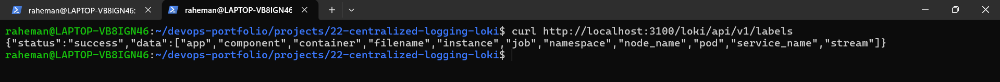
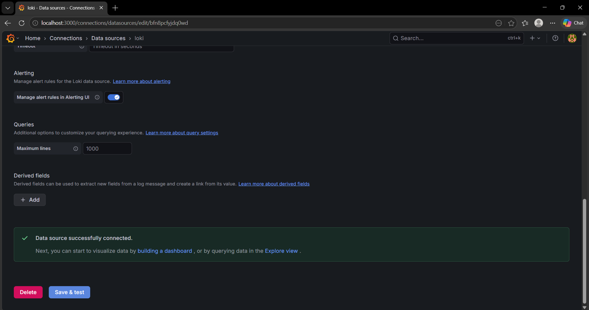
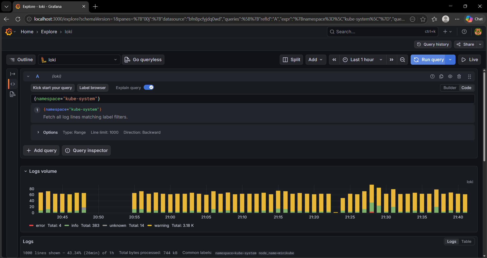
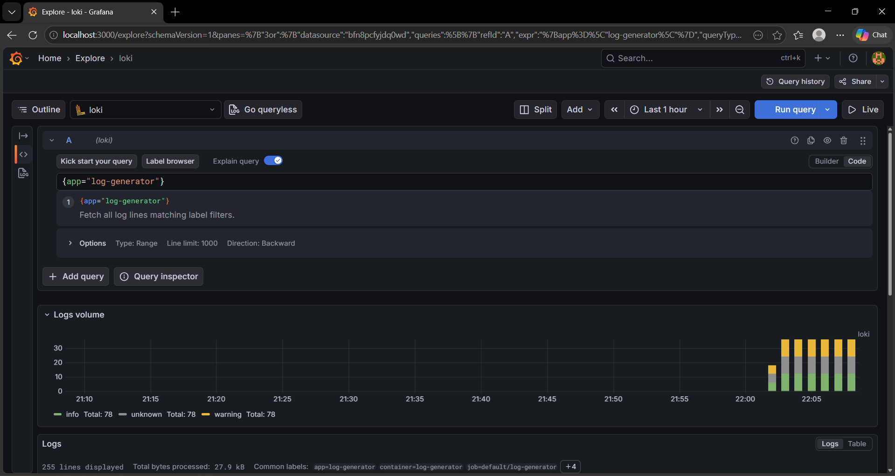
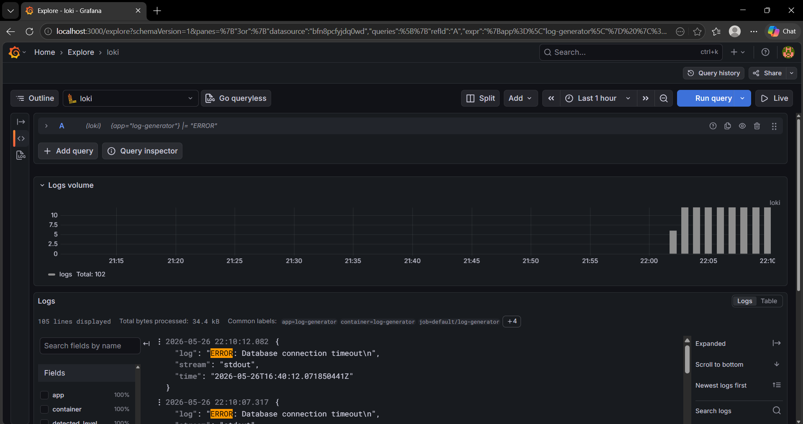
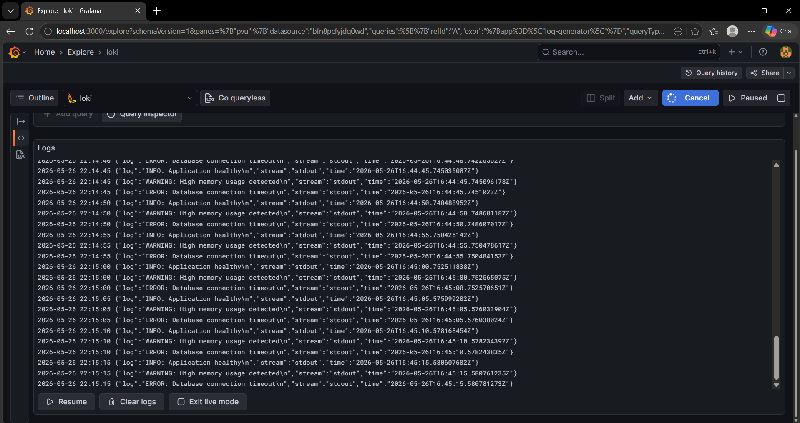

# Project 22 — Centralized Logging with Loki + Promtail + Grafana

## Project Overview

This project demonstrates a **production-style centralized logging system for Kubernetes** using:

- **Loki** → Log aggregation and storage
- **Promtail** → Log collection agent
- **Grafana** → Log visualization and querying
- **Kubernetes (Minikube)** → Container orchestration

The objective of this project is to simulate how **DevOps Engineers and SRE teams investigate production incidents** by collecting, filtering, and analyzing logs from Kubernetes workloads.

Instead of checking logs pod-by-pod using:

```bash
kubectl logs <pod-name>
```

logs are centralized into **Grafana**, enabling:

- Real-time log streaming
- Centralized troubleshooting
- Error filtering
- Namespace-level investigation
- Production incident debugging

---

# Architecture

```text
Kubernetes Pods
       ↓
Promtail (DaemonSet)
       ↓
Loki (Centralized Log Storage)
       ↓
Grafana (Visualization + Querying)
       ↓
Incident Investigation
```

---

#  Tech Stack

| Tool | Purpose |
|------|----------|
| Kubernetes | Container orchestration |
| Minikube | Local Kubernetes cluster |
| Helm | Kubernetes package management |
| Loki | Log aggregation system |
| Promtail | Log collector |
| Grafana | Log visualization |
| LogQL | Query language for logs |

---

# Project Structure

```text
22-centralized-logging-loki/
│── manifests/
│   ├── loki-values.yaml
│   └── log-generator/
│       └── log-generator.yaml
│
│── screenshots/
│   ├── 01-loki-labels-api-working.png
│   ├── 02-grafana-loki-datasource-connected.png
│   ├── 03-grafana-live-cluster-logs.png
│   ├── 04-log-generator-logs-in-grafana.png
│   ├── 05-error-log-filtering-with-logql.png
│   └── 06-centralized-logging-working.png
│
│── docs/
│   └── incident-report.md
│   └── interview-questions.md
│
│── troubleshooting/
│   └── common-errors.md
│
└── README.md
```

---

# Project Setup

## 1. Start Minikube

```bash
minikube start --driver=docker --memory=2560 --cpus=2
```

### Why?

Starts a Kubernetes cluster locally using Docker driver.

---

## 2. Create Namespace

```bash
kubectl create namespace logging
```

### Why?

Separates logging workloads from application workloads.

Production teams isolate services into namespaces.

---

## 3. Add Helm Repository

```bash
helm repo add grafana https://grafana.github.io/helm-charts
helm repo update
```

### Why?

Fetches latest Loki, Promtail, and Grafana Helm charts.

---

## 4. Install Loki

```bash
helm install loki grafana/loki \
 --namespace logging \
 -f manifests/loki-values.yaml
```

### Why?

Deploys Loki as centralized log storage.

---

## 5. Install Promtail

```bash
helm install promtail grafana/promtail \
 --namespace logging \
 --set config.clients[0].url=http://loki-gateway.logging.svc.cluster.local/loki/api/v1/push
```

### Why?

Promtail collects logs from Kubernetes pods and pushes them to Loki.

---

## 6. Install Grafana

```bash
helm install grafana grafana/grafana \
 --namespace logging
```

### Why?

Grafana is used to visualize logs and perform incident debugging.

---

## 7. Get Grafana Password

```bash
kubectl get secret --namespace logging grafana \
-o jsonpath="{.data.admin-password}" | base64 --decode && echo
```

---

## 8. Access Grafana

```bash
kubectl port-forward -n logging svc/grafana 3000:80
```

Open:

```text
http://localhost:3000
```

Login:

```text
Username: admin
Password: <decoded-password>
```

---

# Configure Loki Data Source

Go to:

```text
Connections → Data Source → Add Data Source → Loki
```

Use URL:

```text
http://loki-gateway.logging.svc.cluster.local
```

Click:

```text
Save & Test
```

---

# Log Investigation

## View Kubernetes Logs

Query:

```logql
{namespace="kube-system"}
```

### Purpose 

View logs from Kubernetes system components.

---

## View Application Logs

Query:

```logql
{app="log-generator"}
```

### Purpose

View logs from application workloads.

---

## Filter Error Logs

Query:

```logql
{app="log-generator"} |= "ERROR"
```

### Purpose

Shows only error logs.

This is useful during production incidents.

---

# Screenshots

## Loki Labels API Working



---

## Grafana Loki Data Source Connected



---

## Live Kubernetes Cluster Logs



---

## Application Logs in Grafana



---

## Error Log Filtering using LogQL



---

## Centralized Logging Working



---

# Production Use Cases

### 1. Application Crash Investigation

Instead of:

```bash
kubectl logs
```

Engineers search logs centrally in Grafana.

---

### 2. Error Detection

Filter:

```logql
|= "ERROR"
```

to isolate failures quickly.

---

### 3. Kubernetes Troubleshooting

Investigate:

- kube-system logs
- pod failures
- scheduling issues
- networking problems

---

### 4. Security Monitoring

Track:

- suspicious requests
- failed login attempts
- unusual system behavior

---

# Key Learning Outcomes

After completing this project, I learned:

✅ Centralized logging architecture

✅ Loki + Promtail integration

✅ Grafana log visualization

✅ LogQL query language

✅ Kubernetes log collection

✅ Namespace-based log filtering

✅ Production incident debugging

✅ Error log investigation

---

# Interview Questions

### Q1. Why do companies use centralized logging?

Because checking logs pod-by-pod is inefficient in distributed systems.

Centralized logging helps:

- faster troubleshooting
- incident investigation
- monitoring at scale

---

### Q2. What is Loki?

Loki is a log aggregation system developed by Grafana Labs.

It stores logs efficiently using labels.

---

### Q3. What is Promtail?

Promtail is a log collector that gathers logs from Kubernetes nodes and sends them to Loki.

---

### Q4. What is LogQL?

LogQL is Loki's query language used for searching and filtering logs.

Example:

```logql
{app="nginx"} |= "ERROR"
```

---

### Q5. Why use Loki instead of ELK?

Loki is lightweight and cost-efficient because it indexes metadata (labels) instead of full logs.

ELK provides deeper search capabilities but consumes more resources.

---

# Project Outcome

Successfully built a **production-style centralized logging platform** for Kubernetes using **Loki, Promtail, and Grafana**, enabling real-time log aggregation, filtering, and incident troubleshooting.

# Author

**Abdul Raheman**

Cloud & DevOps Engineer

