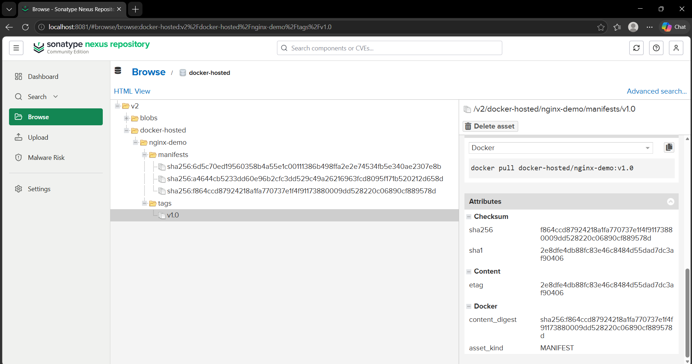
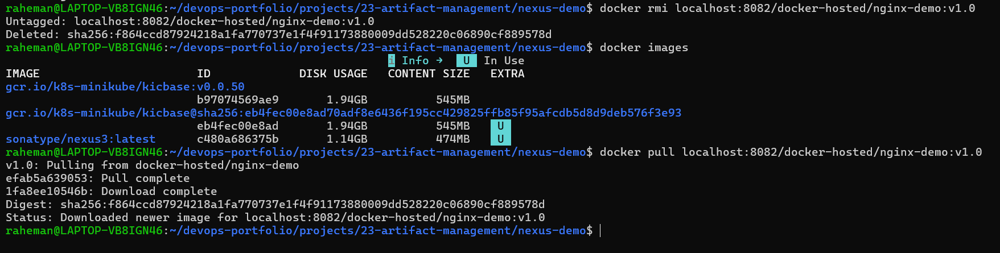
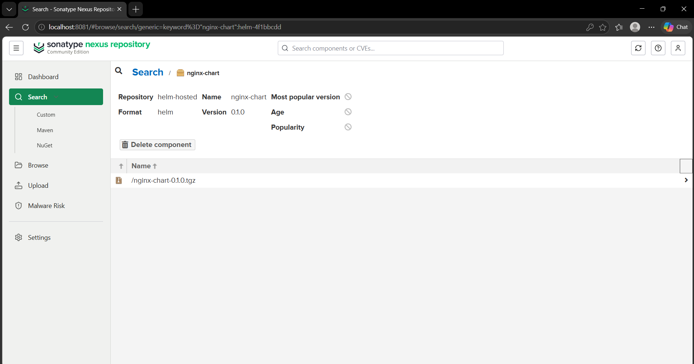
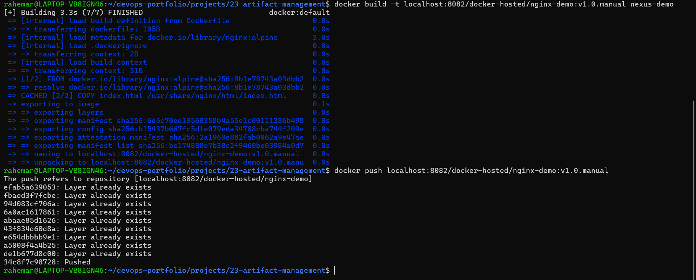

# Project 23 — Artifact Management with Nexus Repository

## Project Overview

This project demonstrates a **production-grade artifact management workflow** using **Sonatype Nexus Repository Manager**.

The objective was to implement a centralized artifact repository for:

- Docker container images
- Helm deployment packages

Instead of directly deploying builds, artifacts are first versioned, stored, and validated inside Nexus, enabling:

- Version control
- Rollback capability
- Immutable deployments
- Centralized package management
- CI/CD integration readiness

---
```text
23-artifact-management/
│── README.md
│
│── screenshots/
│   ├── 01-docker-artifact-pushed-to-nexus.png
│   ├── 02-docker-artifact-pulled-from-nexus.png
│   ├── 03-helm-artifact-uploaded-to-nexus.png
│   └── 04-manual-jenkins-pipeline-simulation.png
│
│── docs/
│   ├── artifact-flow.md
│   └── interview-questions.md
│
│── troubleshooting/
│   └── common-errors.md
│
│── helm/
│   ├── nginx-chart/
│   └── nginx-chart-0.1.0.tgz
│
│── nexus-demo/
│   ├── Dockerfile
│   └── index.html
│
│── jenkins/
│   └── Jenkinsfile
│
│── nexus/
│
└── .gitignore
```
---

## Architecture

```text
GitHub
   ↓
Build Application
   ↓
Docker Image Creation
   ↓
Nexus Repository (docker-hosted)
   ↓
Versioned Artifact Storage
   ↓
Helm Chart Packaging
   ↓
Nexus Repository (helm-hosted)
   ↓
Deployment Ready
```

---

## Tech Stack

- Docker
- Kubernetes
- Helm
- Nexus Repository Manager OSS
- WSL2 (Ubuntu)
- Docker Desktop
- Linux CLI

---

## Project Goals

The following objectives were implemented:

### Docker Artifact Management
- Created Docker hosted repository in Nexus
- Built Docker image artifact
- Version tagged image (`v1.0`)
- Pushed image to Nexus
- Pulled image back from Nexus for validation

### Helm Artifact Management
- Created Helm hosted repository
- Generated Helm chart
- Packaged Helm deployment artifact
- Uploaded chart to Nexus
- Verified chart availability

---

## Repository Setup

### Docker Hosted Repository

Repository Name:

```text
docker-hosted
```

Port:

```text
8082
```

Deployment Policy:

```text
Allow redeploy
```

### Helm Hosted Repository

Repository Name:

```text
helm-hosted
```

Deployment Policy:

```text
Allow redeploy
```

---

## Step 1 — Docker Artifact Creation

Docker image built:

```bash
docker build -t localhost:8082/docker-hosted/nginx-demo:v1.0 .
```

Docker login:

```bash
docker login localhost:8082
```

Push image to Nexus:

```bash
docker push localhost:8082/docker-hosted/nginx-demo:v1.0
```

---

## Step 2 — Artifact Validation

To simulate real production retrieval:

Local image removed:

```bash
docker rmi localhost:8082/docker-hosted/nginx-demo:v1.0
```

Artifact pulled back from Nexus:

```bash
docker pull localhost:8082/docker-hosted/nginx-demo:v1.0
```

This validated:

- Artifact persistence
- Version retrieval
- Rollback readiness

---

## Step 3 — Helm Artifact Packaging

Helm chart generated:

```bash
helm create nginx-chart
```

Packaged chart:

```bash
helm package nginx-chart
```

Generated artifact:

```text
nginx-chart-0.1.0.tgz
```

Uploaded to:

```text
helm-hosted
```

repository in Nexus.

---

## Screenshots

### Docker Artifact Stored in Nexus



---

### Docker Artifact Retrieved from Nexus



---

### Helm Artifact Stored in Nexus



---

### Jenkins Pipeline Simulation



---

## Production Use Case

In enterprise CI/CD environments:

Instead of deploying directly after build:

```text
Build → Deploy
```

Organizations follow:

```text
Build
 ↓
Artifact Repository (Nexus)
 ↓
Validation
 ↓
Deployment
```

This enables:

- Safer deployments
- Version control
- Rollback strategy
- Immutable infrastructure
- Artifact traceability

---

## Key Learning Outcomes

Through this project, I learned:

- Artifact lifecycle management
- Nexus Repository Manager
- Docker image versioning
- Helm package management
- Artifact validation
- Production rollback strategy
- Centralized package storage
- Enterprise CI/CD maturity model

---

## Future Improvements

Planned enhancements:

- Automated Jenkins → Nexus artifact pipeline
- Automated Docker artifact push
- Automated Helm packaging
- CI/CD artifact versioning
- Kubernetes deployment from Nexus
- Security scanning integration

---

## Jenkins Pipeline Simulation

A Jenkins pipeline file was created to automate the Docker artifact lifecycle.

Pipeline path:

```text
jenkins/Jenkinsfile
```

The pipeline is designed to:
- Checkout source code
- Build Docker image
- Tag image using Jenkins build number
- Push Docker image to Nexus

Manual validation was performed using the same commands that Jenkins would execute:

```bash
docker build -t localhost:8082/docker-hosted/nginx-demo:v1.0.manual nexus-demo
docker push localhost:8082/docker-hosted/nginx-demo:v1.0.manual
```

This confirmed that the pipeline logic is valid and Nexus can receive versioned Docker artifacts successfully.

---

## Author

**Abdul Raheman**

Cloud & DevOps Engineer  
AWS | Docker | Kubernetes | Terraform | Jenkins | CI/CD
