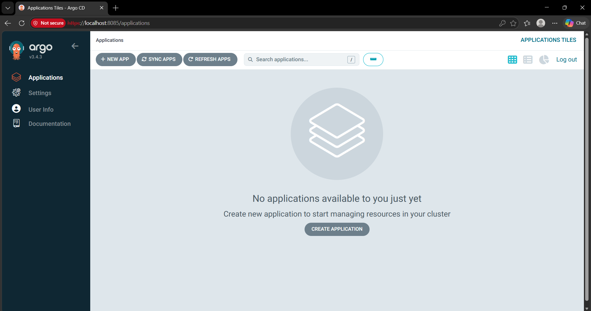
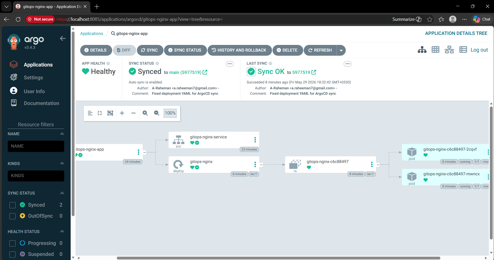
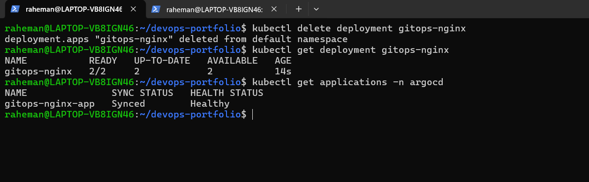
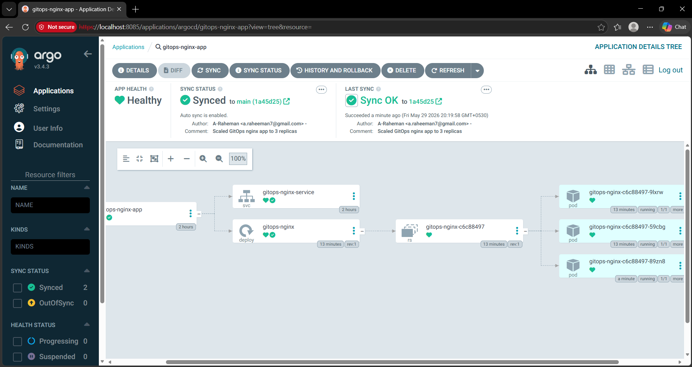
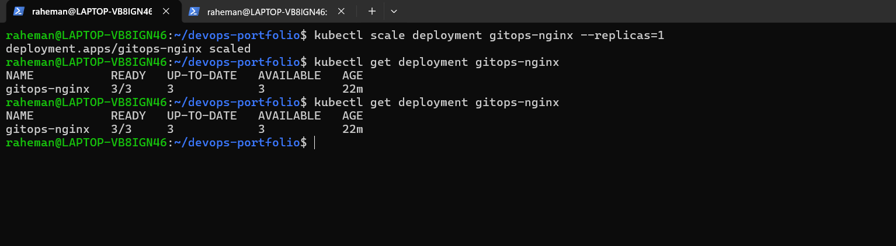
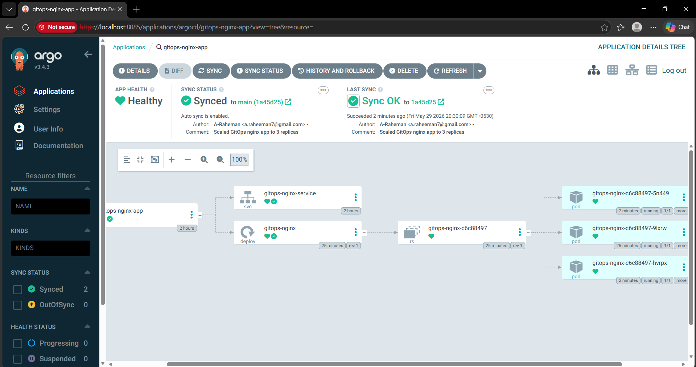

# Project 24 — GitOps Deployment Workflow with ArgoCD

## Project Overview

This project demonstrates a **production-grade GitOps workflow** using **ArgoCD and Kubernetes**.

The goal was to implement a system where:

> **Git becomes the single source of truth for Kubernetes deployments.**

Instead of manually deploying applications, ArgoCD continuously watches a Git repository and automatically synchronizes Kubernetes resources with the desired configuration.

The project includes:

- GitOps deployment model
- Automated synchronization
- Drift detection
- Self-healing infrastructure
- Git-driven scaling updates
- Kubernetes deployment automation

---

## Architecture

```text
Developer Pushes Code
           ↓
GitHub Repository
           ↓
ArgoCD watches Git repository
           ↓
Detects configuration changes
           ↓
Kubernetes Cluster Updated
           ↓
Desired State Maintained
```

---

## Tech Stack

- Kubernetes (Minikube)
- ArgoCD
- GitHub
- Docker
- WSL2 (Ubuntu)
- Linux CLI
- YAML

---

## Problem Statement

Traditional deployment workflow:

```text
Developer
    ↓
kubectl apply
    ↓
Manual deployment
```

Problems:

- manual changes
- configuration drift
- inconsistent deployments
- human error
- poor rollback strategy

GitOps approach:

```text
GitHub
   ↓
ArgoCD
   ↓
Kubernetes Sync
```

Benefits:

- automation
- consistency
- auditability
- rollback
- self-healing

---

## Project Goals

The following objectives were implemented:

### GitOps Deployment
- Installed ArgoCD in Kubernetes
- Configured GitHub repository as source of truth
- Created Kubernetes deployment manifests
- Created ArgoCD Application

### Auto Synchronization
- Automatic synchronization enabled
- GitHub changes automatically applied

### Self-Healing Infrastructure
- Manual drift simulation performed
- ArgoCD automatically restored desired state

### Git-Driven Scaling
- Updated replicas through Git
- ArgoCD automatically synchronized Kubernetes cluster

---

## Project Structure

```text
24-gitops-argocd/
│── README.md
│
│── manifests/
│   └── nginx-app/
│       ├── deployment.yaml
│       └── service.yaml
│
│── argocd/
│   └── nginx-app-application.yaml
│
│── screenshots/
│   ├── 01-argocd-login-success.png
│   ├── 02-argocd-app-synced-healthy.png
│   ├── 03-argocd-self-healing.png
│   ├── 04-git-change-auto-sync-3-replicas.png
│   ├── 05-manual-drift-created.png
│   └── 06-drift-auto-corrected-by-argocd.png
│
│── docs/
│   ├── gitops-flow.md
│   └── interview-questions.md
│
│── troubleshooting/
│   └── common-errors.md
└── .gitignore
```

---

## Step 1 — Install ArgoCD

Created namespace:

```bash
kubectl create namespace argocd
```

Installed ArgoCD:

```bash
kubectl apply -n argocd \
-f https://raw.githubusercontent.com/argoproj/argo-cd/stable/manifests/install.yaml
```

Verified:

```bash
kubectl get pods -n argocd
```

---

## Step 2 — Access ArgoCD UI

Port forwarding:

```bash
kubectl port-forward svc/argocd-server -n argocd 8085:443
```

Accessed:

```text
https://localhost:8085
```

Logged in using:

```bash
kubectl get secret argocd-initial-admin-secret \
-n argocd \
-o jsonpath="{.data.password}" | base64 --decode
```

---

## Step 3 — Create Kubernetes Manifests

Deployment:

```yaml
replicas: 2
image: nginx:1.25-alpine
```

Service:

```yaml
type: ClusterIP
```

Purpose:

- deploy nginx pods
- expose application internally

---

## Step 4 — Create ArgoCD Application

Created:

```yaml
kind: Application
```

with:

```yaml
repoURL:
targetRevision:
path:
destination:
```

Enabled:

```yaml
syncPolicy:
  automated:
    prune: true
    selfHeal: true
```

Meaning:

### prune

Deletes removed resources.

### selfHeal

Automatically restores Kubernetes drift.

---

## Step 5 — GitOps Synchronization

ArgoCD synchronized:

```text
GitHub
↓
Kubernetes cluster
```

Status:

```text
Synced
Healthy
```

Application deployed successfully.

---

## Step 6 — Self-Healing Test

Manual drift created:

```bash
kubectl delete deployment gitops-nginx
```

Result:

```text
ArgoCD automatically recreated deployment
```

This validated:

- drift detection
- automatic reconciliation
- self-healing infrastructure

---

## Step 7 — Git-Driven Scaling Update

Updated:

```yaml
replicas: 2
```

to:

```yaml
replicas: 3
```

Committed to GitHub:

```bash
git push origin main
```

Result:

```text
ArgoCD detected Git change
↓
Auto synchronization triggered
↓
Kubernetes scaled automatically
↓
3 pods running
```

---

## Step 8 — Drift Detection Test

Manual change:

```bash
kubectl scale deployment gitops-nginx --replicas=1
```

Result:

```text
ArgoCD automatically restored deployment
to 3 replicas
```

This validated:

```text
Git = Source of Truth
```

---

## Screenshots

### ArgoCD Login



---

### Application Synced and Healthy



---

### Self Healing Validation



---

### Git Change Auto Sync



---

### Manual Drift Created



---

### Drift Auto Correction



---

## Production Use Case

In enterprise environments:

Instead of:

```text
Engineer manually deploying
```

Companies follow:

```text
GitHub
 ↓
ArgoCD watches repo
 ↓
Automatic deployment
 ↓
Self-healing
 ↓
Desired state maintained
```

Benefits:

- immutable infrastructure
- safer deployments
- automated rollback
- no manual kubectl deployments
- drift prevention

---

## Key Learning Outcomes

Through this project, I learned:

- GitOps workflow
- ArgoCD architecture
- Kubernetes reconciliation
- Desired state management
- Drift detection
- Self-healing infrastructure
- Git-driven deployment
- Auto synchronization
- Declarative Kubernetes management

---

## Future Improvements

Planned enhancements:

- Helm + ArgoCD integration
- Multi-environment GitOps
- Production ingress integration
- RBAC implementation
- Secrets management
- Jenkins → ArgoCD pipeline integration

---

## Author

**Abdul Raheman**

Cloud & DevOps Engineer  
AWS | Docker | Kubernetes | Terraform | Jenkins | CI/CD | GitOps
