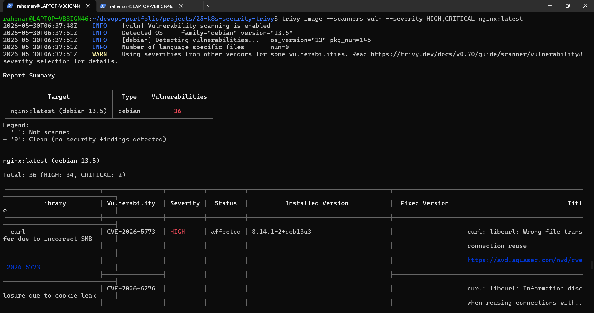
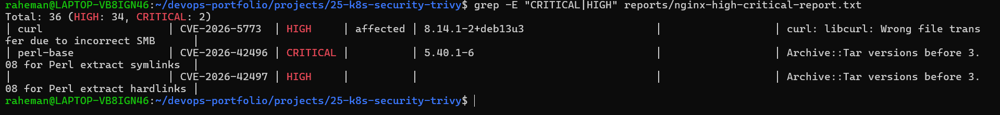
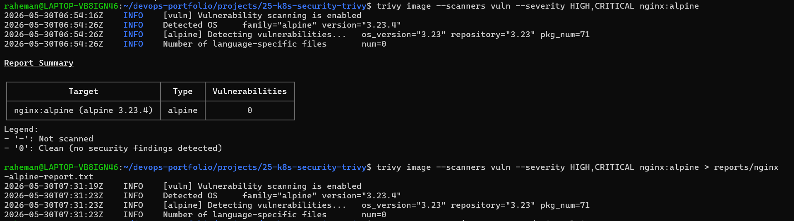
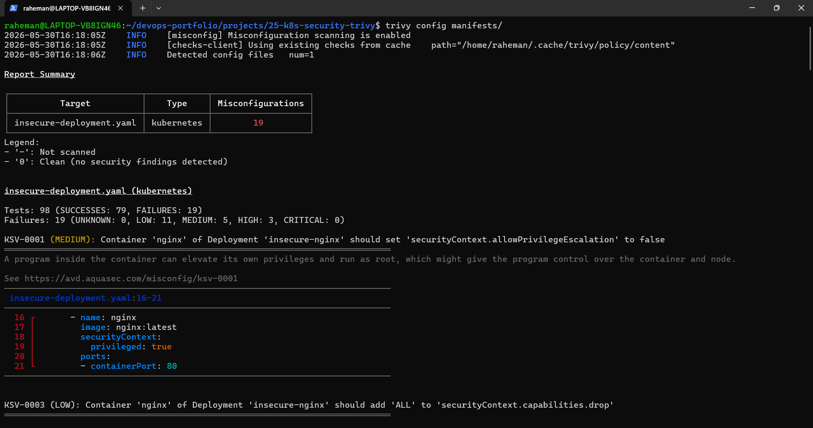
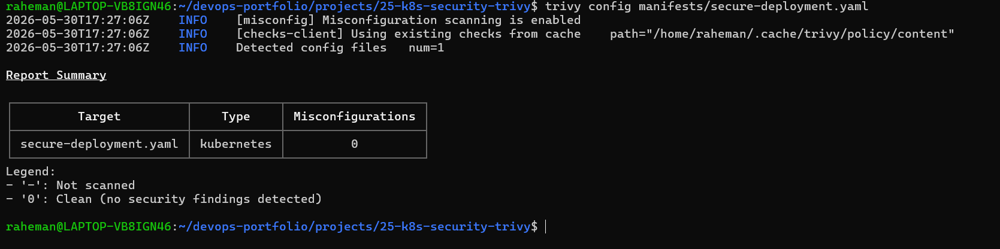
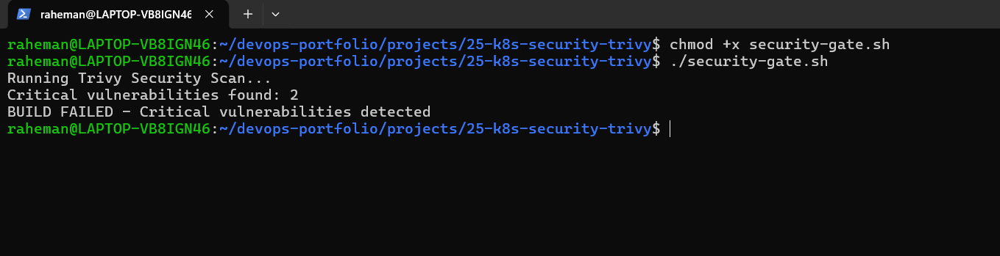

# Project 25 - Kubernetes Security & Vulnerbility Scanning with Trivy

## Project Overview

This project demonstrates a production-style **DevSecOps security workflow** using Trivy to detect vulnerabilities and misconfigurations before deployment.

The objective was to:

- Scan Docker images for CVEs
- Compare vulnerable vs secure images
- Scan Kubernetes manifests
- Remediate sceurity findings
- Validate hardened configurations
- Simulate CI/CD security gates

This project follows a **Shift Left Security** approach.

---

## Architecture

```text
Docker Image
      ↓
Trivy Vulnerability Scan
      ↓
Detect CVEs
      ↓
Security Analysis
      ↓
Remediation
      ↓
Manifest Security Scan
      ↓
Security Gate
      ↓
Deploy
```

---

## Tech Stack

- Trivy
- Docker
- Kubernetes YAML
- WSL2 (Ubuntu)
- Linux CLI
- DevSecOps Practices

---

## Problem Statement

Traditional deployments:

```text
Build
 ↓
Deploy
```

Security risks:

- Vulnerable images
- Privileged containers
- Root execution
- Missing resource limits
- Insecure manifests

DevSecOps workflow:

```text
Build
 ↓
Scan
 ↓
Fix
 ↓
Validate
 ↓
Deploy
```

---

## Project Goals

Implemented:

### Container Security

- Docker image vulnerability scanning
- CVE analysis
- Severity filtering

### Kubernetes Security

- Manifest misconfiguration detection
- Security hardening
- Secure configuration validation

### Pipeline Security

- Simulated deployment blocking
- Security gate implementation

---

## Project Structure

```text
25-k8s-security-trivy/
│
├── README.md
│
├── manifests/
│   ├── insecure-deployment.yaml
│   └── secure-deployment.yaml
│
├── reports/
│   ├── nginx-vulnerability-report.txt
│   ├── nginx-high-critical-report.txt
│   ├── nginx-alpine-report.txt
│   ├── k8s-misconfig-report.txt
│   └── secure-k8s-manifest-report.txt
│
├── screenshots/
│   ├── 01-nginx-image-vulnerability-scan.png
│   ├── 02-high-critical-vulnerabilities-summary.png
│   ├── 03-nginx-alpine-security-scan.png
│   ├── 04-kubernetes-manifest-security-scan.png
│   ├── 05-secure-manifest-scan-result.png
│   └── 06-security-gate-failed-build.png
│
├── docs/
├── troubleshooting/
│
├── security-gate.sh
│
└── .gitignore
```

---

# Step 1 - Install Trivy

Installed Trivy inside WSL.

Verification:

```bash
trivy --version
```

Purpose:

```text
container scanning
manifest scanning
security validation
```

---

# Step 2 - Docker Image Vulnerability Scan

Scanned:

```text
nginx:latest
```

Command:

```bash
trivy image --scanners vuln nginx:latest
```

Result:

```text
HIGH: 34
CRITICAL: 2
```

Examples:

```text
curl → HIGH
perl-base → CRITICAL
```

Conclusion:

Official images can still contain vulnerabilities.

---

# Step 3 - Secure Image Comparsion

Scanned:

```text
nginx:alpine
```

Command:

```bash
trivy image --scanners vuln --severity HIGH,CRITICAL nginx:alpine
```

Result:

```text
0 vulnerabilities
```

Security comparsion:

| Image | HIGH | CRITICAL |
|--------|------|----------|
| nginx:latest | 34 | 2 |
| nginx:alpine | 0 | 0 |


Conclusion:

Smaller images reduce attack surface.

---

# Step 4 - Kubernetes Manifest Scan

Created intentionally insecure manifest.

Issues introduced:

```text
privileged container
latest tag
root permissions
missing resource limits
```

Command:

```bash
trivy config manifests/
```

Result:

```text
Failures: 19
HIGH: 3
MEDIUM: 5
LOW: 11
```

---

# Step 5 - Manifest Hardening

Implemented:

```text
privileged=false
allowPrivilegeEscalation=False
readOnlyRootFilesystem=true
runAsNonRoot=true
capabilities drop ALL
resources limits
seccomProfile
```

Validation:

```text
Misconfiguration: 0
```

---

# Step 6 - Security Gate

Created:

```text
security-gate.sh
```

Purpose:

Block deployment if critical vulnerabilities exist.

Workflow:

```text
Docker Build
      ↓
Trivy Scan
      ↓
CRITICAL Found?
      ↓ YES
Deployment Blocked
```

Result:

```text
BUILD FAILED
Critical vulnerabilities detected
```

---

## Screenshots

### Vulnerability Scan



---

### Severity Summary



---

### Secure Alpine Scan



---

### Kubernetes Manifest Scan



---

### Secure Manifest Validation



---

### Security Gate



---

## Key Learning Outcomes

Learned:

- Trivy scanning
- CVE analysis
- Image hardening
- Kubernetes security
- Security context
- Resource governance
- DevSecOps worklfow
- Shift-left security
- Deployment gating

---

## Production Use Case

Enterprise workflow:

```text
Developer Push
       ↓
CI Pipeline
       ↓
Trivy Scan
       ↓
Critical Found?
       ↓
Block Deployment
       ↓
Fix Vulnerabilities
       ↓
Deploy
```

---

## Future Improvements

Planned:

- Jenkins + Trivy integration
- GitHub Actions security scan
- SBOM generation
- Secrets scanning
- Policy enforcement
- Admission controllers

---

## Author

**Abdul Raheman**

Cloud | DevOps | Kubernetes | Docker | Security | CI/CD
