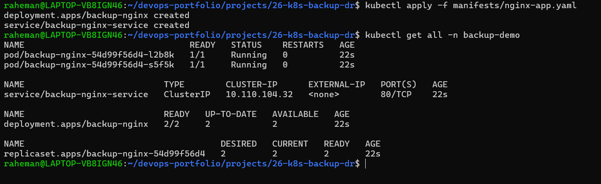
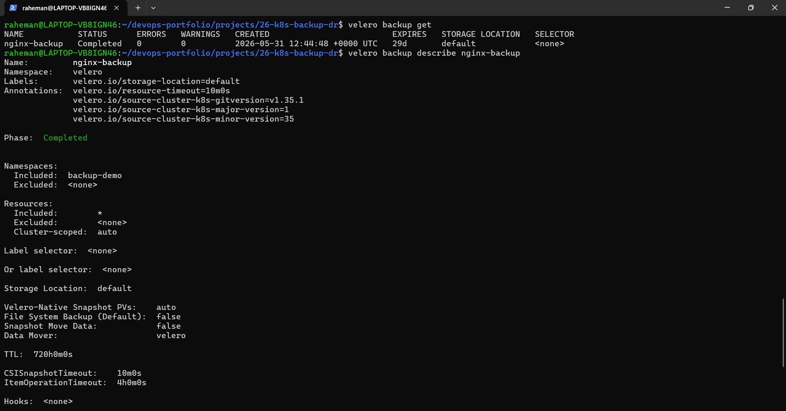
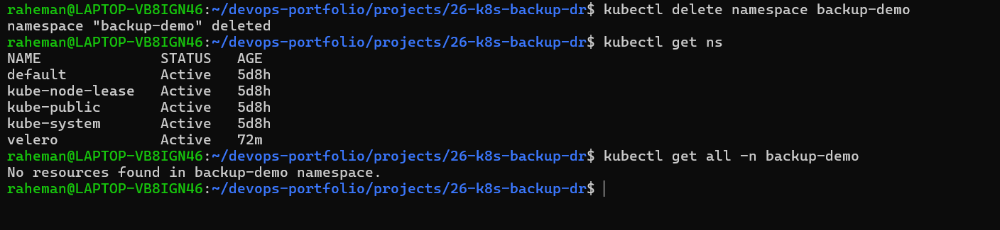
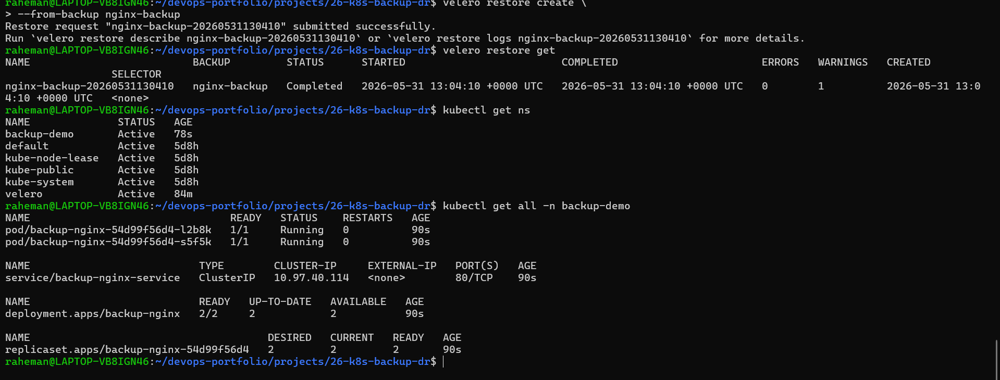

# Project 26 - Kubernetes Backup & Disaster Recovery with Velero

## Project Overview

This project demonstrates a production-style Kubernetes Backup and Disaster Recovery (DR) workflow using velero.

The Objective was to:

- Deploy a Kubernetes application 
- Create backups using Velero
- Store backup metadata in MinIO
- Simulate a disaster
- Restore the application from backup
- Validate successful recovery

This project demonstrates core Site Reliability Enginnering (SRE) and Disaster Recovery practices used in production Kubernetes environments.

---

## Architecture

```text
Application Running
        ↓
Velero Backup
        ↓
Backup Stored in MinIO
        ↓
Disaster Simulation
        ↓
Namespace Deleted
        ↓
Velero Restore
        ↓
Application Recovered
```

---

## Tech Stack

- Kubernetes (Minikube)
- Velero
- MinIO
- Docker
- WSL2 Ubuntu
- Linux CLI

---

## Problem Statement

Production failures can occur due to:

- accidental deletion
- failed deployments
- cluster incidents
- operational mistakes

Without backups:

```text
Application Deleted
       ↓
Permanent Loss
```

With Velero:

```text
Application Deleted
       ↓
Restore Backup
       ↓
Application Recovered
```

---

## Project Goals

Implemented:

### Backup Management

- Velero installation
- Backup creation
- Backup verification

### Disaster Recovery

- Namespace deletion
- Application loss simulation
- Full restore workflow

### Validation

- Deployment recovery
- Service recovery
- Pod recovery

---

## Project Structure

```text
26-k8s-backup-dr/
│
├── README.md
│
├── manifests/
│   └── nginx-app.yaml
│
├── backups/
│   ├── backup-description.txt
│   └── restore-description.txt
│
├── screenshots/
│   ├── 01-sample-app-running-before-backup.png
│   ├── 02-backup-created-successfully.png
│   ├── 03-disaster-namespace-deleted.png
│   └── 04-application-restored-from-backup.png
│
├── docs/
│
├── troubleshooting/
│
└── .gitignore
```

---

# Step 1 - Install Velero

Installed Velero CLI:

```bash
velero version --client-only
```

Purpose:

```text
Backup
Restore
Disaster Recovery
```

---

# Step 2 - Deploy Backup Storage

Installed MinIO.

Purpose:

```text
Local S3-compatible storage
```

Production equivalent:

```text
AWS S3
Azure Blob
Google Cloud Storage
```

---

# Step 3 - Deploy Sample Application

Created namespace:

```text
backup-demo
```

Resources:

```text
Deployment
Service
Pods
```

Application:

```text
nginx:apline
```

---

# Step 4 - Create Backup

Command:

```bash
velero backup create nginx-backup \
--include-namespaces backup-demo
```

Verification:

```bash
velero backup get
```

Result:

```text
Completed
```

---

# Step 5 - Simulate Disaster 

Deleted namespace:

```bash
kubectl delete namespace backup-demo
```

Result:

```text
Application lost
Deployment deleted
Pods deleted
Service deleted
```

---

# Step 6 - Restore Backup

Command:

```bash
velero restore create \
--from-backup nginx-backup
```

Verification:

```bash
velero restore get
```

Result:

```text
Completed
```

---

# Step 7 - Recovery Validation

Verified:

```bash
kubectl get all -n backup-demo
```

Recovered:

```text
Namespace
Deployment
ReplicaSet
Pods
Service
```

Result:

```text
2/2 Pods Running
```

---

## Screenshots

### Application Running Before Backup



---

### Backup Created Successfully



---

### Disaster Simulation



---

### Application Restored



---

## Key Learning Outcomes

Learned:

- Kubernetes backup strategies
- Velero architecture
- Disaster recovery workflows
- Backup verification
- Restore validation
- Business continuity concepts
- Production recovery procedures

---

## Production Concepts

### RPO (Recovery Point Objective)

Maximum acceptable data loss.

Example: 

```text
Last successful backup
```

---

### RTO (Recovery Time Objective)

Maximum acceptable recovery time.

Example:

```text
Time required to restore application
```

---

## Production Use Case

Enterprise workflow:

```text
Application Running
        ↓
Scheduled Backup
        ↓
Failure Occurs
        ↓
Restore Backup
        ↓
Service Restored
```

Used by:

- SRE teams
- Platform teams
- Cloud Operations teams
- DevOps teams

---

## Known Limitation

During local MinIO testing:

```text
velero backup logs
velero restore describe
```

generated DNS lookup errors for:

```text
minio.velero.svc
```

Reason:

```text
Kubernetes internal DNS name
not directly resolvable from WSL host
```

Backups and restores still completed successfully.

---

## Future Improvements

Planned: 

- AWS S3 integration 
- Persistent Volume backups
- Scheduled backups
- Multi-cluster recovery
- Cross-region DR strategy

---

## Author

**Abdul Raheman**

Cloud | DevOps | Kubernetes | SRE | Disaster Recovery
