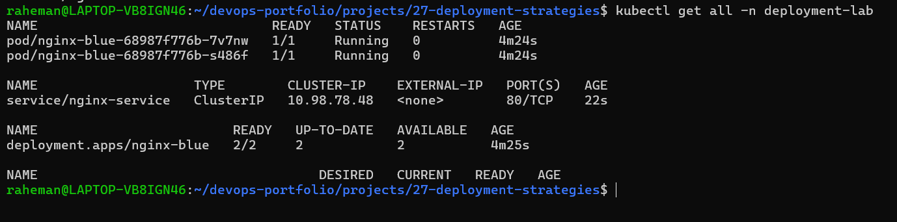
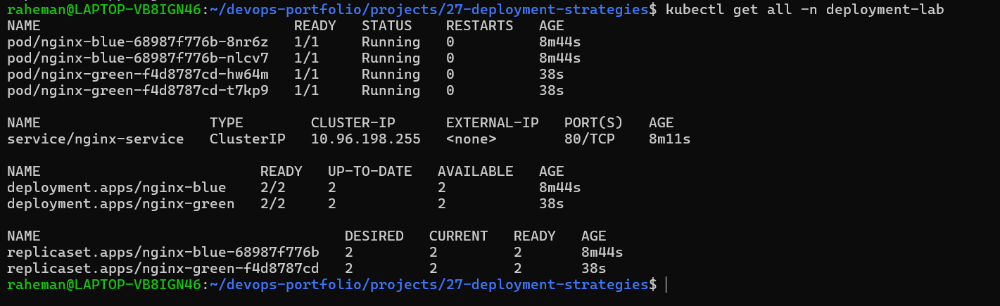
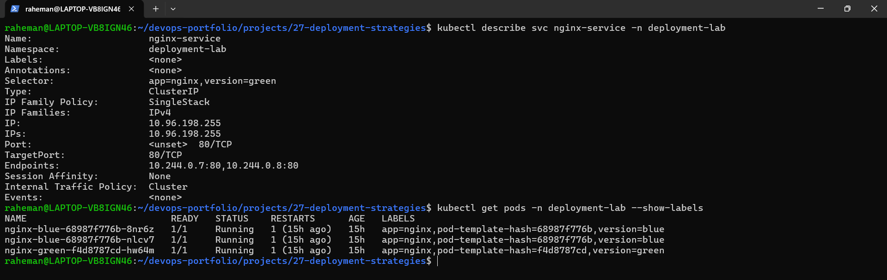
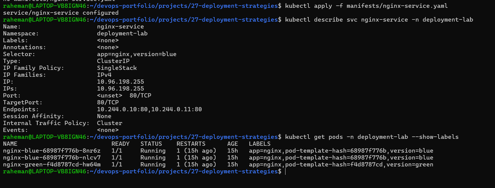
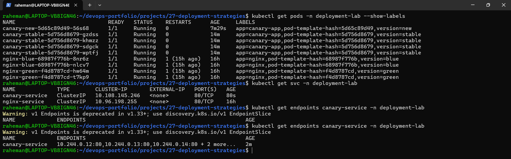
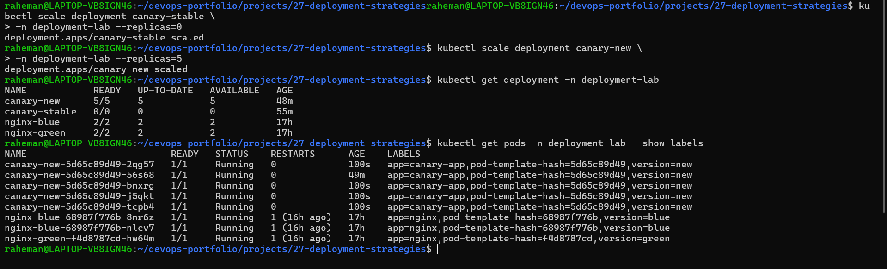

# Project 27 — Advanced Kubernetes Deployment Strategies

## Project Overview

This project demonstrates production-grade Kubernetes deployment strategies used to release applications with minimal risk and near-zero downtime.

The project covers:

- Blue-Green Deployment
- Traffic Switching
- Instant Rollback
- Canary Deployment
- Progressive Rollout
- Production Promotion Strategy

These deployment techniques are widely used by DevOps, Platform Engineering, and Site Reliability Engineering (SRE) teams to safely release new application versions.

---

## Architecture

### Blue-Green Deployment

```text
Blue Environment (Live)
          ↓
Green Environment Created
          ↓
Traffic Switch
          ↓
Green Environment Live
          ↓
Rollback if Required
```

---

### Canary Deployment

```text
Stable Version (v1)
          ↓
Deploy Canary Version (v2)
          ↓
Small Traffic Percentage
          ↓
Validation
          ↓
Full Promotion
```

---

## Tech Stack

- Kubernetes
- Minikube
- Docker
- Linux
- kubectl

---

## Problem Statement

Traditional deployments introduce risk because all users immediately receive the new version.

Example:

```text
Deploy New Version
        ↓
Bug Found
        ↓
Entire User Base Impacted
```

Modern deployment strategies reduce this risk by controlling traffic exposure and enabling rapid rollback.

---

## Project Goals 

Implemented:

### Blue-Green Deployment

- Blue environment deployment
- Green environment deployment
- Traffic switching
- Rollback validation

### Canary Deployment

- Stable deployment
- Canary deployment
- Traffic distribution simulation
- Production promotion

---

## Project Structure

```text
27-deployment-strategies/
│
├── README.md
│
├── manifests/
│   ├── blue-deployment.yaml
│   ├── green-deployment.yaml
│   ├── nginx-service.yaml
│   ├── canary-stable.yaml
│   ├── canary-new.yaml
│   └── canary-service.yaml
│
├── screenshots/
│   ├── 01-blue-environment-running.png
│   ├── 02-blue-and-green-running.png
│   ├── 03-traffic-switched-to-green.png
│   ├── 04-rollback-to-blue.png
│   ├── 05-canary-deployment-80-20-split.png
│   └── 06-canary-promoted-to-production.png
│
├── docs/
│
├── troubleshooting/
│
└── .gitignore
```

---

# Step 1 - Blue Environment Deployment

Created: 

```text
nginx-blue
```

Configuration:

```text
2 replicas
Version: blue
```

Purpose:

```text
Current production environment
```

---

# Step 2 - Service Configuration

Created Kubernetes Service:

```text
nginx-service
```

Initial selector:

```text
version=blue
```

Traffic routed to:

```text
Blue Pods
```

---

# Step 3 - Green Environment Deployment

Created:

```text
nginx-green
```

Configuration:

```text
2 replicas
Version: green
```

Purpose:

```text
New application release candidate
```

---

# Step 4 - Traffic Switch

Modified service selector:

Before:

```text
version=blue
```

After:

```text
version=green
```

Result:

```text
Traffic switched to Green
```

No deployment recreation required.

---

# Step 5 - Rollback Validation

Modified service selector:

Before:

```text
version=green
```

After:

```text
version=blue
```

Result:

```text
Instant rollback
```

This demonstrates the primary advantage of Blue-Green deployment.

---

# Step 6 - Canary Deployment

Stable Deployment:

```text
canary-stable
4 replicas
```

Canary Deployment:

```text
canary-new
1 replica
```

Traffic distribution:

```text
~80% Stable
~20% Canary
```

Purpose:

```text
Expose new version to limited users
```

---

# Step 7 - Canary Promotion

Scaled:

```text
Stable → 0 replicas
```

Scaled:

```text
Canary → 5 replicas
```

Result:

```text
New version promoted to production
```

---

## Screenshots

### Blue Environment Running



---

### Blue and Green Running



---

### Traffic Switched to Green



---

### Rollback to Blue



---

### Canary Deployment



---

### Canary Promotion



---

## Deployment Strategy Comparison

| Strategy | Downtime | Rollback Speed | Risk |
|-----------|-----------|---------------|------|
| Recreate | High | Slow | High |
| Rolling Update | Low | Medium | Medium |
| Blue-Green | Near Zero | Instant | Low |
| Canary | Near Zero | Moderate | Lowest |

---

## Key Learning Outcomes

Learned:

- Zero-downtime deployment concepts
- Blue-Green architecture
- Canary release strategy 
- Traffic management
- Rollback techniques
- Progressive delivery
- Production deployment workflows

---

## Production Use Cases

### Blue-Green

Used when:

```text
Immediate rollback required
High availability needed
```

Examples:

```text
Banking Systems
Payment Platforms
Healthcare Applications
```

---

### Canary 

Used when:

```text
New feature validation required
User impact needs control
```

Examples:

```text
E-commerce Platforms
Streaming Platforms
SaaS Products
```

---

## Interview Takeaways

Questions answered by this project:

- What is Blue-Green Deployment?
- What is Canary Deployment?
- How do you achieve zero downtime deployments?
- Which deployment strategy is safest?
- How do large companies reduce deployment risk?

---

## Future Improvements

Potential enhancements:

- Argo Rollouts
- Service Mesh Traffic Splitting
- Istio Canary Releases
- Automated Rollbacks
- Progressive Delivery Metrics

---

## Author

**Abdul Raheman**

Cloud | DevOps | Kubernetes | Platform Engineering | SRE
