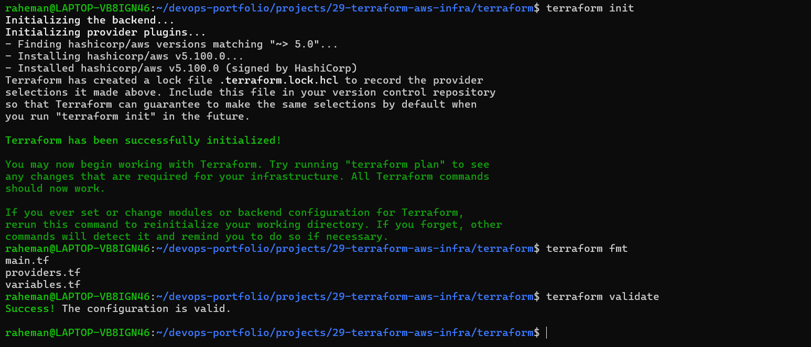
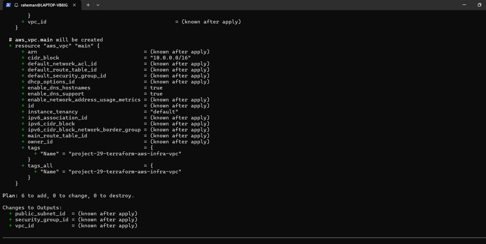
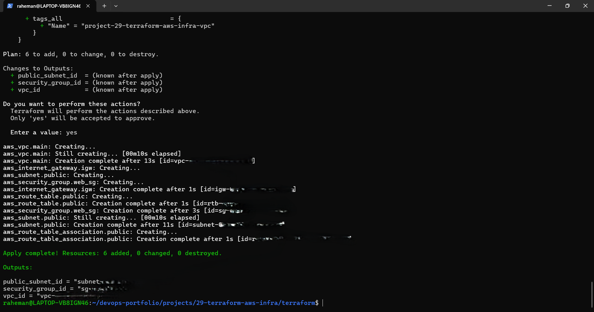
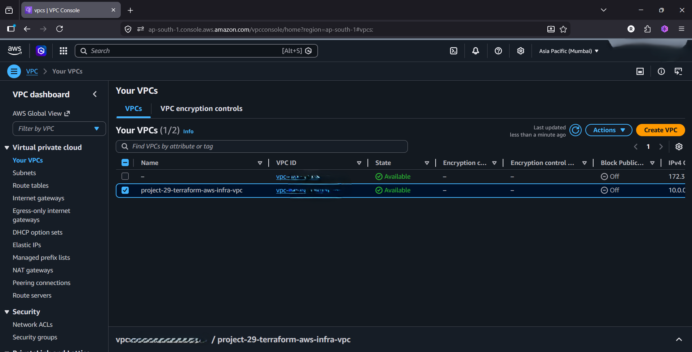
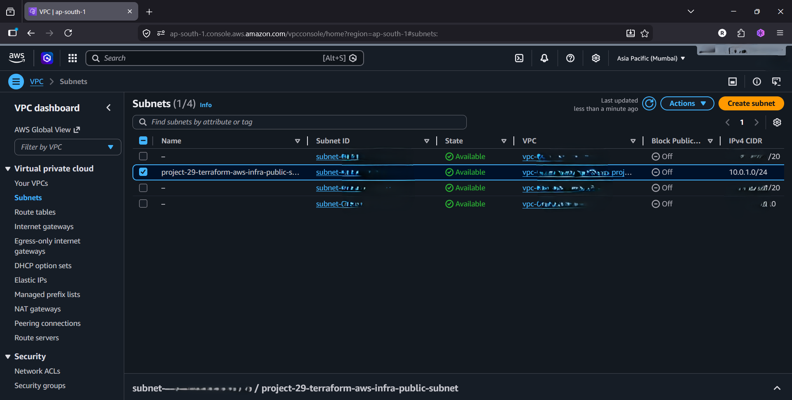
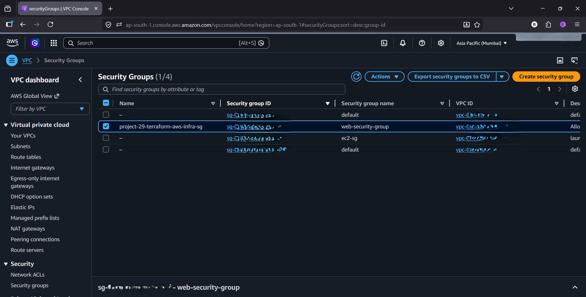
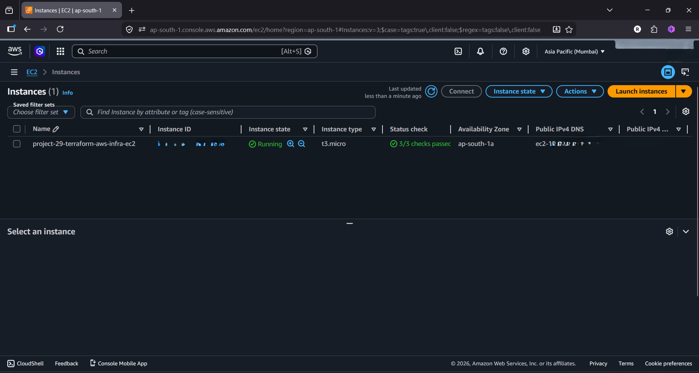
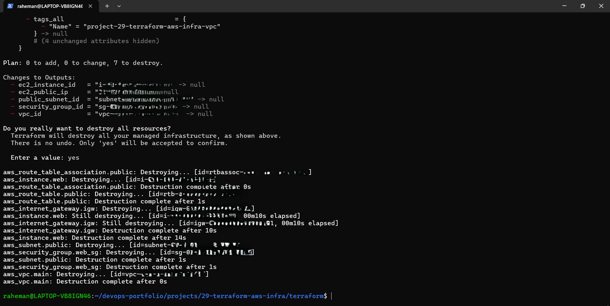
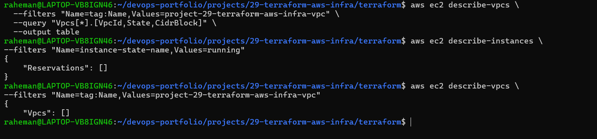

# Project 29 - Production Terraform on AWS

## Project Overview 

This project demonstrates Infrastructure as Code (IaC) using Terraform to provision AWS networking and compute resources.

The infrastructure was created entirely through Terraform without manually creating resources in the AWS Console.

The project covers:

- AWS VPC
- Public Subnet
- Internet Gateway
- Route Table 
- Security Group
- EC2 Instance
- Terraform Variables
- Terraform outputs
- Terraform State
- Terraform Lifecycle Management
- Infrastructure Cleanup

---

## Architecture

```text
AWS Cloud
│
├── VPC
│
├── Public Subnet
│
├── Internet Gateway
│
├── Route Table
│
├── Security Group
│
└── EC2 Instance
```

---

## Tech Stack

- Terraform
- AWS
- EC2
- VPC
- Internet Gateway
- Route Tables
- Security Groups
- AWS CLI
- Linux

---

## Project Objectives

Implemented:

- Infrastructure as Code
- AWS Networking
- Terraform Planning
- Infrastructure Provisioning
- Infrastructure Verification
- Infrastructure Destruction
- Cost-Aware Resource Management

---

## Project Structure

```text
29-terraform-aws-infra/
│
├── README.md
│
├── terraform/
│   ├── providers.tf
│   ├── variables.tf
│   ├── terraform.tfvars
│   ├── main.tf
│   └── outputs.tf
│
├── screenshots/
│   ├── 01-terraform-validate-success.png
│   ├── 02-terraform-plan-success.png
│   ├── 03-terraform-apply-success.png
│   ├── 04-vpc-created.png
│   ├── 05-subnet-created.png
│   ├── 06-security-group-created.png
│   ├── 07-ec2-created-with-terraform.png
│   ├── 08-terraform-destroy-success.png
│   └── 09-aws-cleanup-verification.png
│
├── docs/
│   ├── terraform-workflow.md
│   ├── aws-networking-concepts.md
│   └── interview-questions.md
│
├── troubleshooting/
│   └── common-errors.md
│
└── .gitignore
```

---

# Step 1 — Terraform Initialization

Terraform initialized provider plugins and project configuration.

Commands:

```bash
terraform init
terraform fmt
terraform validate
```

Purpose:

```text
Prepare Terraform environment
Validate configuration
Format code
```

---

# Step 2 — Infrastructure Planning

Generated execution plan.

Command:

```bash
terraform plan
```

Purpose:

```text
Preview infrastructure changes
Estimate resource creation
Avoid unexpected modifications
```

---

# Step 3 — VPC Creation

Created:

```text
Custom AWS VPC
CIDR: 10.0.0.0/16
```

Purpose:

```text
Logical network boundary
```

---

# Step 4 — Public Subnet

Created:

```text
Public Subnet
CIDR: 10.0.1.0/24
```

Purpose:

```text
Host internet-accessible resources
```

---

# Step 5 — Internet Gateway

Created:

```text
Internet Gateway
```

Purpose:

```text
Enable internet connectivity
```

---

# Step 6 — Route Table

Configured:

```text
0.0.0.0/0
```

Route:

```text
Internet Gateway
```

Purpose:

```text
Direct internet traffic
```

---

# Step 7 — Security Group

Created:

```text
SSH Access
TCP 22
```

Purpose:

```text
Secure EC2 access
```

---

# Step 8 — EC2 Provisioning

Terraform launched:

```text
Amazon Linux EC2 Instance
```

Purpose:

```text
Compute resource deployment
```

---

# Step 9 — Infrastructure Cleanup

Destroyed infrastructure using:

```bash
terraform destroy
```

Verified:

```text
No running EC2 instances
No project VPC
```

Purpose:

```text
Prevent unnecessary AWS charges
```

---

## Screenshots

### Terraform Validation



---

### Terraform Plan



---

### Terraform Apply



---

### VPC Created



---

### Subnet Created



---

### Security Group Created



---

### EC2 Created



---

### Terraform Destroy



---

### Cleanup Verification



---

## Key Learning Outcomes

Learned:

- Infrastructure as Code
- Terraform Workflow
- AWS Networking Fundamentals
- Resource Provisioning
- Resource Lifecycle Management
- Infrastructure Planning
- Infrastructure Validation
- Infrastructure Cleanup

---

## Cost Management

This project was designed with cost awareness.

Measures taken:

```text
Single EC2 Instance
No NAT Gateway
No Load Balancer
No RDS
Immediate Resource Cleanup
```

---

## Real-World Use Cases

Examples:

- Cloud Infrastructure Provisioning
- Environment Automation
- Platform Engineering
- DevOps Automation
- Cloud Operations

---

## Interview Questions Answered

- What is Infrastructure as Code?
- What is Terraform?
- What is a VPC?
- What is a Public Subnet?
- What is an Internet Gateway?
- What is a Route Table?
- What is a Security Group?
- What is terraform plan?
- What is terraform apply?
- What is terraform destroy?

---

## Future Improvements

Potential enhancements:

- Private Subnets
- NAT Gateway Architecture
- Terraform Modules
- Remote State Storage
- Multi-Environment Deployments
- Auto Scaling Infrastructure

---

## Author

**Abdul Raheman**

Cloud | DevOps | AWS | Terraform | Platform Engineering


