# Project 30 - AWS High Availability Architecture

## Project Overview 

This project demonstrates a highly available AWS architecture deployed using Terraform.

The infrastructure was designed to eliminate single points of failure by distributing application servers across multiple Availability Zones and placing them behind an Application Load Balancer (ALB).

The project covers:

- Terraform Infrastructure as Code (IaC)
- AWS VPC Networking
- Multi-AZ Architecture 
- Public Subnets
- Internet Gateway
- Route Tables
- Security Groups
- EC2 Instances
- Application Load Balancer (ALB)
- Target Groups 
- Health Checks 
- Failover Testing
- Infrastructure Cleanup

---

## Architecture

```text
                    Internet
                        │
                        ▼
          Application Load Balancer
                        │
         ┌──────────────┴──────────────┐
         ▼                             ▼
   EC2 Instance 1                EC2 Instance 2
   AZ: ap-south-1a               AZ: ap-south-1b
         │                             │
         └────────── VPC ──────────────┘
```

---

## Tech Stack

- Terraform
- AWS
- EC2
- VPC
- Public Subnets
- Internet Gateway
- Route Tables
- Security Groups
- Application Load Balancer (ALB)
- Target Groups
- AWS CLI
- Linux

---

## Project Objectives

Implemented:

- High Availability Architecture
- Multi-AZ Deployment
- Load Balancing
- Health Monitoring
- Failover Validation
- Infrastructure Automation
- Cost-Aware Resource Management
- Infrastructure Cleanup

---

## Project Structure

```text
30-aws-high-availability/
│
├── README.md
│
├── terraform/
│   ├── providers.tf
│   ├── variables.tf
│   ├── terraform.tfvars
│   ├── main.tf
│   └── outputs.tf
│
├── screenshots/
│   ├── 01-terraform-validate-success.png
│   ├── 02-terraform-plan-success.png
│   ├── 03-ec2-plan-ready.png
│   ├── 04-alb-plan-ready.png
│   ├── 05-terraform-apply-success.png
│   ├── 06-vpc-multi-az-subnets.png
│   ├── 07-ec2-instances-running.png
│   ├── 08-load-balancer-created.png
│   ├── 09-target-group-healthy.png
│   ├── 10-alb-application-access.png
│   ├── 11-ha-failover-test.png
│   ├── 12-alb-access-after-failover.png
│   ├── 13-terraform-destroy-success.png
│   └── 14-aws-cleanup-verification.png
│
├── docs/
│
├── troubleshooting/
│
└── .gitignore
```

---

# Step 1 - Terraform Validation

Validated Terraform configuration before deployment.

Commands:

```bash
terraform init
terraform fmt
terraform validate
```

Purpose:

```text
Initialize Terraform
Validate Configuration
Ensure Correct Syntax
```

---

# Step 2 - Infrastructure Planning

Generated execution plans before deployment.

Commands:

```bash
terraform plan
```

Purpose:

```text
Review Infrastructure Changes
Prevent Deployment Errors
Preview Resources
```

---

# Step 3 - Multi-AZ Networking

Created:

```text
Custom VPC
2 Public Subnets
2 Availability Zones
Internet Gateway
Route Table
```

Purpose:

```text
Provide Networking Redundancy
Enable Multi-AZ Design
```

---

# Step 4 - EC2 Deployment

Provisioned:

```text
EC2 Instance 1 (AZ-1)
EC2 Instance 2 (AZ-2)
```

Purpose:

```text
Eliminate Single Point of Failure
Support High Availability
```

---

# Step 5 - Application Load Balancer

Created:

```text
Application Load Balancer
Target Group
Listener
Health Checks
```

Purpose:

```text
Distribute Traffic
Monitor Target Health
Provide Fault Tolerance
```

---

# Step 6 - Health Check Validation

Verified:

```text
Target 1 Healthy
Target 2 Healthy
```

Purpose:

```text
Ensure Traffic Can Be Routed
Verify Backend Availability
```

---

# Step 7 - Application Access

Verified application access through:

```text
ALB DNS Endpoint
```

Observed:

```text
Traffic Successfully Routed
```

Purpose:

```text
Validate Load Balancer Functionally
```

---

# Step 8 - High Availability Failover Test

Simulated failure by stopping one EC2 instance.

Observed:

```text
One Target Unavailable
One Target Healthy
```

Result:

```text
Application Remained Accessible
```

Purpose:

```text
Validate High Availability
Validate Fault Tolerance
```

---

# Step 9 - Infrastructure Cleanup

Destroyed infrastructure using:

```bash
terraform destroy
```

Verified:

```text
No Running EC2 Instances
No Load Balancers
No Project Resources
```

Purpose:

```text
Prevent Unnecessary AWS Charges
```

---

## Screenshots

### Terraform Validation

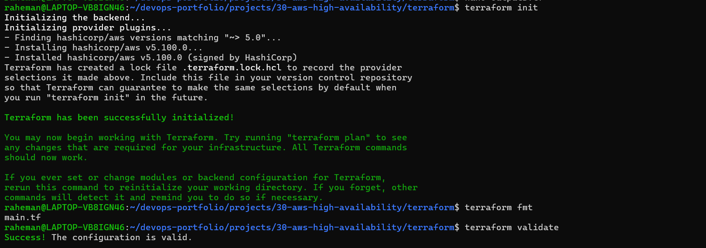

---

### Terraform Plan

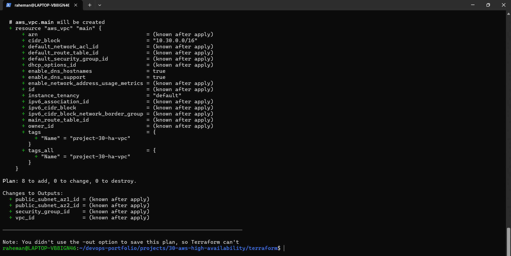

---

### EC2 Deployment Plan

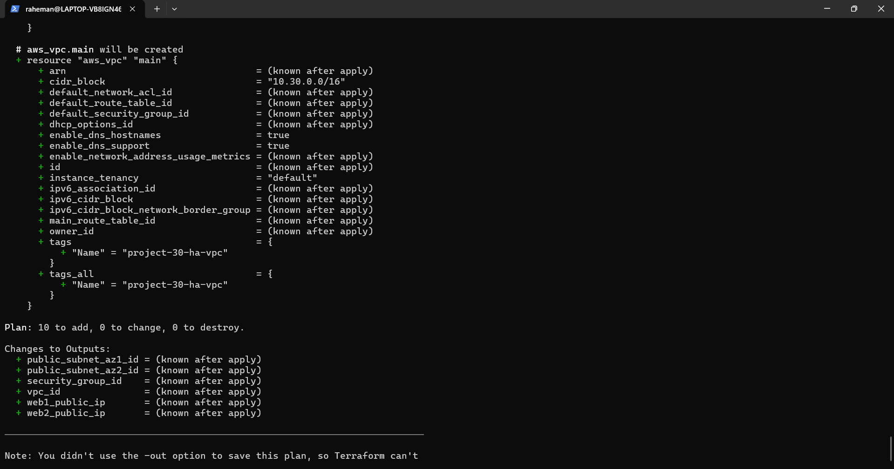

---

### ALB Deployment Plan

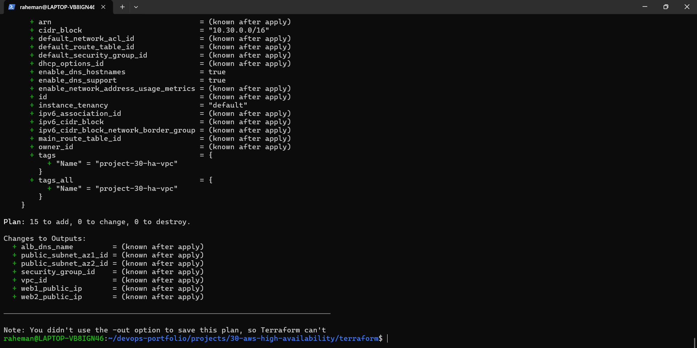

---

### Terraform Apply

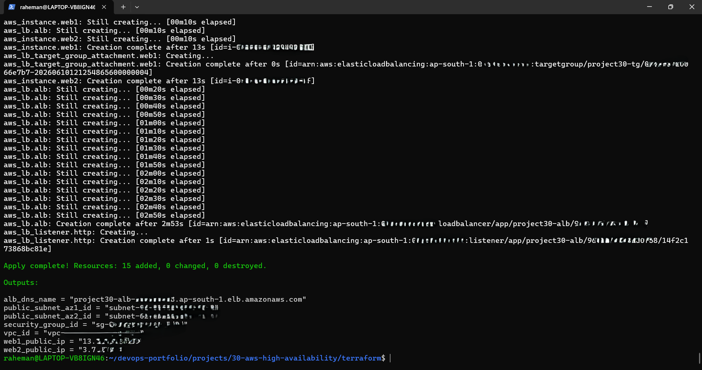

---

### Multi-AZ Networking

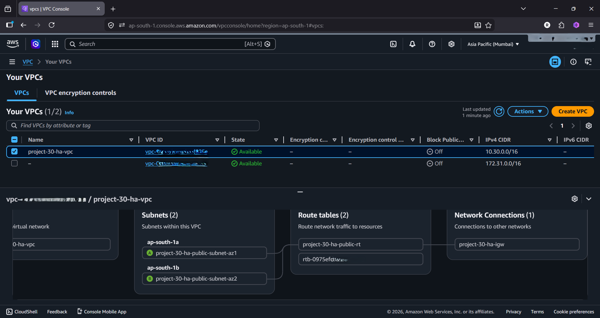

---

### EC2 Instances Running

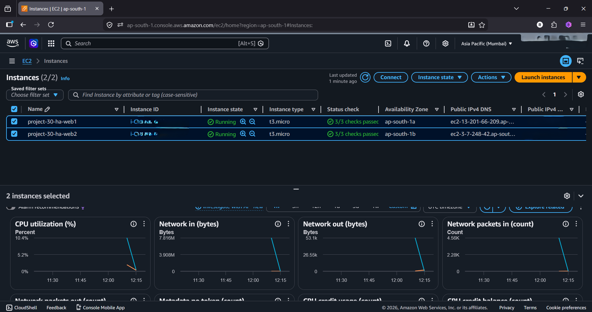

---

### Load Balancer Created

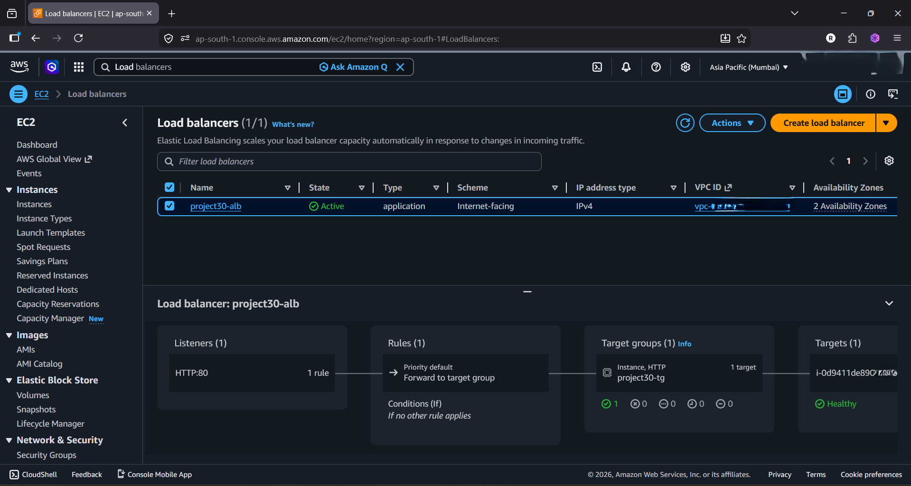

---

### Healthy Targets

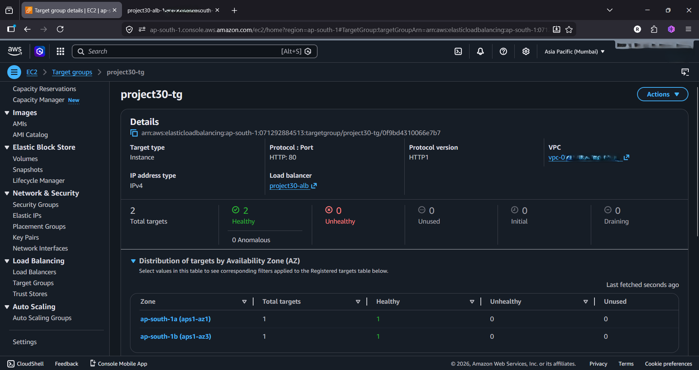

---

### Application Access

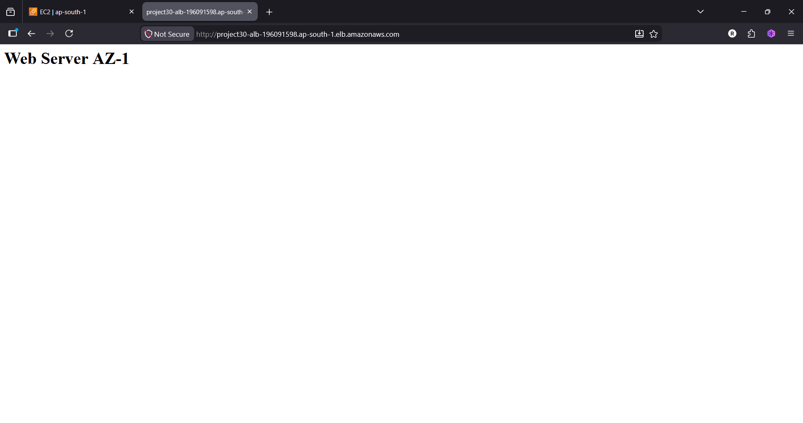

---

### Failover Test


---

### Application Access After Failover


---

### Terraform Destroy

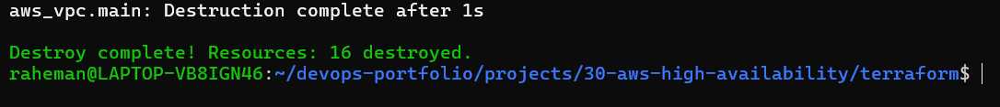

---

### AWS Cleanup Verification

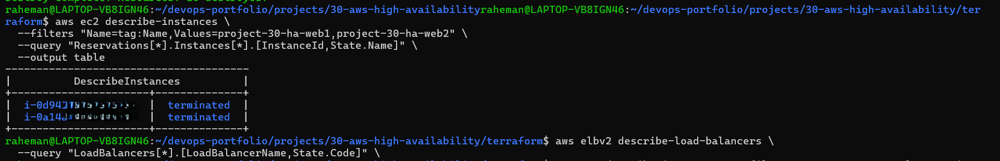

---

## Key Learning Outcomes

Learned:

- High Availability Design
- Multi-AZ Architecture
- Load Balancing Concepts
- Target Groups
- Health Checks
- Fault Tolerance
- Terraform Automation
- Infrastructure Lifecycle Management
- AWS Resource Cleanup

---

## Cost Management

This project was designed with strict cost control.

Measures taken:

```text
Short Runtime
Immediate Cleanup
No NAT Gateway
No RDS
No EKS
No Route53
Resources Destroyed After Testing
```

---

## Real-World Use Cases

Examples:

- Production Web Applications
- High Availability Deployments
- Cloud Infrastructure Design
- Platform Engineering
- DevOps Automation
- Disaster Resilience Planning

---

## Interview Questions Answered

- What is High Availability?
- What is Fault Tolerance?
- What is an Application Load Balancer?
- What is a Target Group?
- How do Health Checks work?
- Why use Multi-AZ Architecture?
- How does ALB handle failures?
- How do you validate failover?
- How does Terraform deploy AWS infrastructure?
- How do you safely clean up cloud resources?

---

## Future Improvements

Potential Enhancements:

- Auto Scaling Groups
- Private Subnets
- NAT Gateway Architecture
- HTTPS with ACM Certificates
- Route53 Integration
- Blue-Green Deployments
- Multi-Region Architecture

---

## Author

**Abdul Raheman**

Cloud | DevOps | AWS | Terraform | High Availability | Platform Engineering
