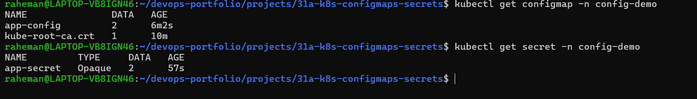
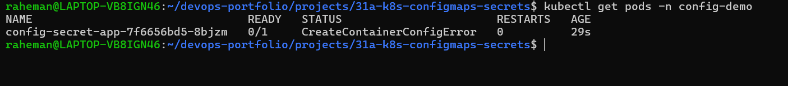
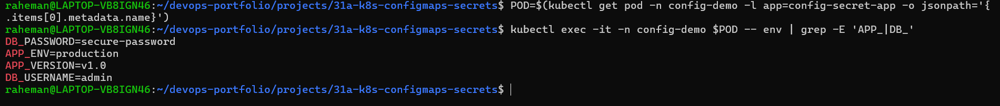
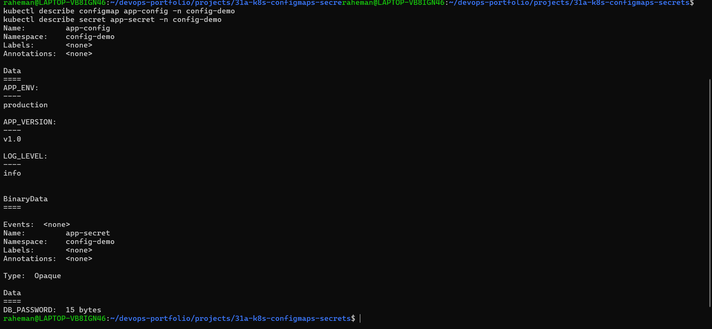

# Mini Project 31A — Kubernetes ConfigMaps & Secrets

## Project Overview

This mini project demonstrates how Kubernetes ConfigMaps and Secrets are used to manage application configuration and sensitive information separately.

A sample application was deployed using a Kubernetes Deployment that consumed values from both a ConfigMap and a Secret as environment variables.

---

## Architecture

```text
                Kubernetes Cluster
                       │
        ┌──────────────┴──────────────┐
        │                             │
   ConfigMap                     Secret
 (Application Config)      (Sensitive Data)
        │                             │
        └──────────────┬──────────────┘
                       │
                Deployment
                       │
                      Pod
                       │
              Environment Variables
```

---

## Tech Stack

- Kubernetes
- Minikube
- kubectl
- ConfigMaps
- Secrets
- BusyBox

---

## Objectives

- Create and manage ConfigMaps
- Create and manage Secrets
- Inject configuration into Pods
- Inject sensitive values securely
- Verify environment variables inside containers
- Troubleshoot configuration issues

---

## Project Structure

```
31a-k8s-configmaps-secrets/
│
├── README.md
│
├── manifests/
│   ├── app-configmap.yaml
│   ├── app-secret.yaml
│   └── app-deployment.yaml
│
├── screenshots/
│   ├── 01-configmap-secret-created.png
│   ├── 02-app-pod-running-with-config-secret.png
│   ├── 03-environment-variables-verified.png
│   └── 04-configmap-secret-verification.png
│
├── docs/
│   └── interview-questions.md
│
└── troubleshooting/
    └── common-errors.md
```

---

# Implementation Steps

## Step 1 — Create ConfigMap

Created a ConfigMap containing non-sensitive application configuration.

Example values:

```text
APP_ENV
APP_VERSION
LOG_LEVEL
```

Purpose:

- Store application configuration
- Separate configuration from application code

---

## Step 2 — Create Secret

Created a Kubernetes Secret containing sensitive information.

Example values:

```text
DB_USERNAME
DB_PASSWORD
```

Purpose:

- Store credentials securely
- Avoid hardcoding sensitive values

---

## Step 3 — Deploy Application

Created a Deployment that references both:

- ConfigMap
- Secret

Environment variables were injected into the running container using:

- `configMapKeyRef`
- `secretKeyRef`

---

## Step 4 — Verify Environment Variables

Verified that the application successfully loaded:

```text
APP_ENV
APP_VERSION
LOG_LEVEL
DB_USERNAME
DB_PASSWORD
```

using:

```bash
kubectl exec
```

---

## Screenshots

### ConfigMap & Secret Created



---

### Application Running



---

### Environment Variables Verified



---

### ConfigMap & Secret Verification



---

## Troubleshooting

### Issue Encountered

The Deployment initially failed with:

```text
CreateContainerConfigError
```

Cause:

```text
Missing APP_VERSION key in ConfigMap
```

Resolution:

- Updated the ConfigMap to include the missing key
- Reapplied the manifest
- Restarted the Deployment
- Verified successful Pod startup

---

## Key Learning Outcomes

- Difference between ConfigMaps and Secrets
- Injecting environment variables into Pods
- Managing application configuration
- Secure handling of sensitive data
- Debugging `CreateContainerConfigError`

---

## Interview Questions

- What is a ConfigMap?
- What is a Secret?
- When should you use ConfigMaps vs Secrets?
- How do you inject ConfigMap values into a Pod?
- How do you inject Secret values into a Pod?
- What causes `CreateContainerConfigError`?
- How would you troubleshoot a missing ConfigMap key?

---

## Real-World Use Cases

- Database credentials
- API keys
- Feature flags
- Environment-specific configuration
- Logging configuration
- Application settings

---

## Author

**Abdul Raheman**

Cloud | DevOps | Kubernetes | Configuration Management
