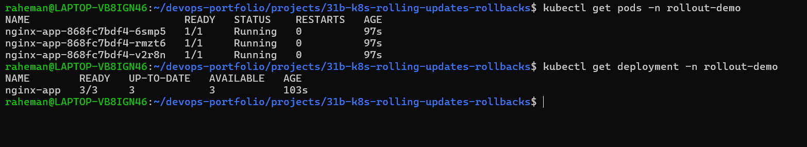
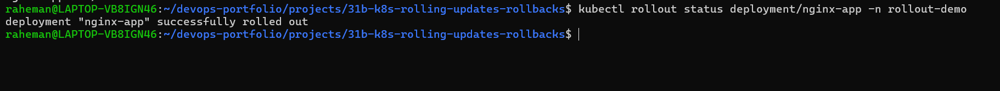
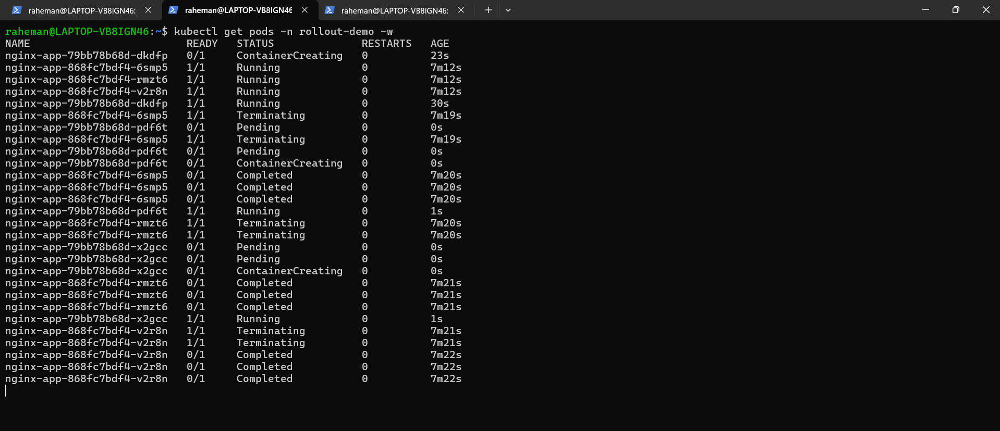
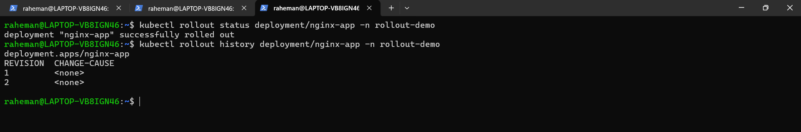
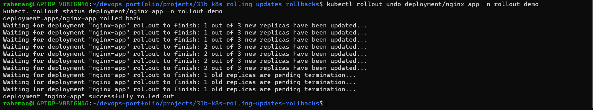
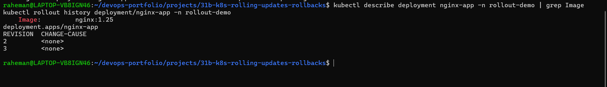

# Mini Project 31B — Kubernetes Rolling Updates & Rollbacks

## Project Overview

This mini project demonstrates Kubernetes rolling updates and rollback capabilities using a Deployment running NGINX.

The project showcases how Kubernetes updates applications with minimal downtime and quickly restores a previous version when required.

---

## Architecture

```text
Deployment
     │
     ▼
ReplicaSet
     │
     ▼
3 NGINX Pods

v1
 │
 ▼
Rolling Update
 │
 ▼
v2
 │
 ▼
Rollback
 │
 ▼
v1
```

---

## Tech Stack

- Kubernetes
- Minikube
- kubectl
- NGINX

---

## Objectives

- Deploy an application
- Perform a rolling update
- Monitor rollout progress
- View rollout history
- Roll back to a previous revision
- Verify deployment recovery

---

## Project Structure

```text
31b-k8s-rolling-updates-rollbacks/
│
├── README.md
│
├── manifests/
│   └── nginx-deployment.yaml
│
├── screenshots/
│   ├── 01-nginx-v1-deployed.png
│   ├── 02-rollout-status-success.png
│   ├── 03-rolling-update-in-progress.png
│   ├── 04-rollout-history.png
│   ├── 05-rollout-rollback-success.png
│   └── 06-rollback-image-verified.png
│
├── docs/
│   └── interview-questions.md
│
└── troubleshooting/
    └── common-errors.md
```

---

## Workflow

1. Deploy NGINX v1
2. Verify rollout status
3. Update image to a newer version
4. Monitor rolling update
5. Check rollout history
6. Roll back to the previous version
7. Verify rollback

---

## Screenshots

### Initial Deployment



---

### Rollout Status



---

### Rolling Update



---

### Rollout History



---

### Rollback



---

### Image Verification



---

## Key Commands

```bash
kubectl rollout status deployment/nginx-app -n rollout-demo

kubectl rollout history deployment/nginx-app -n rollout-demo

kubectl rollout undo deployment/nginx-app -n rollout-demo

kubectl set image deployment/nginx-app nginx=nginx:1.27 -n rollout-demo
```

---

## Key Learning Outcomes

- Rolling Updates
- Zero-Downtime Deployments
- Rollout Monitoring
- Rollback Operations
- Deployment History
- Kubernetes Deployment Lifecycle

---

## Interview Questions

- What is a Rolling Update?
- What is a Rollback?
- What does `kubectl rollout status` do?
- What does `kubectl rollout history` show?
- How do you undo a failed deployment?
- How does Kubernetes achieve zero-downtime deployments?

---

## Author

**Abdul Raheman**

Cloud | DevOps | Kubernetes | Deployment Strategies
